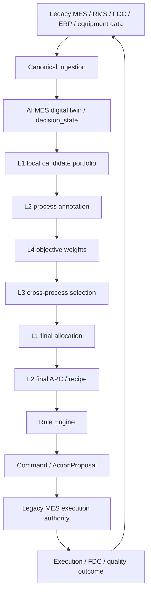

# AI MES Documentation Index

Status: canonical navigation index
Last updated: 2026-05-31

This folder is the source of truth for the AI MES architecture, runtime,
production-transition contracts, API, UI, and roadmap.

Use this file as navigation only. Detailed implementation status lives in
[17_CURRENT_IMPLEMENTATION_STATUS.md](17_CURRENT_IMPLEMENTATION_STATUS.md).

## Start Here

If this is the first time reading the project, start with
[01_ARCHITECTURE_FLOW_GUIDE.md](01_ARCHITECTURE_FLOW_GUIDE.md). It explains the
system boundary, A/B/C simulator example, L1/L2/L3/L4 decision flow, legacy MES
integration path, and UI reading path.

## Reader Paths

| Reader | Read in this order |
|---|---|
| New reader / non-MES reader | `01 -> 02 -> 03 -> 04 -> 17` |
| AI policy developer | `01 -> 03 -> 04 -> 05 -> 09 -> 16` |
| Backend/API developer | `01 -> 05 -> 06 -> 07 -> 10 -> 17` |
| UI developer | `01 -> 08 -> 07 -> 05 -> 17` |
| Production integration engineer | `01 -> 10 -> 11 -> 12 -> 13 -> 14 -> 15` |
| Project planner | `01 -> 15 -> 16 -> 17` |

## Architecture At A Glance



Core principle:

```text
AI MES recommends. Legacy MES decides whether and how to execute.
```

## Document Map

| Order | Document | Primary reader | Purpose |
|---:|---|---|---|
| 00 | [00_INDEX.md](00_INDEX.md) | Everyone | Navigation, reader paths, document sequence |
| 01 | [01_ARCHITECTURE_FLOW_GUIDE.md](01_ARCHITECTURE_FLOW_GUIDE.md) | New readers | First-read architecture guide with glossary, flows, and figures |
| 02 | [02_SYSTEM_VISION.md](02_SYSTEM_VISION.md) | Product/engineering leads | Product goal, boundaries, non-goals, and target state |
| 03 | [03_ABC_CANONICAL_SCHEMA_REFERENCE.md](03_ABC_CANONICAL_SCHEMA_REFERENCE.md) | Policy and data developers | Concrete A/B/C schema, candidates, annotations, and LLM tools |
| 04 | [04_LAYERED_AI_DECISION_ARCHITECTURE.md](04_LAYERED_AI_DECISION_ARCHITECTURE.md) | AI policy developers | L1/L2/L3/L4 decision contracts and layer boundary rules |
| 05 | [05_RUNTIME_HARNESS_RULE_ENGINE.md](05_RUNTIME_HARNESS_RULE_ENGINE.md) | Runtime/backend developers | Harness, planner/generator/evaluator, Rule Engine, commands |
| 06 | [06_MES_DOMAIN_MODEL.md](06_MES_DOMAIN_MODEL.md) | Backend/data developers | DTOs, persistence ownership, data entities, store model |
| 07 | [07_API_CONTRACTS.md](07_API_CONTRACTS.md) | API/UI developers | FastAPI contracts, payloads, endpoints, response rules |
| 08 | [08_UI_CONTROL_ROOM_SPEC.md](08_UI_CONTROL_ROOM_SPEC.md) | UI/product developers | Control-room IA, screens, visual rules, data bindings |
| 09 | [09_PROCESS_APC_MCP_AGENT.md](09_PROCESS_APC_MCP_AGENT.md) | Agent/tool developers | Process APC tools, MES chat, model config, agent loop |
| 10 | [10_OPERATION_REGISTRY_ACTION_PROPOSAL.md](10_OPERATION_REGISTRY_ACTION_PROPOSAL.md) | Production integration engineers | Operation registry, equipment definitions, action proposal boundary |
| 11 | [11_LEGACY_SOURCE_KEY_MAPPING.md](11_LEGACY_SOURCE_KEY_MAPPING.md) | Integration/data engineers | Source key mapping from legacy systems to AI MES ids |
| 12 | [12_LEGACY_INGESTION_CONTRACT.md](12_LEGACY_INGESTION_CONTRACT.md) | Integration/data engineers | Raw source records and canonical ingestion records |
| 13 | [13_PRODUCTION_DIGITAL_TWIN_BACKBONE.md](13_PRODUCTION_DIGITAL_TWIN_BACKBONE.md) | Production-state engineers | Event replay, canonical twin, policy-ready state |
| 14 | [14_RUNTIME_CONFIG.md](14_RUNTIME_CONFIG.md) | Operators/developers | Runtime config for simulator and production-transition naming |
| 15 | [15_PRODUCTION_MES_V1_GOALS.md](15_PRODUCTION_MES_V1_GOALS.md) | Product/architecture leads | Production MES V1 implemented axes and remaining boundary |
| 16 | [16_IMPLEMENTATION_ROADMAP.md](16_IMPLEMENTATION_ROADMAP.md) | Project planners | Build phases, acceptance criteria, tests, migration strategy |
| 17 | [17_CURRENT_IMPLEMENTATION_STATUS.md](17_CURRENT_IMPLEMENTATION_STATUS.md) | Everyone | Current implementation snapshot and what is not implemented |
| 99 | [archive/README.md](archive/README.md) | Maintainers | Archived planning docs and supersession notes |

## Source Of Truth Rules

- Keep simulator physics in `src/environment/*`.
- Keep per-process local policies in `src/schedulers/*` and `src/tuners/*`.
- Treat `src/agents/factory.py` as the policy-stack source of truth.
- Treat `src/agents/default_meta_scheduler.py` as a legacy simulator baseline
  and regression comparator, not the active MES L3 path.
- Treat `src/mes/rule_engine.py` as the execution gate.
- Treat `src/mes/action_proposals.py` as the production-facing command
  boundary. AI commands become legacy-safe Action Proposals.
- Treat `src/mes/api.py` as route wiring only. Runtime payload builders and
  feature routers live under `src/mes/runtime/`.
- Treat `src/mes/ui/templates/control_room.html` and
  `src/mes/ui/static/*` as the control-room implementation.

## Editing Policy

When changing the AI MES architecture, update this folder in the same change.
Old drafts and prototypes under `sandox/` or `docs/ai-mes/archive/` are
historical context, not decision authority.
