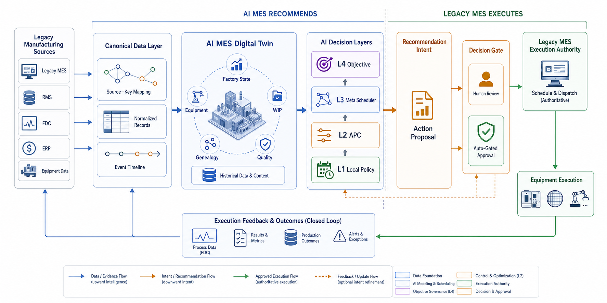
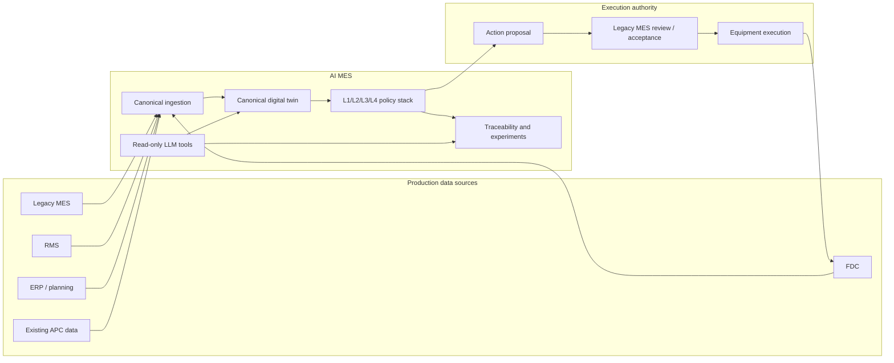
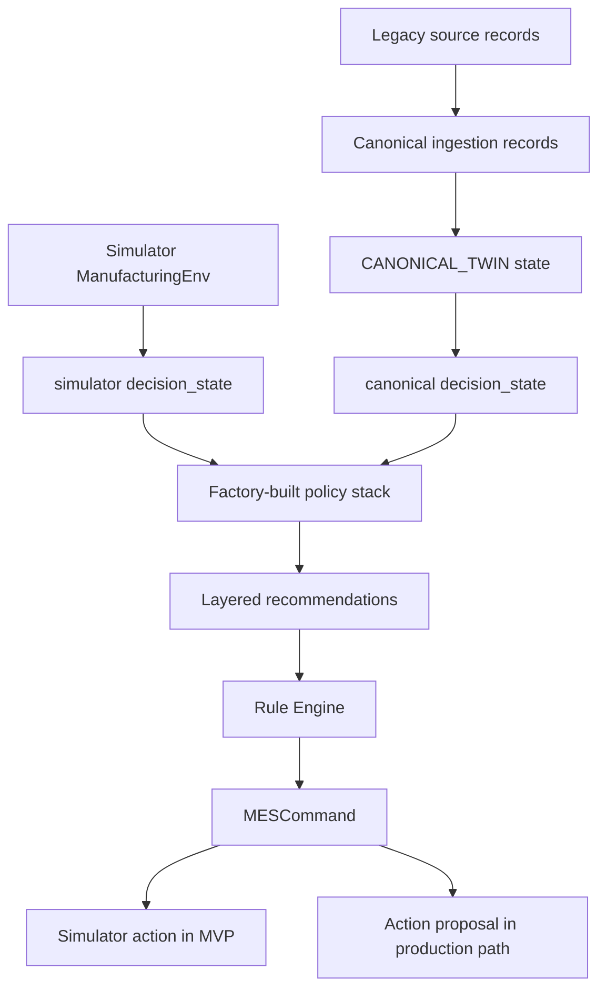
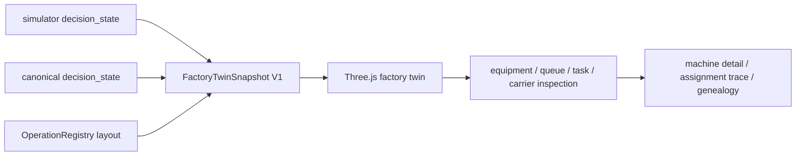
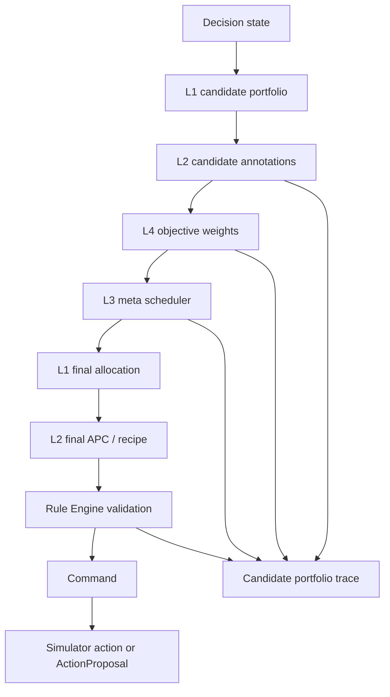
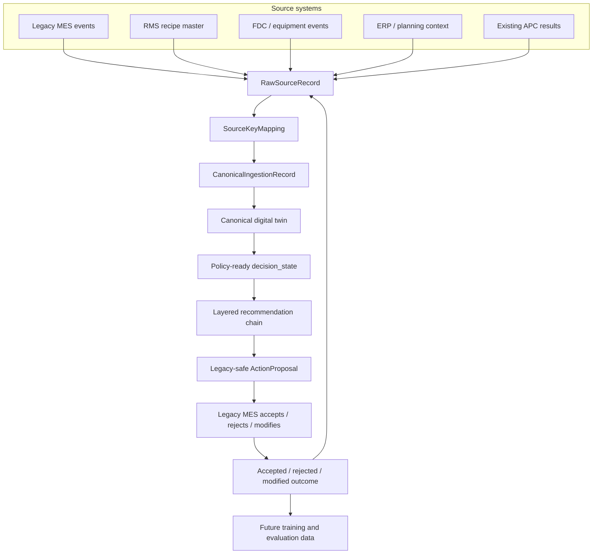
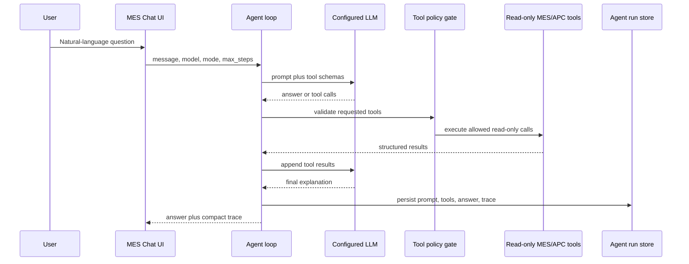

# AI MES Architecture Flow Guide

Status: canonical onboarding guide
Last updated: 2026-07-17

## Reader

Primary reader: anyone encountering the AI MES docs for the first time,
including readers without MES, APC, semiconductor dispatch, or codebase
context.

Use this as the first-read architecture guide. It explains the system boundary,
the A/B/C simulator example, the L1/L2/L3/L4 decision model, and how the
simulator path transitions toward a legacy-safe production path.

Read after: [00_INDEX.md](00_INDEX.md).

## Purpose

This guide is the first document to read when the reader does not already know
MES, APC, semiconductor dispatching, or the current codebase.

It explains the system with concrete A/B/C examples first, then points to the
more detailed specification documents.

The one-sentence product definition:

```text
AI MES is a recommendation, traceability, and experiment layer that turns
manufacturing state into explainable L1/L2/L3/L4 action proposals without
directly controlling production equipment.
```



The image above shows the production integration principle: AI MES standardizes
legacy manufacturing evidence, reconstructs a digital twin, generates
recommendation intent, and sends an action proposal through human review or an
auto-gated approval path. The legacy MES remains the execution authority.

## Four Core Principles

Keep these four rules in mind while reading the rest of the document:

1. AI MES recommends; the legacy MES remains the execution authority.
2. Source data is normalized into an AI MES standard representation before
   policies read it.
3. L1/L2 are local per-process intelligence layers.
4. L3/L4 coordinate cross-process priorities and system objectives.

## Why Layered Manufacturing Decisions Matter

AI MES is not being designed because the factory needs "one better scheduler."
The target problem is broader: modern manufacturing is becoming a multi-layer
manufacturing decision problem.

In a packing process, if `n` units are waiting, the feasible pack combinations
can grow combinatorially. That alone is already difficult. The real plant
problem is harder because the locally best combination may not be the safest or
most valuable manufacturing decision once the system considers:

- high-mix, low-volume production,
- tighter product and customer specifications,
- frequent product changeovers,
- equipment setup loss and restart uncertainty,
- incomplete DOE or weak recipe confidence for some product/equipment pairs,
- downstream WIP and rework pressure,
- due-date and customer-priority pressure.

This is why a single KPI algorithm often fails in practice. A utilization-first
algorithm may keep equipment busy while increasing quality risk, setup
instability, rework, or downstream blockage. A due-date-first rule may protect
one customer while starving another operation. A local packing optimizer may
choose the best material/color group while ignoring a more urgent fab-level
constraint.

The four-layer structure exists to make those conflicts explicit:

```text
L1: expose feasible local candidates
L2: interpret process/APC quality, recipe, setup, and risk implications
L3: coordinate candidates across operations and WIP pressure
L4: choose system objective weights and governance constraints
```

The goal is not to hide manufacturing complexity inside a larger black-box
scheduler. The goal is to compose a traceable manufacturing decision from
local feasibility, process control, cross-process coordination, and system
governance.

## Basic Manufacturing Terms

| Term | Meaning in this project |
|---|---|
| MES | Manufacturing Execution System. In production, the legacy MES remains the execution authority. |
| Legacy MES | The existing plant system that owns production dispatch, reservations, recipe download, and tool execution. |
| RMS | Recipe Management System. Source of approved recipe definitions and recipe eligibility. |
| FDC | Fault Detection and Classification. Observes equipment/process signals and records execution evidence. |
| APC | Advanced Process Control. Chooses or predicts process settings such as recipes, replacements, and quality risk. |
| ERP / Planning | Business-side demand, due-date, customer priority, and order context. |
| Lot / unit / wafer | The manufacturing item being moved, processed, cleaned, packed, or shipped. |
| Operation | A process step such as A, B, or C in the simulator. Production routes may contain many more operations. |
| Equipment | A tool or machine that can run one or more operations. |
| Recipe | The approved process parameter set used by a tool for an operation. |
| WIP | Work in process. Items currently waiting, running, held, or reworking. |
| Dispatch | Selecting which waiting item or batch should run on which equipment. |
| Candidate | A feasible local action option generated before the final decision. |
| Annotation | L2 process/APC metadata attached to a candidate, such as predicted quality or risk. |
| Action proposal | A legacy-safe recommendation. It is not direct equipment control. |
| Canonical / standard representation | The AI MES internal standard shape that policies, traces, experiments, and LLM tools read after source data is normalized. |
| Digital twin | Canonical reconstructed production state built from source events and master data. |

## Current A/B/C Example

The simulator uses three operations because they are small enough to debug but
still represent the architecture:

| Stage | Display example | Local decision | L2 process context |
|---|---|---|---|
| A | Lithography QA | Pick a batch for process QA equipment | Recipe, consumable replacement, predicted QA |
| B | Wet Clean QA | Pick a batch for cleaning equipment | Cleaning recipe, solution replacement, risk |
| C | Final Packing | Pick a packing batch by material/color/customer grouping | Pack compatibility, batch quality, risk |

The same contracts are intended to work when A/B/C are replaced by real
operation ids from route master data.

## System Boundary

AI MES should not bypass the plant execution systems. It reads state, produces
recommendations, explains decisions, and records traceability.



The production principle is strict:

```text
AI MES recommends. Legacy MES decides whether and how to execute.
```

## Runtime Modes

The project currently supports two state sources:

1. Simulator state, used for MVP development and repeatable tests.
2. Canonical digital twin state, used for production-transition contracts.

Both are converted into the same policy-ready `decision_state` shape.



The same two state sources also feed one spatial projection:



The spatial twin visualizes authoritative state; it does not become another
scheduler or equipment controller. See
[22_FACTORY_SPATIAL_DIGITAL_TWIN.md](22_FACTORY_SPATIAL_DIGITAL_TWIN.md).

This is why the code keeps environment state transitions separate from policies.
Policies should not read simulator internals directly if the same logic must
later run on production data.

## Layered Decision Flow

The core decision model is two-pass.

The first pass asks local layers what is feasible. The second pass lets upper
layers choose which local opportunity best serves the global objective, then
finalizes the action back through the local layers.



The Mermaid flow is the exact logic. The figures below are visual explanations
of the same contract.


Read this diagram from left to right. L1/L2 first create evidence, L4/L3 convert
that evidence into global intent, and the final action is only created after the
intent flows back down through L1/L2 and the Rule Engine.


The A/B/C diagram shows the same idea in the simulator line. A, B, and C each
contain their own L1 and L2 logic. L3 spans the full line because it compares
process-level portfolios and decides which stage should receive priority. L4 is
above the line because it sets the objective weights and governance rules for
the whole system.

Layer responsibilities:

| Layer | Owns | Does not own |
|---|---|---|
| L1 | Local feasible dispatch/packing candidates | Fab-wide business objective |
| L2 | Recipe, APC, quality, replacement, process risk | Final global scheduling priority |
| L3 | Cross-stage and cross-group selection | Inventing task batches that L1 did not expose |
| L4 | Objective weights and governance | Direct equipment assignment |
| Rule Engine | Safety/contract validation | Optimization scoring |

## Concrete Decision Example

Assume C has two packing options:

```text
Alpha pack candidate: local_score=90, due_date_pressure=30
Beta pack candidate:  local_score=100, due_date_pressure=0
```

In a simplified scoring view:

| Candidate | Local score | Due-date pressure | Final upper score |
|---|---:|---:|---:|
| Alpha | 90 | 30 | 120 |
| Beta | 100 | 0 | 100 |

L1 says Beta is locally cleaner. L2 says both are feasible. L4 currently favors
due-date recovery. L3 can therefore choose Alpha because the upper score is
higher after due-date pressure is applied.

The important part is not only the selected action. The system must also show:

- the rejected Beta candidate,
- Beta's higher local score,
- Alpha's due-date reason,
- the final command or action proposal linked to the selection.

That is why Candidate Portfolio, Decision Chain, Assignment Trace, and AI
Developer Console exist.

## Production Data Flow

Production data usually arrives with inconsistent source keys. The AI MES must
convert those records into canonical ids before policy evaluation.



Three times must be kept separate:

| Time | Meaning |
|---|---|
| Event time | When the manufacturing event happened. |
| Ingest time | When AI MES received or stored the source evidence. |
| Decision time | When a policy generated a recommendation from a state snapshot. |

This separation is required for replay, audit, and later learning-based policy
evaluation.

## LLM Agent Tool Flow

The chat system is for process engineers and AI developers. V1 is read-only.
It lets the model inspect MES state and run APC/process prediction tools, but it
does not change recipes or dispatch lots.



## UI Reading Path

Use the UI views in this order when debugging a decision:

| View | Question it answers |
|---|---|
| `/mes#fab` | What is happening in the line right now? |
| `/mes#candidate-portfolio` | What candidates existed and which were selected/rejected? |
| `/mes#assignment-trace` | Why did a specific task end up on a specific equipment row? |
| `/mes#ai-dev` | Which policies, cycles, scores, and experiments produced the decision? |
| `/mes#chat` | Can a process engineer ask read-only APC/MES questions in natural language? |
| `/mes#events` | What audit events were stored? |

## How To Extend From A/B/C To Real Operations

Use A/B/C as the reference pattern:

1. Add operation metadata to the operation registry.
2. Add equipment metadata and display names.
3. Map source system ids into canonical ids with `SourceKeyMapping`.
4. Map raw legacy rows into `CanonicalIngestionRecord`.
5. Ensure the digital twin can produce a policy-ready `decision_state`.
6. Add or configure an L1 local candidate generator for the operation.
7. Add or configure an L2 annotation/APC tool for recipe, risk, or quality.
8. Let L3/L4 consume the same candidate and annotation contracts.
9. Validate final recommendations through the Rule Engine.
10. Emit an ActionProposal instead of directly controlling equipment.
11. Record acceptance/rejection/modification outcomes from the legacy MES.

The expected production expansion point is the data and operation registry
contract, not a rewrite of the L1/L2/L3/L4 architecture.

## Recommended Reading Order

For a non-MES reader:

1. This document.
2. [03_ABC_CANONICAL_SCHEMA_REFERENCE.md](03_ABC_CANONICAL_SCHEMA_REFERENCE.md)
3. [04_LAYERED_AI_DECISION_ARCHITECTURE.md](04_LAYERED_AI_DECISION_ARCHITECTURE.md)
4. [05_RUNTIME_HARNESS_RULE_ENGINE.md](05_RUNTIME_HARNESS_RULE_ENGINE.md)
5. [13_PRODUCTION_DIGITAL_TWIN_BACKBONE.md](13_PRODUCTION_DIGITAL_TWIN_BACKBONE.md)
6. [22_FACTORY_SPATIAL_DIGITAL_TWIN.md](22_FACTORY_SPATIAL_DIGITAL_TWIN.md)

For an AI/policy developer:

1. [04_LAYERED_AI_DECISION_ARCHITECTURE.md](04_LAYERED_AI_DECISION_ARCHITECTURE.md)
2. [03_ABC_CANONICAL_SCHEMA_REFERENCE.md](03_ABC_CANONICAL_SCHEMA_REFERENCE.md)
3. [09_PROCESS_APC_MCP_AGENT.md](09_PROCESS_APC_MCP_AGENT.md)
4. [07_API_CONTRACTS.md](07_API_CONTRACTS.md)

For a production integration engineer:

1. [10_OPERATION_REGISTRY_ACTION_PROPOSAL.md](10_OPERATION_REGISTRY_ACTION_PROPOSAL.md)
2. [11_LEGACY_SOURCE_KEY_MAPPING.md](11_LEGACY_SOURCE_KEY_MAPPING.md)
3. [12_LEGACY_INGESTION_CONTRACT.md](12_LEGACY_INGESTION_CONTRACT.md)
4. [13_PRODUCTION_DIGITAL_TWIN_BACKBONE.md](13_PRODUCTION_DIGITAL_TWIN_BACKBONE.md)
5. [22_FACTORY_SPATIAL_DIGITAL_TWIN.md](22_FACTORY_SPATIAL_DIGITAL_TWIN.md)

## Current Maturity

Implemented:

- Simulator-backed MES control room.
- A/B/C L1/L2 policy tools and L3/L4 policy stack.
- Candidate portfolio, assignment trace, AI Developer Console, experiments.
- Read-only MES/APC chat agent with Continue-style model config.
- Operation registry, source key mapping, ingestion, canonical twin preview.
- Action proposal boundary with `direct_equipment_control=false`.
- Factory Spatial Digital Twin with Three.js equipment/queue/OHT/warehouse
  rendering, simulator live stream, and canonical replay.

Not implemented:

- Production action-proposal submission and approval integration.
- Legacy MES acceptance/rejection/modification outcome ingestion.
- Production reservation locks and operator approval workflows.
- Normalized PostgreSQL production schema.
- Learning-based policy training and deployment.
- Primary event-sourced digital twin replacing simulator state.
