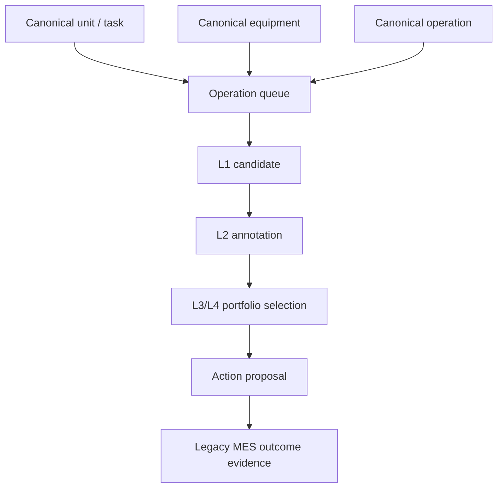
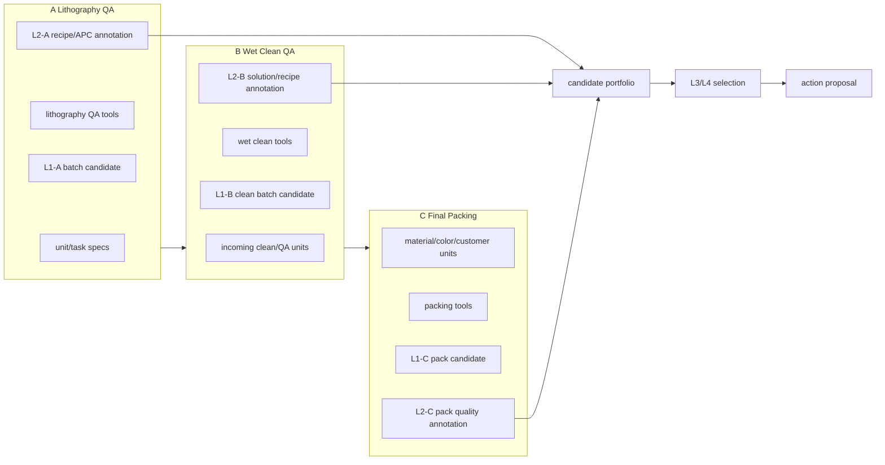

# A/B/C Canonical Schema Reference V1

Status: implemented reference contract
Last updated: 2026-05-31

## Reader

Primary reader: policy developers, data engineers, and LLM tool developers who
need a concrete A/B/C example before generalizing to real operations.

Use this when defining state fields, candidate rows, APC annotations, tool
inputs, and action proposal payloads for a new process.

Read after: [01_ARCHITECTURE_FLOW_GUIDE.md](01_ARCHITECTURE_FLOW_GUIDE.md) and
before [04_LAYERED_AI_DECISION_ARCHITECTURE.md](04_LAYERED_AI_DECISION_ARCHITECTURE.md).

## Purpose

This document defines the concrete schema reference for the current simulator
line:

```text
A: Lithography QA / Process QA
B: Wet Clean QA / Clean QA
C: Final Packing
```

Here, "canonical" means the AI MES internal standard shape. Legacy source names
and simulator object names can differ, but policy code, traces, APIs, and LLM
tools should read this normalized shape.

The runtime also exposes the broader production schema contract through:

```http
GET /api/v2/production/schema
GET /api/v2/production/data-quality
```

Use this document for the A/B/C example shape. Use the API contract when
checking the current implementation's production data surfaces and diagnostics.

The goal is not to freeze production to A/B/C. The goal is to make A/B/C a
complete example that future real operations can copy:

```text
new operation
-> operation registry row
-> equipment rows
-> task/unit attributes
-> L1 candidate contract
-> L2 annotation contract
-> L3/L4 portfolio selection
-> action proposal
```

## Schema Flow



The A/B/C examples below should be read as the minimum production schema shape:
unit attributes, equipment capabilities, operation metadata, candidate rows,
process annotations, and the final proposal link. New operations should add
operation-specific fields without changing the common candidate/annotation
contract.

This schema exists because the AI MES must compare manufacturing decisions, not
just schedule jobs. The same candidate row has to carry enough information for
L1 to describe local feasibility, L2 to describe process/APC implications, and
L3/L4 to compare competing business and flow objectives. Without this shared
shape, each process would optimize locally and the system could not explain why
a lower local score was still the correct manufacturing decision.

## A/B/C Contract Map



The common contract is the portfolio row. A, B, and C may use different local
features, but every process must expose candidates and annotations in a shape
that L3/L4 can compare.

## Canonical Unit / Task

Current simulator tasks map to production wafers/units.

```json
{
  "task_uid": 701,
  "lot_id": "LOT_ALPHA_001",
  "unit_id": "WAFER_701",
  "job_id": "JOB_ALPHA",
  "customer_id": "ALPHA",
  "product_id": "P_ALPHA",
  "operation_id": "A",
  "task_type": "new",
  "due_date": 40,
  "arrival_time": 0,
  "rework_count": 0,
  "spec_a": [48.0, 53.0],
  "spec_b": [20.0, 80.0],
  "material_type": "plastic",
  "color": "red",
  "margin_value": 0.5,
  "source_keys": {
    "LEGACY_MES.WIP_UNIT": "WAFER_701",
    "ERP.ORDER": "ORDER_ALPHA_001"
  }
}
```

Required fields for policy input:

| Field | Type | A | B | C | Notes |
|---|---|---:|---:|---:|---|
| `task_uid` | integer | yes | yes | yes | Stable policy key inside one digital-twin state |
| `lot_id` | string | yes | yes | yes | Production grouping key |
| `unit_id` | string | yes | yes | yes | Legacy wafer/unit key |
| `operation_id` | string | yes | yes | yes | Current operation, currently `A/B/C` |
| `due_date` | integer | yes | yes | yes | Used by L3/L4 urgency |
| `arrival_time` | integer | yes | yes | yes | Used by local wait/queue features |
| `spec_a` | number[2] | yes | optional | optional | A QA target window |
| `spec_b` | number[2] | optional | yes | optional | B QA target window |
| `material_type` | string | optional | optional | yes | C grouping quality |
| `color` | string | optional | optional | yes | C grouping quality |
| `customer_id` | string | yes | yes | yes | L3/L4 group and business priority |
| `margin_value` | number | yes | yes | yes | Business score proxy |

## Canonical Equipment

```json
{
  "equipment_id": "A_0",
  "display_name": "LITHO-01",
  "operation_id": "A",
  "equipment_group_id": "LITHO_QA",
  "status": "idle",
  "batch_size": 3,
  "process_time": 20,
  "finish_time": -1,
  "current_batch_uids": [],
  "capabilities": {
    "operation_ids": ["A"],
    "batching": true
  },
  "process_state": {
    "u": 6,
    "m_age": 12
  }
}
```

A-specific equipment state:

```json
{"u": 6, "m_age": 12}
```

B-specific equipment state:

```json
{"v": 3, "b_age": 8}
```

C-specific equipment state:

```json
{"current_batch_uids": [], "finish_time": -1}
```

## Canonical Operation

```json
{
  "operation_id": "C",
  "display_name": "Final Packing",
  "operation_type": "packing",
  "upstream_operation_ids": ["B"],
  "downstream_operation_ids": [],
  "default_l1_policy": "packing_C",
  "default_l2_policy": "packing_quality_rule",
  "equipment_group_id": "PACK"
}
```

Current A/B/C defaults:

| Operation | L1 role | L2 role | Current baseline |
|---|---|---|---|
| A | Dispatch batch to QA/process equipment | APC recipe and QA risk | FIFO + rule-based A tuner |
| B | Dispatch clean batch to cleaner | Cleaning recipe and solution risk | FIFO + rule-based B tuner |
| C | Select packing batch | Material/color pack quality | FIFO/grouped packing + rule quality annotation |

## L1 Candidate Contract

L1 creates local feasible candidates. L1 does not decide global priority.

```json
{
  "candidate_id": "CAND_C_ALPHA_PLASTIC_PLASTIC_C_0_001_401_402_403_404",
  "operation_id": "C",
  "stage": "C",
  "candidate_type": "PACK",
  "equipment_id": "C_0",
  "task_uids": [401, 402, 403, 404],
  "group_key": {
    "customer_id": "ALPHA",
    "product_id": "plastic",
    "material_type": "plastic",
    "operation_id": "C",
    "task_type": "pack"
  },
  "local_score": 85.0,
  "local_rank": 1,
  "features": {
    "avg_quality": 50.0,
    "compatibility": 1.0,
    "avg_wait_time": 0.0,
    "min_due_date": 60,
    "due_date_pressure": 0.0,
    "margin_value": 0.5,
    "batch_size": 4,
    "local_score": 85.0
  },
  "rule_precheck_status": "ELIGIBLE",
  "policy_source": {
    "factory": "build_mes_policy_stack",
    "l1_policy_id": "L1_FIFO_BASELINE",
    "scheduler": "fifo"
  }
}
```

## L2 Annotation Contract

L2 attaches process implication to a candidate. L2 does not mutate the MES.

A annotation:

```json
{
  "candidate_id": "CAND_A_...",
  "stage": "A",
  "recipe_id": "SIM_A_BASE",
  "recipe": [10.0, 2.0, 1.0],
  "parameters": {"temp": 10.0, "flow": 2.0, "duration": 1.0},
  "replace_consumable": false,
  "predicted_qa": 50.5,
  "target_spec": {"low": 48.0, "high": 53.0, "target": 50.5},
  "quality_risk": "LOW",
  "apc_mode": "L2_PRESELECT_ANNOTATION"
}
```

B annotation:

```json
{
  "candidate_id": "CAND_B_...",
  "stage": "B",
  "recipe_id": "SIM_B_DEFAULT",
  "recipe": [50.0, 50.0, 30.0],
  "parameters": {"chem_a": 50.0, "chem_b": 50.0, "time": 30.0},
  "replace_solution": false,
  "predicted_risk": "LOW",
  "quality_risk": "LOW",
  "apc_mode": "L2_PRESELECT_ANNOTATION"
}
```

C annotation:

```json
{
  "candidate_id": "CAND_C_...",
  "stage": "C",
  "recipe_id": "SIM_C_NO_RECIPE",
  "pack_quality_prediction": 50.0,
  "compatibility": 1.0,
  "pack_mode": "STANDARD",
  "quality_risk": "LOW",
  "apc_mode": "L2_PRESELECT_ANNOTATION"
}
```

## LLM Tool Reference

The MES chat agent exposes the A/B/C reference contracts as read-only tools.

L1 tools:

```text
generate_process_a_l1_candidates
generate_process_b_l1_candidates
generate_process_c_l1_candidates
```

L2 tools:

```text
annotate_process_a_l2_apc
annotate_process_b_l2_apc
annotate_process_c_l2_pack_quality
```

All six tools run against the current MES decision state, return `layer`,
`operation_id`, `policy_id`, `decision_time`, diagnostics, and candidate or
annotation rows. They do not apply recipes, dispatch equipment, or write
records.

Example natural-language flow:

```text
User: C packing에서 현재 어떤 조합이 좋은지 설명해줘.
Agent:
  1. get_fab_snapshot
  2. generate_process_c_l1_candidates
  3. annotate_process_c_l2_pack_quality
  4. answer with material/color compatibility and quality risk
```

## Extension Rule For New Operations

To add a real operation later:

1. Add an operation registry row.
2. Add equipment rows and display names.
3. Define required unit attributes.
4. Implement or configure the operation's L1 candidate generator.
5. Implement or configure the operation's L2 annotation/tool.
6. Add the operation to L3/L4 portfolio scoring.
7. Add source-key mapping and ingestion adapter coverage.
8. Add tool tests and trace tests before connecting real data.
