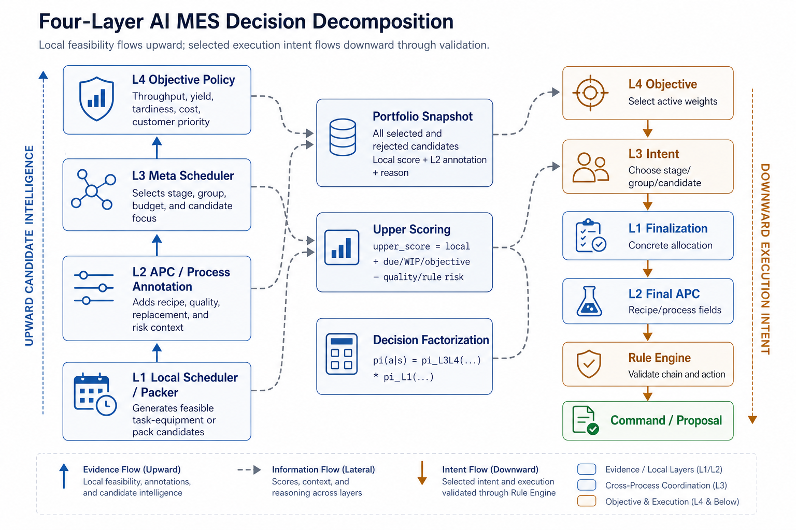
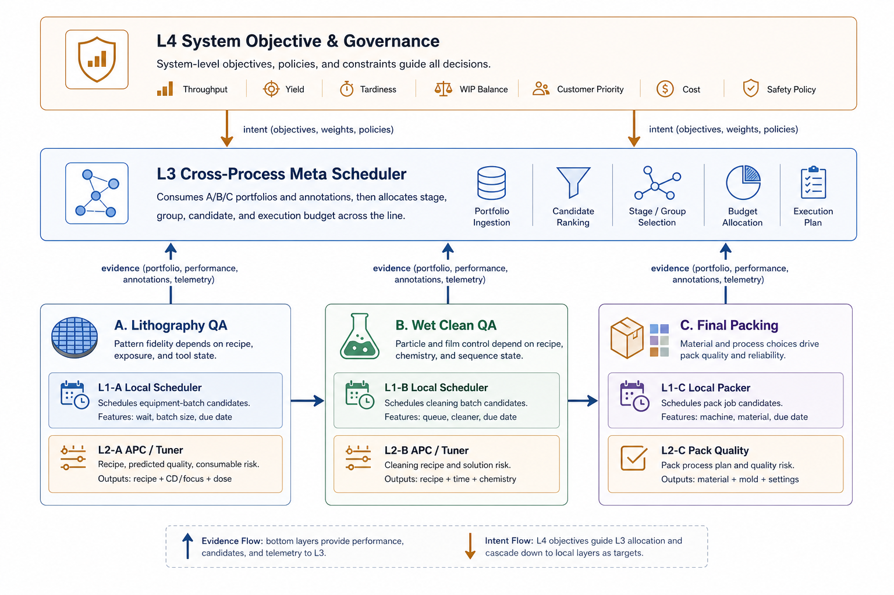
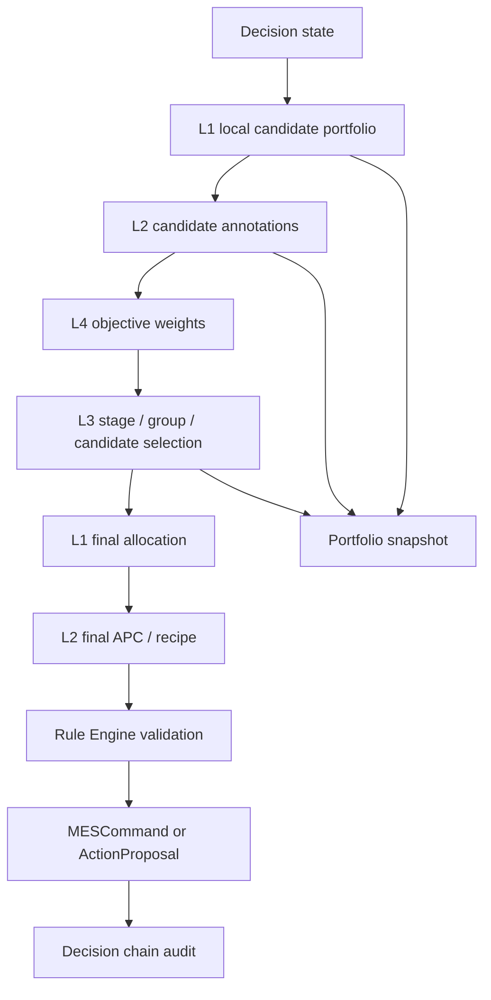

# Layered AI Decision Architecture

Status: canonical
Last updated: 2026-05-31

## Reader

Primary reader: AI policy developers and backend developers implementing or
reviewing L1/L2/L3/L4 behavior.

Use this when deciding which layer owns a decision, what each layer may output,
and how candidate evidence flows upward before execution intent flows downward.

Read after: [03_ABC_CANONICAL_SCHEMA_REFERENCE.md](03_ABC_CANONICAL_SCHEMA_REFERENCE.md).

## Core Decision Model

The AI MES uses four decision layers, but the information flow is not only
top-down. Local layers first expose what is feasible. Upper layers then choose
which local opportunity best matches fab-wide goals.

```text
Candidate intelligence flows upward:
L1 local candidates -> L2 process annotations -> L3 flow selection -> L4 objective

Execution intent flows downward:
L4 objective -> L3 selected group/stage -> L1 final allocation -> L2 final APC
  -> Rule Engine -> Command
```

This is the central design. Any implementation that makes L3 or L4 directly
choose task lists without L1 candidate support is crossing layer boundaries.

## Why This Is A Manufacturing Decision Problem

The target problem is not "find the best scheduler." The target problem is
"compose a safe manufacturing decision from conflicting local, process,
cross-stage, and business objectives."

Modern semiconductor-style operations are moving toward tighter specifications,
more product variants, smaller lots, and more frequent product changeovers.
Those conditions reduce the slack that older manual rules or single-objective
dispatch algorithms relied on. A rule that only maximizes utilization can
increase setup instability or quality risk. A rule that only minimizes lateness
can starve downstream WIP balance. A local packer can choose the best local
material/color combination while ignoring customer priority or rework pressure.

The layer split is the control mechanism for those tradeoffs:

- L1 should say what is locally feasible and locally attractive.
- L2 should say what recipe, equipment setup, DOE confidence, quality, and APC
  risk attach to each feasible option.
- L3 should compare those options across operations and decide which process,
  group, or candidate should receive execution focus now.
- L4 should set the current system objective and governance weights, such as
  throughput, yield, tardiness, WIP balance, customer priority, cost, and safety.

This structure preserves disagreement instead of flattening it. If L1 says Beta
is locally better but L3/L4 choose Alpha because Alpha has higher due-date or
customer-priority pressure, the system can show both truths and explain the
final decision.



The figure above is the decision philosophy in paper-diagram form. The left
side is evidence generation: L1 exposes feasible local candidates and L2 adds
process/APC implications. The center is the auditable portfolio and upper score
decomposition. The right side is execution intent: L4/L3 choose the objective
and selected focus, then L1/L2 finalize the concrete allocation and process
fields before the Rule Engine can create a command or action proposal.



The second figure maps the same philosophy onto the current A -> B -> C line.
Each process owns its own local L1 and L2 pair:

- A owns batch dispatch plus recipe-sensitive QA/APC.
- B owns cleaning dispatch plus solution/recipe risk.
- C owns packing combination generation plus material/color quality scoring.

L3 is intentionally drawn across A, B, and C because it is not a single-process
scheduler. It compares the local portfolios from every process and selects the
stage, group, candidate, and execution budget that best match the L4 objective.
L4 sits above the line because its role is system objective and governance, not
local scheduling.

## Visual Flow



For non-MES readers:

- `WIP` means work currently waiting, running, held, or reworking.
- `dispatch` means selecting which item or batch should run on which equipment.
- `recipe` means an approved process parameter set.
- `APC` means process-control logic that predicts or selects recipe, quality,
  replacement, or maintenance context.
- `candidate portfolio` means the full set of feasible local actions, including
  rejected actions, not only the final selected action.

## Layer Responsibilities

| Layer | Name | Question | Output |
|---|---|---|---|
| L1 | Local dispatch / packing | What feasible task/equipment or pack combinations exist locally? | Candidate portfolio and final allocation within a selected group |
| L2 | Process dynamics / APC | What recipe, quality, replacement, or maintenance implications attach to each candidate? | Candidate annotations and final process-control fields |
| L3 | Cross-stage meta scheduling | Which stage, customer group, product group, or WIP pressure should be favored now? | Selected group/stage intent, budgets, constraints, and reasons |
| L4 | System objective | Which business/fab objective weights matter now? | Objective id, objective weights, override policy, and governance |

## C Packing Canonical Example

The C packing example is intentionally compact. It shows why layered
manufacturing decisions are necessary before the system expands to many real
operations. Packing looks local, but the candidate space grows quickly and the
right answer depends on product mix, material/color compatibility, setup
stability, due-date pressure, customer priority, and fab-wide WIP state.

For C packing, the final decision is:

```text
pi(a | s)
```

Where:

- `s` is the C wait pool plus relevant fab state,
- `a` is the selected product combination on a selected C machine.

The final policy decomposes into local combination quality and upper-layer
customer/product selection:

```text
pi(a | s)
= pi_L3_L4(a_customer_product | s, L1_candidate_portfolio)
  * pi_L1(a_product_combo | s, a_customer_product)
```

L1 answers: "If the upper layer chooses customer/product group Alpha, what is
the best concrete pack combination for Alpha?"

L3/L4 answer: "Should we choose Alpha, Beta, or another group under WIP, due
date, customer priority, rework pressure, throughput, yield, and business
objectives?"

### Example

```text
L1 candidate portfolio:
  Alpha group:
    candidate A1 local_score=100
    candidate A2 local_score=94

  Beta group:
    candidate B1 local_score=90
    candidate B2 local_score=88

Upper-layer context:
  Alpha due date risk: high
  Beta local score: lower
  C queue age: increasing
  fab objective: due-date recovery

L3/L4 selection:
  select Alpha despite needing to preserve global due-date recovery.

L1 finalization:
  choose Alpha candidate A1.
```

The key is that L1 exposes Alpha and Beta local frontiers. L3/L4 do not invent
the product combination themselves.

## Candidate Portfolio Contract

Every L1 candidate should be a structured action candidate, not just a task list.

```python
{
    "candidate_id": "CAND_C_ALPHA_001",
    "stage": "C",
    "candidate_type": "PACK",
    "group_key": {
        "customer_id": "ALPHA",
        "product_id": "P1",
        "material_type": "plastic"
    },
    "equipment_id": "C_0",
    "task_uids": [101, 104, 109, 112],
    "local_score": 100.0,
    "local_rank": 1,
    "features": {
        "avg_quality": 72.1,
        "compatibility": 0.98,
        "avg_wait_time": 18,
        "min_due_date": 132,
        "margin_value": 0.82
    },
    "reasons": [
        "same_customer",
        "high_compatibility",
        "batch_ready"
    ]
}
```

For A/B, the same shape applies with `candidate_type="DISPATCH"` and fields such
as `operation_id`, `task_type`, and `batch_size`.

## L2 Annotation Contract

L2 attaches process-control information to each candidate or to the selected
candidate.

For A:

```python
{
    "candidate_id": "CAND_A_001",
    "recipe_id": "SIM_A_BASE",
    "recipe": [10.0, 2.0, 1.0],
    "parameters": {"temp": 10.0, "flow": 2.0, "duration": 1.0},
    "replace_consumable": False,
    "predicted_qa": 49.8,
    "target_spec": {"low": 47.1, "high": 52.9},
    "apc_mode": "L2_PRESELECT_ANNOTATION",
    "apc_policy": "A_BASE_PRESELECT"
}
```

For B:

```python
{
    "candidate_id": "CAND_B_001",
    "recipe_id": "SIM_B_DEFAULT",
    "recipe": [50.0, 50.0, 30.0],
    "replace_solution": False,
    "predicted_risk": "LOW",
    "apc_mode": "L2_PRESELECT_ANNOTATION"
}
```

For C:

```python
{
    "candidate_id": "CAND_C_ALPHA_001",
    "recipe_id": "SIM_C_NO_RECIPE",
    "recipe": [],
    "pack_quality_prediction": 72.1,
    "compatibility": 0.98,
    "pack_mode": "STANDARD",
    "quality_risk": "LOW",
    "apc_mode": "L2_PRESELECT_ANNOTATION"
}
```

C does not currently have a physical recipe/APC model, but it still needs L2
process annotations for quality, compatibility, packing mode, and future package
recipe constraints.

## L3 Selection Contract

L3 consumes the annotated candidate portfolio and chooses the stage/group focus.

```python
{
    "selected_stage": "C",
    "selected_group_key": {
        "customer_id": "ALPHA",
        "product_id": "P1"
    },
    "stage_priorities": {"A": 0.2, "B": 0.6, "C": 1.0},
    "dispatch_budgets": {"A": 0, "B": 1, "C": 1},
    "constraints": {
        "allow_rework": True,
        "prefer_due_date_recovery": True,
        "max_c_packs": 1
    },
    "score_components": {
        "local_candidate_score": 100.0,
        "due_date_pressure": 24.0,
        "wip_pressure": 11.0,
        "rework_pressure": 0.0
    },
    "reasons": ["due_date_recovery", "c_queue_ready"]
}
```

L3 should not finalize `task_uids` unless the selected candidate has already
been created by L1. It selects from the L1/L2 portfolio.

## L4 Objective Contract

L4 defines the system objective weights and governance mode.

```python
{
    "objective_id": "OBJ_DUE_DATE_RECOVERY",
    "weights": {
        "throughput": 0.8,
        "yield": 1.0,
        "tardiness": 1.4,
        "cost": 0.2,
        "customer_priority": 1.2
    },
    "governance": {
        "requires_rule_validation": True,
        "allow_operator_override": True,
        "max_command_count_per_cycle": 3
    },
    "reasons": ["commit_risk_high", "queue_pressure_normal"]
}
```

L4 should be stable across a planning interval. It does not need to change every
simulator tick unless the system objective changes.

The current L4 baseline is `RuleBasedL4ObjectivePolicy`. It uses due-date
pressure, tardiness, and total wait pressure to choose one of:

- `OBJ_DUE_DATE_RECOVERY`,
- `OBJ_THROUGHPUT_FIRST`,
- `OBJ_RULE_ONLY_BALANCED`.

The current L3 baseline is `CandidatePortfolioL3MetaSchedulerPolicy`. It scores
annotated L1 candidates using local candidate score, due-date pressure,
objective weights, WIP/rework pressure, and selected stage constraints. It
returns selected stage, selected candidate ids, selected group key, stage
priorities, dispatch budgets, budget candidate ids, score components, and
constraints.

## Recommendation Chain

The audit chain remains:

```text
L4 OBJECTIVE
  -> L3 STAGE_PRIORITY / GROUP_SELECTION
  -> L1 DISPATCH or PACK
  -> L2 RECIPE / APC / PROCESS_ANNOTATION
  -> RULE_VALIDATION
  -> COMMAND
```

Current implementation status:

```text
Implemented MES path:
  L1 portfolio -> L2 annotations -> L4 objective policy -> L3 meta policy
    -> L1 finalizes candidate -> L2 finalizes process fields -> validation
```

`src/agents/factory.py` builds a `MESPolicyStack` with L1, L2, L3, and L4
policy slots. The default L3 policy is `L3_CANDIDATE_PORTFOLIO_RULE`, and the
default L4 policy is `L4_CYCLE_WEIGHT_RULE`. `MESPlannerAgent` lives in
`src/mes/harnessing/planner.py` and remains the audit orchestrator for plan
creation, but it delegates objective selection and meta scheduling to those
policy objects.

Current active config keys:

| Layer | Config key | Accepted current values | Default |
|---|---|---|---|
| L1 A | `scheduler_A` | `fifo`, `adaptive`, `rl` | `fifo` |
| L1 B | `scheduler_B` | `fifo`, `rule-based`, `rl` | `fifo` |
| L1 C | `packing_C` | `fifo`, `random`, `greedy` | `fifo` |
| C candidate mode | `mes_l1_C` | `fifo`, `random`, `greedy`, `grouped` | `packing_C` |
| L2 A | `tuner_A` | `fifo`, `rule-based`, `adaptive`, `rl` | `rule-based` |
| L2 B | `tuner_B` | `fifo`, `rule-based`, `rl` | `rule-based` |
| L3 | `meta_scheduler_L3` | `candidate-portfolio-rule`, `rule-based`, `default` | `candidate-portfolio-rule` |
| L4 | `objective_policy_L4` | `cycle-weight-rule`, `rule-based`, `default` | `cycle-weight-rule` |

## Layer Boundary Rules

- L1 owns concrete task/equipment or pack-combination feasibility.
- L2 owns recipe/APC/process-control fields and predicted quality risk.
- L3 owns cross-stage, customer/product group, WIP, rework, and due-date tradeoff.
- L4 owns objective weights and governance.
- Rule Engine owns final executability.
- Environment owns physics and state transitions.
