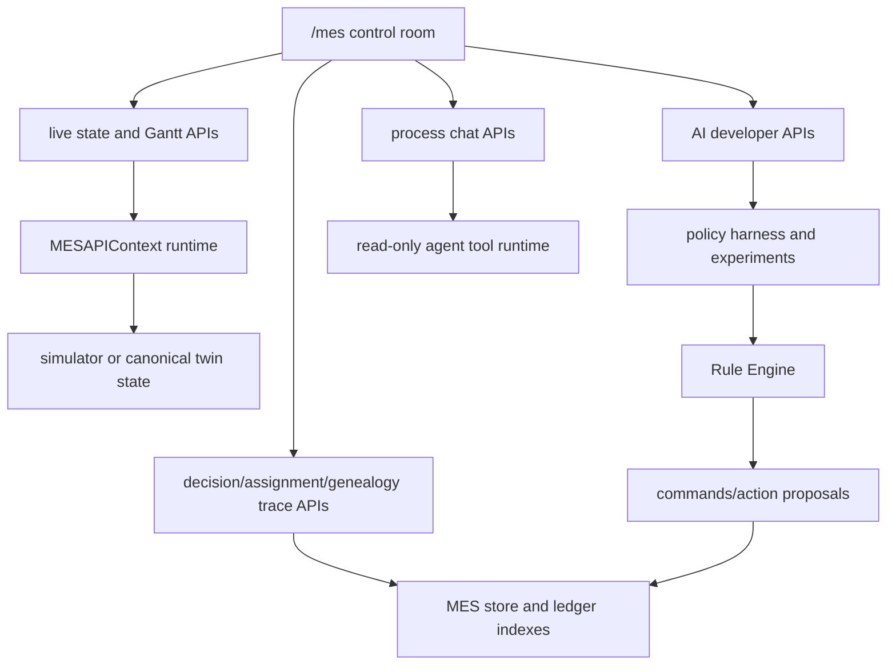

# API Contracts

Status: canonical
Last updated: 2026-06-12

## Reader

Primary reader: API developers, UI developers, and integration engineers who
need stable request/response contracts.

Use this when adding an endpoint, changing a payload, wiring a UI panel, or
building an external integration against the simulator-backed MES.

Read after: [05_RUNTIME_HARNESS_RULE_ENGINE.md](05_RUNTIME_HARNESS_RULE_ENGINE.md).

## Purpose

This document defines the simulator-backed MES API surface and the target API
contracts needed for the layered AI architecture.

The FastAPI app wiring lives in `src/mes/api.py`. Feature-specific route
declarations live in small router modules under `src/mes/runtime/*_api.py` and
delegate runtime behavior to `src/mes/runtime/*`.

## API Surface Map



The API is organized by user question rather than by internal class. Control
room endpoints answer "what is happening now", trace endpoints answer "why did
this happen", AI developer endpoints answer "which policy/candidate caused it",
and production endpoints answer "what proposal or source record crossed the
legacy boundary".

| Runtime concern | Module |
|---|---|
| app shell and health | `src/mes/runtime/app_shell_api.py` |
| v1 compatibility routes | `src/mes/runtime/v1_api.py` |
| v2 simulator control and live state routes | `src/mes/runtime/control_api.py` |
| lifecycle/reset | `src/mes/runtime/context.py` |
| run-cycle/run-until/autoplay/generate lot | `src/mes/runtime/simulation_control.py` |
| live control-room state | `src/mes/runtime/live_state.py` |
| decision-chain and portfolio traceability routes | `src/mes/runtime/trace_api.py`, `src/mes/runtime/decision_trace.py`, `src/mes/runtime/candidate_portfolio.py` |
| assignment and genealogy traceability | `src/mes/runtime/assignment_trace.py`, `src/mes/runtime/genealogy.py` |
| AI developer console routes | `src/mes/runtime/ai_dev_api.py`, `src/mes/runtime/ai_dev.py`, `src/mes/runtime/experiments.py` |
| operation registry and action proposal routes | `src/mes/runtime/production_boundary_api.py`, `src/mes/runtime/operations.py`, `src/mes/operations/registry.py` |
| run and ledger index routes | `src/mes/runtime/run_ledger_api.py`, `src/mes/runtime/run_ledger.py` |
| equipment detail | `src/mes/runtime/equipment_detail.py` |
| equipment agent telemetry | `src/mes/runtime/equipment_telemetry.py` |
| Gantt state | `src/mes/runtime/gantt.py` |

## Current Read APIs

| Endpoint | Purpose |
|---|---|
| `GET /health` | Service health |
| `GET /api/v1/decision-state` | Raw simulator decision state |
| `GET /api/v1/kpis/fab` | Fab KPI summary |
| `GET /api/v1/wip` | WIP by stage |
| `GET /api/v1/equipment` | Equipment list |
| `GET /api/v1/lots` | Lot list from store-backed runtime snapshot |
| `GET /api/v1/wafers` | Wafer list, optional `lot_id` filter |
| `GET /api/v1/recipes` | Recipe list, optional `operation_id` filter |
| `GET /api/v1/dispatch/candidates?stage=A` | L1 policy-stack dispatch candidates |
| `GET /api/v1/ai/recommendations` | Recommendation records, optional `correlation_id` |
| `GET /api/v1/events` | Event records, optional `correlation_id` |
| `GET /api/v1/commands` | Command records, optional `correlation_id` |
| `GET /api/v2/decision-chain/{correlation_id}` | Aggregated chain details |
| `GET /api/v2/candidate-portfolio/latest` | Latest actionable selected/rejected portfolio workbench payload |
| `GET /api/v2/candidate-portfolio/{correlation_id}` | Portfolio snapshot for one decision correlation |
| `GET /api/v2/ai-dev/policy-stack` | Active L1/L2/L3/L4 policy stack and config |
| `GET /api/v2/ai-dev/decision-cycles` | Correlation-level AI decision cycle browser |
| `GET /api/v2/ai-dev/candidate-portfolio/{correlation_id}` | Developer portfolio payload with score/L2 details |
| `GET /api/v2/ai-dev/decision-dataset` | Learning/evaluation-ready decision rows across portfolio, command, proposal, workflow, and outcome evidence |
| `GET /api/v2/ai-dev/policy-evaluation-summary` | Policy platform summary over decisions, validation statuses, workflow states, experiments, and learning-ready rows |
| `GET /api/v2/equipment/{equipment_id}/detail` | A/B/C machine quality and packing detail data |
| `GET /api/v2/gantt` | Gantt rows, bars, stage views, and horizon |
| `GET /api/v2/fab/live` | Live control-room state |
| `GET /api/v2/runs` | Current and historical local simulator run/session index |
| `GET /api/v2/operations` | Operation and equipment registry for simulator and future production process mapping |
| `GET /api/v2/operations/route-graph` | Operation route graph with downstream edges and capable equipment |
| `GET /api/v2/production-readiness` | Deployment-boundary readiness and persistence diagnostics |
| `GET /api/v2/production/schema` | Canonical production data schema contract and current persistence/index introspection |
| `GET /api/v2/production/data-quality` | Raw/canonical/source-key data quality diagnostics for the active production-shaped run |
| `GET /api/v2/action-proposals` | Legacy-safe action proposals derived from validated MES commands |
| `GET /api/v2/action-proposals/{proposal_id}/legacy-decisions` | Legacy MES accept/modify/reject decision records for one proposal |
| `GET /api/v2/action-proposals/{proposal_id}/outcomes` | Execution/quality outcome records for one proposal |
| `GET /api/v2/action-proposals/{proposal_id}/lifecycle` | Combined lifecycle summary, legacy decisions, and outcomes for one proposal |
| `GET /api/v2/action-proposals/approval-queue` | Review queue with approval-gated workflow state for generated action proposals |
| `GET /api/v2/action-proposals/{proposal_id}/workflow` | Safe workflow state for one action proposal |
| `GET /api/v2/action-proposals/{proposal_id}/feedback-summary` | Proposed-vs-actual feedback summary for policy evaluation |
| `GET /api/v2/legacy-adapters` | Source-specific row adapter catalog |
| `GET /api/v2/source-key-mappings` | Legacy source-system key to canonical AI MES id mappings |
| `GET /api/v2/source-key-mappings/resolve` | Resolve one source-system key to a canonical AI MES id |
| `GET /api/v2/ingestion/source-records` | Raw legacy source rows/events preserved as ingestion evidence |
| `GET /api/v2/ingestion/canonical-records` | Canonical AI MES projections created from ingested source records |
| `GET /api/v2/ledger-index/{index_name}` | Run-scoped normalized SQLite index rows |
| `GET /api/v2/genealogy/task/{task_uid}` | Run-scoped task/wafer lineage with assignments, command links, and simulator events |
| `GET /api/v2/genealogy/equipment/{equipment_id}` | Run-scoped equipment command and process timeline |
| `GET /api/v2/genealogy/lot/{lot_id}` | Run-scoped lot-level task and command rollout |
| `GET /api/v2/genealogy/canonical/{entity_type}/{canonical_id}` | Canonical twin entity genealogy with raw source evidence and replay timeline |
| `GET /api/v2/execution-ledger/{correlation_id}` | Run-scoped command, rule, simulator-action, and post-state ledger |
| `GET /api/v2/digital-twin/state-at?time=0` | Run-scoped replayable decision-state snapshot at or before time |
| `GET /api/v2/digital-twin/canonical-state` | Event-sourced production twin state replayed from canonical ingestion records |
| `GET /api/v2/digital-twin/canonical-decision-state` | Policy-ready decision state built from the canonical twin |
| `GET /api/v2/digital-twin/candidate-preview` | L1 candidate preview generated from canonical twin decision state |
| `GET /api/v2/process-tools/catalog` | Read-only process model tool catalog for LLM/MCP callers |
| `GET /api/v2/process-chat/models` | Continue-style chat model catalog for process chat |
| `GET /api/v2/agent-runs` | Recent Agent Mode and local fallback run records |
| `GET /api/v2/agent-runs/{agent_run_id}` | Agent run detail with metadata, tool calls, and step trace |

## Current Mutation APIs

| Endpoint | Purpose |
|---|---|
| `POST /api/v1/harness/run` | Preview one stage, or execute L3-budget AUTO |
| `POST /api/v1/rules/validate` | Validate recommendation payloads |
| `POST /api/v1/commands/track-in/preview` | Preview track-in command |
| `POST /api/v1/commands/track-in/execute` | Execute validated command |
| `POST /api/v2/tasks/generate` | Generate simulator tasks |
| `POST /api/v2/harness/run-cycle` | Run and execute one cycle |
| `POST /api/v2/harness/run-until` | Run cycles until stop condition |
| `POST /api/v2/simulation/reset` | Reset simulator runtime and start a new run_id while preserving prior audit/ledger history |
| `POST /api/v2/simulation/autoplay/start` | Enable autoplay |
| `POST /api/v2/simulation/autoplay/stop` | Disable autoplay |
| `GET /api/v2/simulation/autoplay/status` | Poll autoplay and optionally step |
| `POST /api/v2/process-tools/{tool_id}/run` | Read-only process model inference with structured input |
| `POST /api/v2/process-chat` | Process-engineer chat over read-only process tools with LLM/fallback mode |
| `POST /api/v2/legacy-adapters/{adapter_id}/ingest` | Adapt one source-specific row and ingest it through the canonical contract |
| `POST /api/v2/action-proposals/{proposal_id}/reviews` | Record operator/process-engineer review before legacy submission |
| `POST /api/v2/action-proposals/{proposal_id}/legacy-decisions` | Record the legacy MES decision for an AI proposal |
| `POST /api/v2/action-proposals/{proposal_id}/outcomes` | Record actual execution/quality evidence for an AI proposal |
| `POST /api/v2/source-key-mappings` | Upsert one legacy source-key mapping |
| `POST /api/v2/ingestion/source-records` | Store one raw source record and optional canonical projection |
| `POST /api/v2/digital-twin/recommendation-run` | Run L4/L3/L1/L2/Rule Engine against canonical twin state and return an ActionProposal |
| `POST /api/v2/ai-dev/scenarios/capture-canonical` | Capture a canonical twin scenario for policy experiments |

## Current V2 Payload Summary

`POST /api/v2/harness/run-cycle` with `target_stage="AUTO"` returns an L3
budget-driven execution payload:

```python
{
    "mode": "AUTO",
    "selection_source": "l3_budget_plan",
    "budget_plan": {
        "selected_candidate_ids": ["CAND_..."],
        "dispatch_budgets": {"A": 5, "B": 0, "C": 0},
        "budget_candidate_ids": {"A": ["CAND_..."], "B": [], "C": []}
    },
    "combined_actions": {"A": {...}, "B": {}, "C": {}},
    "cycles": [...]
}
```

`GET /api/v2/decision-chain/{correlation_id}` returns the persisted audit chain
and a `traceability` block with L4/L3 policy ids, selected candidates, final
L1/L2 actions, validated command, and `portfolio_summary`.

`GET /api/v2/candidate-portfolio/latest` and
`GET /api/v2/candidate-portfolio/{correlation_id}` return the workbench-ready
portfolio snapshot. `latest` prefers the latest actionable portfolio over a
newer empty cycle, while still reporting the latest empty correlation and empty
diagnostics.

```python
{
    "correlation_id": "CORR_...",
    "feature_snapshot_id": "FS_...",
    "kind": "ACTIONABLE",
    "is_actionable": True,
    "empty_reason": None,
    "last_actionable_correlation_id": "CORR_...",
    "latest_empty_correlation_id": "CORR_...",
    "diagnostics": {
        "stages": {
            "A": {"queue_size": 12, "idle_machines": 2, "candidate_count": 5}
        }
    },
    "count": 12,
    "summary": {
        "selected_count": 1,
        "rejected_count": 11,
        "stage_counts": {"A": 5, "B": 3, "C": 4},
        "objective_id": "OBJ_DUE_DATE_RECOVERY",
        "l4_policy_id": "L4_CYCLE_WEIGHT_RULE",
        "l3_policy_id": "L3_CANDIDATE_PORTFOLIO_RULE"
    },
    "items": [
        {
            "candidate_id": "CAND_C_ALPHA_001",
            "stage": "C",
            "candidate_type": "PACK",
            "group_key": {"customer_id": "ALPHA"},
            "equipment_id": "C_0",
            "task_uids": [1, 2, 3, 4],
            "local_score": 90.0,
            "upper_score": 124.2,
            "score_components": {
                "local_candidate_score": 90.0,
                "due_date_pressure": 2.0,
                "wip_pressure": 4.0,
                "objective_weight_bonus": 34.2,
                "quality_risk_penalty": 0.0,
                "final_upper_score": 124.2
            },
            "l2_annotation": {"quality_risk": "LOW"},
            "selected": True,
            "budget_selected": True,
            "rejection_reason": None,
            "linked_recommendation_ids": {"L4": "REC_...", "L3": "REC_..."},
            "command_status": "EXECUTED"
        }
    ]
}
```

`GET /api/v2/process-tools/catalog` lists process model tools that are safe for
LLM/MCP use. `POST /api/v2/process-tools/{tool_id}/run` executes one read-only
inference. The first implemented tool is `predict_process_a_apc`, backed by the
Process A rule-based APC model.

`GET /api/v2/production/schema` exposes the production data contract that the
current SQLite MVP must preserve when moved to PostgreSQL.

```python
{
    "schema_version": "canonical-production-data-v1",
    "status": "POSTGRESQL_READY_CONTRACT_DRAFT",
    "storage_target": "postgresql",
    "current_mvp_backend": {
        "backend": "sqlite_json_plus_indexes",
        "schema_version": "legacy_ingestion_v1",
        "tables": {"canonical_ingestion_records": "record_id"},
        "normalized_indexes": ["source_key_mapping_index", "..."]
    },
    "tables": {
        "units": {
            "primary_key": "unit_id",
            "required_fields": ["unit_id", "lot_id", "operation_id", "status"]
        }
    },
    "invariants": [
        "Event time, ingest time, and decision time are stored separately."
    ]
}
```

`GET /api/v2/production/data-quality` checks whether raw records, canonical
records, and source-key mappings are safe enough to build a policy-ready digital
twin.

```python
{
    "schema_version": "canonical-production-data-v1",
    "status": "OK",
    "counts": {
        "raw_records": 3,
        "canonical_records": 3,
        "source_key_mappings": 3,
        "issues": 0
    },
    "coverage": {
        "entity_types": {"UNIT": 2, "EQUIPMENT": 1},
        "operations": [{"operation_id": "A", "canonical_records": 3}]
    },
    "freshness": {
        "latest_event_time": 3,
        "latest_ingest_time": 4,
        "event_lag": 1
    },
    "issues": []
}
```

`GET /api/v2/genealogy/canonical/{entity_type}/{canonical_id}` follows a
canonical entity through replayed canonical records and the raw source evidence
behind those records.

```python
{
    "found": True,
    "entity_type": "UNIT",
    "canonical_id": "WAFER_401",
    "record_count": 2,
    "raw_evidence_count": 2,
    "timeline": [
        {"event_type": "UNIT_WAITING", "operation_id": "A"},
        {"event_type": "QUALITY_MEASURED", "operation_id": "A"}
    ],
    "related_entities": {
        "lot_ids": ["LOT_TRACE_ALPHA"],
        "equipment_ids": [],
        "operation_ids": ["A"]
    }
}
```

`GET /api/v2/ai-dev/decision-dataset` exposes the production-oriented policy
evaluation row set. It does not train a model; it makes the current rule/FIFO
decisions reviewable as future learning data.

```python
{
    "count": 1,
    "items": [
        {
            "correlation_id": "CORR_...",
            "state_source": "CANONICAL_TWIN",
            "objective_id": "OBJ_THROUGHPUT_FIRST",
            "selected_stage": "A",
            "selected_candidate_id": "CAND_...",
            "candidate_count": 1,
            "policy_stack": {
                "l1_policy_id": "L1_FIFO_BASELINE",
                "l2_policy_id": "L2_RULE_BASED_APC",
                "l3_policy_id": "L3_CANDIDATE_PORTFOLIO_RULE",
                "l4_policy_id": "L4_CYCLE_WEIGHT_RULE"
            },
            "validation_status": "PASSED",
            "action_proposal": {"proposal_id": "PROP_CMD_..."},
            "workflow": {"current_status": "PENDING_REVIEW"},
            "learning_label": {
                "has_legacy_decision": False,
                "has_outcome": False,
                "usable_for_policy_evaluation": False
            }
        }
    ]
}
```

`GET /api/v2/action-proposals/{proposal_id}/workflow` and
`POST /api/v2/action-proposals/{proposal_id}/reviews` implement the current
safe proposal gate.

```python
POST /api/v2/action-proposals/PROP_CMD_123/reviews
{
    "review_status": "APPROVED",
    "reviewer": "process_engineer",
    "required_role": "PROCESS_ENGINEER",
    "reason": "safe legacy MES review candidate"
}

{
    "workflow": {
        "current_status": "APPROVED_FOR_LEGACY_SUBMISSION",
        "safe_to_submit_to_legacy": True,
        "direct_equipment_control": False
    }
}
```

```python
POST /api/v2/process-tools/predict_process_a_apc/run
{
    "task_rows": [{"task_uid": "T0", "spec_a": [48.0, 53.0]}],
    "machine_state": {"u": 6, "m_age": 12},
    "recipe": [10.0, 2.0, 1.0],
    "current_time": 120
}

{
    "tool_id": "predict_process_a_apc",
    "stage": "A",
    "model_id": "A_RULE_BASED_APC_PREDICTOR",
    "read_only": True,
    "recipe": [10.0, 2.0, 1.0],
    "predicted_qa": 49.6646,
    "quality_risk": "LOW",
    "replace_consumable": True
}
```

`POST /api/v2/process-chat` accepts a natural-language process/MES question and
returns a chat answer plus any tool calls used. `use_llm=true` attempts the local
Continue-inspired runtime first and falls back to the local A APC parser/tool
when the model is unavailable. `use_llm=false` runs the local parser/tool
directly. `mode=agent` runs a multi-step read-only tool loop; `mode=chat` sends
one model request without tool execution. `max_steps` bounds Agent Mode.
`model_name` may select any configured chat model by `name` or `model` id. V1
supports `ollama` and `openai` providers. By default the runtime reads
`config/mes-process-agent.yaml`; `MES_PROCESS_AGENT_CONFIG` can override this
path. The model list is filtered to Continue `chat` role models. Continue
`capabilities` are combined with provider/model autodetection; `tool_use`
controls native tool-schema sending. Models without native `tool_use` use a
system-message JSON tool fallback in Agent Mode.

```python
POST /api/v2/process-chat
{
    "message": "A 공정에서 spec_a 48~53이고 u=6, m_age=12, recipe=[10,2,1]이면 QA가 어떻게 나올까?",
    "use_llm": False,
    "model_name": "Gemma4 Remote",
    "mode": "agent",
    "max_steps": 5
}

{
    "agent_run_id": "ARUN_...",
    "mode": "local_process_tool",
    "status": "completed",
    "answer": "A 공정 APC 예측 결과 predicted_qa=49.6646...",
    "tool_calls": [
        {
            "tool_name": "predict_process_a_apc",
            "status": "executed",
            "policy": "local_process_tool",
            "result": {"stage": "A", "quality_risk": "LOW"}
        }
    ],
    "agent_trace": [],
    "visual_artifacts": []
}
```

Agent Mode may return `mode="llm_agent"`, `status`, `agent_trace`, and multiple
tool calls. The MES API process registers these read-only tools for Agent Mode:
`predict_process_a_apc`, `get_fab_snapshot`, `get_policy_stack`,
`get_candidate_portfolio_latest`, `get_equipment_detail`, and
`get_assignment_trace`, plus the generic equipment analytics tools:

```text
list_equipment_metrics
query_equipment_timeseries
query_equipment_anomalies
```

The visual tools accept canonical equipment ids or configured display names and
cover quality, utilization, throughput, observed alarm, and derived anomaly
evidence across A/B/C equipment. A successful visual query returns one or more
server-validated `visual_artifacts`. Non-read-only or unknown tool calls are rejected with
`status="policy_blocked"` and `policy="excluded"`.

Example artifact excerpt:

```python
{
    "artifact_id": "VIZ_...",
    "artifact_type": "equipment_timeseries",
    "equipment_ids": ["A_0"],
    "metrics": ["quality", "utilization", "throughput"],
    "series": [
        {
            "equipment_id": "A_0",
            "display_name": "LITHO-01",
            "metric": "quality",
            "time": 18,
            "value": 50.4
        }
    ],
    "visualization": {
        "chart_type": "line",
        "x_field": "time",
        "y_field": "value",
        "series_field": "equipment_id",
        "metric_field": "metric",
        "target_bands": [[48.0, 53.0]]
    },
    "provenance": {
        "source": "SIMULATOR",
        "time_basis": "SIMULATION_STEP",
        "requested_range": "15 days",
        "effective_range": "last 15 simulation periods"
    }
}
```

`GET /api/v2/agent-runs` and `GET /api/v2/agent-runs/{agent_run_id}` expose the
inspection record created by each chat request. In the MES API process these
records are SQLite-backed through the runtime database path, so recent Agent
Mode and local fallback runs survive process restarts. Standalone chat service
usage without a runtime context may still use the in-memory store.

```python
GET /api/v2/agent-runs/{agent_run_id}
{
    "found": True,
    "agent_run_id": "ARUN_...",
    "mes_run_id": "RUN_...",
    "question": "현재 fab 상태와 active policy stack을 보고 병목을 설명해줘",
    "mode": "agent",
    "status": "completed",
    "answer": "A 공정이 병목입니다...",
    "tool_count": 2,
    "step_count": 5,
    "artifact_count": 1,
    "metadata": {
        "model_name": "gemma4:latest",
        "provider": "ollama",
        "max_steps": 5,
        "prompt_id": "MES_AGENT_SYSTEM_PROMPT",
        "prompt_version": "0.1.0",
        "tool_catalog_version": "mes-agent-tools-v1",
        "requested_think": True
    },
    "tool_calls": [
        {"tool_name": "get_fab_snapshot", "status": "executed"}
    ],
    "agent_trace": [
        {"type": "llm_response", "step": 1, "tool_call_count": 1},
        {"type": "tool_call", "step": 1, "tool_name": "get_fab_snapshot"}
    ],
    "visual_artifacts": [{"artifact_id": "VIZ_...", "artifact_type": "equipment_timeseries"}]
}
```

Process and equipment naming is display metadata, not a state/action key
replacement. Live state, Gantt rows, and equipment detail payloads can include:

```python
{
    "stage": "A",
    "label": "Lithography QA",
    "equipment_id": "A_0",
    "display_name": "Lithography Tool 01"
}
```

Canonical ids (`A`, `B`, `C`, `A_0`, `B_0`, `C_0`) remain the values used for
policy decisions, Rule Engine validation, command payloads, and simulator
actions.

### Process Quality Evidence Tool

Agent Mode exposes the read-only tool:

```text
query_process_quality_evidence
```

It accepts operation A/B, an equipment id/display name, a completed task UID,
or a compatible combination:

```json
{
  "operation_id": "B",
  "equipment_id": "CLEAN-01",
  "task_uid": 284
}
```

When `task_uid` is omitted, the latest completed map for the equipment is
returned. When `equipment_id` is omitted, the runtime searches A/B completion
evidence for the task. Process C is not supported because packing quality does
not currently have a spatial provider.

Successful responses include:

```json
{
  "found": true,
  "read_only": true,
  "source": "SIMULATOR",
  "time_basis": "SIMULATION_STEP",
  "operation_id": "B",
  "evidence_type": "SIMULATED_CLEANING_QUALITY",
  "equipment_id": "B_0",
  "display_name": "CLEAN-01",
  "task_uid": 284,
  "completion_time": 24,
  "quality_evidence": {
    "quality_kind": "PROCESS_B_CLEANING_QUALITY",
    "scalar_qa": 52.4,
    "scalar_verdict": "PASS",
    "map_verdict": "RISK",
    "geometry": {
      "shape": "CIRCLE",
      "grid_size": 17,
      "coordinate_system": "NORMALIZED_CARTESIAN"
    },
    "cells": [],
    "summary": {
      "mean": 52.4,
      "oos_ratio": 0.03,
      "scalar_passed": true,
      "map_passed": false
    },
    "reason_codes": [
      "RESIDUAL_CONTAMINATION_CLUSTER",
      "EDGE_CLEANING_NON_UNIFORMITY"
    ],
    "model": {
      "model_id": "PROCESS_B_CLEANING_FIELD",
      "version": "1.0.0",
      "evidence_type": "SIMULATED_CLEANING_QUALITY"
    }
  },
  "visual_artifacts": [
    {
      "artifact_type": "process_quality_evidence",
      "visualization": {
        "chart_type": "process_quality_map"
      }
    }
  ]
}
```

The existing A/B scalar QA and pass/rework results remain the execution
contract. The map is additional simulated local-risk evidence. The legacy
`query_process_a_spatial_quality` tool and `process_a_spatial_quality` artifact
remain available for compatibility.

`GET /api/v2/operations` returns the active operation/equipment registry. A/B/C
are default simulator operations today, but the contract is shaped for future
production operations loaded from route and equipment master data.

```python
{
    "source": "operation_registry",
    "canonical_id_policy": "operation_id_and_equipment_id_are_stable_contract_keys",
    "count": 3,
    "equipment_count": 11,
    "items": [
        {
            "operation_id": "A",
            "display_name": "Process QA",
            "operation_type": "process_qa",
            "equipment_group_id": "A",
            "execution_boundary": "SIMULATOR_STAGE",
            "upstream_operation_ids": [],
            "downstream_operation_ids": ["B"],
            "batch_size": 3,
            "process_time": 20,
            "l1_policy_key": "scheduler_A",
            "l2_policy_key": "tuner_A",
            "legacy_submission_mode": "SIMULATOR_ONLY"
        }
    ],
    "equipment": [
        {
            "equipment_id": "A_0",
            "display_name": "A_0",
            "equipment_group_id": "A",
            "capable_operations": ["A"],
            "batch_size": 3,
            "execution_boundary": "SIMULATOR_STAGE"
        }
    ]
}
```

`GET /api/v2/action-proposals` returns production-facing proposal envelopes
derived from validated `MESCommand` records. Optional `correlation_id` and
`run_id` query parameters filter the result. The contract intentionally says the
AI layer is proposing an action to legacy MES, not directly driving equipment.

```python
{
    "count": 1,
    "correlation_id": "CORR_...",
    "run_id": "RUN_...",
    "items": [
        {
            "proposal_id": "PROP_CMD_...",
            "proposal_type": "LEGACY_MES_ACTION_PROPOSAL",
            "correlation_id": "CORR_...",
            "operation_id": "A",
            "source_command_id": "CMD_...",
            "source_command_type": "RESERVE_AND_TRACK_IN",
            "validation_status": "PASSED",
            "status": "PROPOSED",
            "candidate_id": "CAND_A_...",
            "target_equipment_id": "A_0",
            "target_unit_ids": ["WAFER_1", "WAFER_2", "WAFER_3"],
            "policy_refs": {
                "dispatch_recommendation_id": "REC_L1_...",
                "recipe_recommendation_id": "REC_L2_..."
            },
            "legacy_submission_mode": "SIMULATOR_ONLY",
            "direct_equipment_control": False,
            "lifecycle": {
                "legacy_decision_count": 0,
                "outcome_count": 0,
                "latest_legacy_status": "",
                "latest_outcome_status": ""
            },
            "payload": {"stage": "A", "task_uids": [1, 2, 3]}
        }
    ]
}
```

Action Proposal lifecycle endpoints record the legacy MES feedback loop without
mutating the simulator command path.

```python
POST /api/v2/action-proposals/PROP_CMD_123/legacy-decisions
{
    "legacy_status": "ACCEPTED",
    "correlation_id": "CORR_...",
    "legacy_assignment_id": "LEGACY_ASSIGN_...",
    "actual_equipment_id": "A_0",
    "actual_unit_ids": ["WAFER_1", "WAFER_2", "WAFER_3"],
    "reason": "legacy mes accepted recommendation",
    "decision_time": 120
}

POST /api/v2/action-proposals/PROP_CMD_123/outcomes
{
    "outcome_status": "EXECUTED",
    "correlation_id": "CORR_...",
    "actual_equipment_id": "A_0",
    "actual_unit_ids": ["WAFER_1", "WAFER_2", "WAFER_3"],
    "event_time": 140,
    "quality_result": {"status": "PASS"},
    "cycle_time": 20.0,
    "rework_count": 0
}

GET /api/v2/action-proposals/PROP_CMD_123/lifecycle
{
    "proposal_id": "PROP_CMD_123",
    "summary": {
        "legacy_decision_count": 1,
        "outcome_count": 1,
        "latest_legacy_status": "ACCEPTED",
        "latest_outcome_status": "EXECUTED"
    },
    "legacy_decisions": [{"decision_id": "LDEC_..."}],
    "outcomes": [{"outcome_id": "OUT_..."}]
}
```

`POST /api/v2/source-key-mappings`, `GET /api/v2/source-key-mappings`, and
`GET /api/v2/source-key-mappings/resolve` expose the legacy source-key mapping
boundary. This is the first ingestion-facing contract for connecting legacy
MES/FDC/RMS/APC/ERP identifiers to canonical AI MES ids.

```python
POST /api/v2/source-key-mappings
{
    "source_system": "LEGACY_MES",
    "source_table": "WIP_LOT",
    "source_pk": "LOT123",
    "entity_type": "LOT",
    "canonical_id": "LOT_CANON_123",
    "ingest_time": 100,
    "event_time": 90,
    "decision_time": 120,
    "source_payload": {"LOT_ID": "LOT123"}
}

{
    "status": "UPSERTED",
    "item": {
        "mapping_id": "SKM_...",
        "source_key": "LEGACY_MES:WIP_LOT:LOT123",
        "canonical_id": "LOT_CANON_123",
        "entity_type": "LOT",
        "run_id": "RUN_..."
    }
}
```

### Legacy Ingestion Records

`POST /api/v2/ingestion/source-records` stores the original source row/event as
`RawSourceRecord`. If the payload contains `canonical_id`, the runtime also
creates a `CanonicalIngestionRecord` and upserts a `SourceKeyMapping`.

```http
POST /api/v2/ingestion/source-records
```

```json
{
  "source_system": "LEGACY_MES",
  "source_table": "WIP_LOT",
  "source_pk": "LOT123",
  "entity_type": "LOT",
  "canonical_id": "LOT_CANON_123",
  "lot_id": "LOT_CANON_123",
  "operation_id": "A",
  "event_time": 90,
  "ingest_time": 100,
  "decision_time": 120,
  "canonical": {
    "event_type": "LOT_WAITING",
    "attributes": {"priority": "HOT"}
  },
  "payload": {"LOT_ID": "LOT123", "OPER": "A"}
}
```

List APIs:

```http
GET /api/v2/ingestion/source-records?source_system=LEGACY_MES&entity_type=LOT
GET /api/v2/ingestion/canonical-records?canonical_id=LOT_CANON_123
```

Ledger index names:

```http
GET /api/v2/ledger-index/raw_source_record_index
GET /api/v2/ledger-index/canonical_ingestion_index
```

### Canonical Digital Twin

`GET /api/v2/digital-twin/canonical-state` replays
`CanonicalIngestionRecord` rows into event-sourced production WIP, unit, and
equipment state.

```http
GET /api/v2/digital-twin/canonical-state?at_time=10
```

`GET /api/v2/digital-twin/canonical-decision-state` converts that replay into
the existing policy-compatible `decision_state` contract.

```http
GET /api/v2/digital-twin/canonical-decision-state
```

`GET /api/v2/digital-twin/candidate-preview` proves the canonical decision
state can feed the active L1 candidate portfolio generator.

```http
GET /api/v2/digital-twin/candidate-preview?stage=A
```

The response includes:

```python
{
    "state_source": "CANONICAL_TWIN",
    "candidate_count": 1,
    "items": [{"candidate_id": "CAND_A_...", "task_uids": [301, 302]}],
    "decision_state_summary": {
        "task_count": 2,
        "stages": {"A": {"wait": 2, "machines": 1}}
    }
}
```

The mapping record separates `event_time`, `ingest_time`, and `decision_time`.
Policy code should consume canonical ids and decision-time state rather than raw
source keys.

`GET /api/v2/ai-dev/policy-stack` returns the active factory-built stack:

```python
{
    "factory_name": "build_mes_policy_stack",
    "l1_policy_id": "L1_FIFO_BASELINE",
    "l2_policy_id": "L2_RULE_BASED_APC",
    "l3_policy_id": "L3_CANDIDATE_PORTFOLIO_RULE",
    "l4_policy_id": "L4_CYCLE_WEIGHT_RULE",
    "config": {"scheduler_A": "fifo", "tuner_A": "rule-based"},
    "layers": {
        "L3": {
            "policy_id": "L3_CANDIDATE_PORTFOLIO_RULE",
            "model_id": "candidate-portfolio-meta-scheduler",
            "model_version": "0.1.0"
        }
    }
}
```

`GET /api/v2/ai-dev/decision-cycles` returns recent correlation rows for the
developer cycle browser. `GET /api/v2/ai-dev/candidate-portfolio/{correlation_id}`
adds objective weights, L3 action, policy stack metadata, selected candidate,
score breakdown, and L2 annotations to the base portfolio payload.

`GET /api/v2/gantt` returns `flow`, `rows`, `bars`, `stage_views`, `horizon`,
and `legend`.

`GET /api/v2/equipment/{equipment_id}/detail` returns A/B APC quality trends or
C packing composition quality, including material/color counts for C.

## Future Standalone Layered AI APIs

The current API can run the baseline chain. The target architecture needs APIs
that expose candidate portfolios before final upper-layer selection.

### Candidate Portfolio

```http
GET /api/v1/ai/candidates?stage=C
```

Response:

```python
{
    "time": 42,
    "stage": "C",
    "count": 12,
    "group_keys": [
        {"customer_id": "ALPHA", "product_id": "P1"},
        {"customer_id": "BETA", "product_id": "P2"}
    ],
    "items": [
        {
            "candidate_id": "CAND_C_ALPHA_001",
            "candidate_type": "PACK",
            "stage": "C",
            "group_key": {"customer_id": "ALPHA"},
            "equipment_id": "C_0",
            "task_uids": [1, 2, 3, 4],
            "local_score": 100.0,
            "features": {"compatibility": 0.98}
        }
    ]
}
```

### Candidate Annotation

```http
POST /api/v1/ai/candidates/annotate
```

Request:

```python
{
    "correlation_id": "CORR_...",
    "candidates": [...]
}
```

Response:

```python
{
    "correlation_id": "CORR_...",
    "count": 12,
    "items": [
        {
            "candidate_id": "CAND_C_ALPHA_001",
            "l2": {
                "pack_quality_prediction": 72.1,
                "quality_risk": "LOW"
            }
        }
    ]
}
```

### Objective Recommendation

```http
POST /api/v1/ai/recommendations/objective
```

Creates or previews L4 objective weights.

### Meta Selection

```http
POST /api/v1/ai/recommendations/meta-selection
```

Consumes annotated candidate portfolios and returns L3/L4 group selection.

Request:

```python
{
    "correlation_id": "CORR_...",
    "objective": {...},
    "candidate_portfolio": [...]
}
```

Response:

```python
{
    "recommendation_id": "REC_L3_...",
    "layer_id": "L3",
    "recommended_action": {
        "selected_stage": "C",
        "selected_group_key": {"customer_id": "ALPHA"},
        "selected_candidate_id": "CAND_C_ALPHA_001"
    }
}
```

### Finalize Command

```http
POST /api/v1/commands/finalize
```

Consumes selected L4/L3/L1/L2 recommendations and returns validation/command
preview.

### Execute Command

```http
POST /api/v1/commands/{command_id}/execute
```

Executes only commands that are validated and executable.

## Response Envelope Rules

Every AI-facing response should include:

- `time`,
- `correlation_id` when part of a decision chain,
- `count` for collections,
- `items` for lists,
- stable ids for recommendations, snapshots, candidates, and commands,
- validation status when available.

## Error Rules

Recommended error categories:

| HTTP status | Use |
|---:|---|
| 400 | invalid target stage, malformed recommendation, impossible request |
| 404 | unknown lot, wafer, equipment, command, or correlation id |
| 409 | command no longer executable because state changed |
| 422 | syntactically valid but rule-invalid request |
| 500 | unexpected internal error |

Rule rejects should usually return `200` with `validation_status="REJECTED"`

## Current Control Room Runtime Baseline

The local `/mes` runtime currently starts with:

```text
A: 5 equipment, batch_size=3, process_time=20
B: 3 equipment, batch_size=2, process_time=8
C: 3 equipment, batch_size=4, process_time=2, max_packs_per_step=3
```

The UI exposes Start, Stop, Run cycle, Generate lot, and Reset. Server startup
and Reset initialize a clean simulator runtime and start a new `run_id`.
Historical audit, genealogy, and normalized ledger-index rows are preserved
under their prior `run_id`, which is required because simulator task ids are
reused after reset.

Rule rejects should remain successful HTTP responses when the request shape is
valid but the recommendation is not executable.

## AI Developer Experiment APIs

Policy Experiment Runner V1 is intentionally a development API. It captures an
immutable scenario snapshot from the current simulator state, replays that
snapshot through multiple factory-built policy stacks, and returns comparison
payloads without mutating the live simulator.

### Capture Scenario

```http
POST /api/v2/ai-dev/scenarios/capture
```

Response shape:

```python
{
    "scenario_id": "SCN_...",
    "time": 37,
    "source_correlation_id": "CORR_...",
    "config": {"scheduler_A": "fifo", "tuner_A": "rule-based"},
    "decision_state": {"A": {}, "B": {}, "C": {}, "tasks": {}},
    "tasks": {},
    "A": {},
    "B": {},
    "C": {},
    "equipment": [],
    "kpis": {}
}
```

### List Scenarios

```http
GET /api/v2/ai-dev/scenarios
```

Returns summary rows with `scenario_id`, `time`, `task_count`, `queue_sizes`,
and `equipment_count`.

### List Policy Variants

```http
GET /api/v2/ai-dev/policy-variants
```

V1 variants are config/objective presets:

- `baseline_fifo_rule`
- `l3_due_date_aggressive`
- `l3_throughput_aggressive`
- `c_grouped_packing`
- `bottleneck_relief`

### Run Experiment

```http
POST /api/v2/ai-dev/experiments/run
```

Request:

```python
{
    "scenario_id": "SCN_...",
    "variant_ids": ["baseline_fifo_rule", "c_grouped_packing"]
}
```

Response:

```python
{
    "experiment_id": "EXP_...",
    "scenario_id": "SCN_...",
    "count": 2,
    "results": [
        {
            "variant_id": "baseline_fifo_rule",
            "correlation_id": "CORR_EXP_...",
            "l4_objective_id": "OBJ_THROUGHPUT_FIRST",
            "selected_stage": "A",
            "selected_candidate_id": "CAND_A_...",
            "candidate_count": 5,
            "local_score": 17.8,
            "upper_score": 23.9,
            "quality_risk": "LOW",
            "command_valid": True,
            "validation_status": "PASSED",
            "portfolio": {"items": []},
            "score_components": {},
            "kpi_delta": {
                "selected_task_count": 3,
                "expected_wip_reduction": 3,
                "expected_completion_delta": 0,
                "command_count_delta": 1
            }
        }
    ],
    "comparison": {
        "best_variant_id": "baseline_fifo_rule",
        "best_reason": "highest_upper_score_then_expected_wip_reduction",
        "decision_diff": []
    }
}
```

### Read Experiment

```http
GET /api/v2/ai-dev/experiments/{experiment_id}
```

Returns the stored in-memory experiment payload. V1 experiment storage is reset
with the runtime and is not part of SQLite genealogy.

## Assignment Trace API

Assignment Trace Inspector V1 resolves a concrete equipment/task assignment back
to the full layered decision chain.

```http
GET /api/v2/assignment-trace
```

Query options:

```text
equipment_id=A_0
task_uid=0
correlation_id=CORR_...
candidate_id=CAND_...
```

Lookup precedence:

- if `correlation_id` is supplied, search commands in that decision chain,
- if `candidate_id` is supplied, match the selected candidate command,
- if `equipment_id + task_uid` are supplied, match the command that assigned
  that task to that equipment,
- if no command matches, return `200` with `found=false`.

Response shape:

```python
{
    "found": True,
    "lookup": {
        "equipment_id": "A_0",
        "task_uid": 0,
        "correlation_id": None,
        "candidate_id": None
    },
    "assignment": {
        "stage": "A",
        "equipment_id": "A_0",
        "task_uids": [0, 1, 2],
        "task_type": "new",
        "candidate_id": "CAND_A_...",
        "correlation_id": "CORR_...",
        "command_id": "CMD_...",
        "start": 0,
        "end": 20
    },
    "decision_state": {},
    "state_summary": {},
    "task_snapshots": [],
    "machine_snapshot": {},
    "layers": {
        "L4": {},
        "L3": {},
        "L1": {},
        "L2": {},
        "RULE_ENGINE": {},
        "COMMAND": {}
    },
    "candidate_portfolio": {},
    "simulator_action": {},
    "raw": {}
}
```

No-match response:

```python
{
    "found": False,
    "reason": "NO_MATCHING_COMMAND",
    "lookup": {...}
}
```

## Digital Twin Genealogy And Execution Ledger APIs

Digital Twin Genealogy V1 adds an execution backbone over the existing
recommendation chain. Run-Scoped Normalized Ledger Index V1 adds a durable
`run_id` namespace and normalized SQLite index tables so resets no longer
delete prior genealogy. Assignment Trace answers "why was this assigned";
genealogy answers "what did that assignment create over time".

All genealogy/ledger endpoints default to the current run. Pass `run_id=RUN_...`
to query prior runs after reset.

### Runs

```http
GET /api/v2/runs
```

Response includes:

- `current_run_id`: active simulator run,
- `items`: historical runs with reason, start time, config metadata, and
  normalized index counts,
- `is_current`: whether a row is the active run.

### Normalized Ledger Index

```http
GET /api/v2/ledger-index/{index_name}?run_id=RUN_...&limit=200
```

Allowed `index_name` values:

- `run_index`,
- `task_index`,
- `lot_index`,
- `assignment_index`,
- `equipment_timeline_index`,
- `command_ledger_index`,
- `event_ledger_index`,
- `state_snapshot_index`,
- `genealogy_edge_index`.

This endpoint exposes the SQLite normalized index rows used by developer
diagnostics. It is not the final production schema, but it gives stable
run-scoped lookup surfaces for task, lot, equipment, command, event, and state
snapshot evidence.

### Task Genealogy

```http
GET /api/v2/genealogy/task/{task_uid}
```

Response shape:

```python
{
    "found": True,
    "entity_type": "TASK",
    "run_id": "RUN_...",
    "task_uid": 0,
    "wafer_id": "WAFER_0",
    "lot_id": "LOYM",
    "current_state": {"uid": 0, "location": "PROC_A_0"},
    "related_correlation_ids": ["CORR_..."],
    "assignments": [
        {
            "command_id": "CMD_...",
            "correlation_id": "CORR_...",
            "candidate_id": "CAND_...",
            "stage": "A",
            "equipment_id": "A_0",
            "task_uids": [0, 1, 2],
            "status": "EXECUTED",
            "trace_url": "/api/v2/assignment-trace?correlation_id=CORR_...&run_id=RUN_..."
        }
    ],
    "timeline": [
        {"event_type": "TASK_CREATED", "time": 0},
        {"event_type": "COMMAND_CREATED", "time": 0},
        {"event_type": "EQUIPMENT_STARTED", "time": 0},
        {"event_type": "COMMAND_EXECUTED", "time": 1}
    ],
    "assignment_trace": {
        "found": True,
        "correlation_id": "CORR_...",
        "command_id": "CMD_..."
    }
}
```

### Equipment Genealogy

```http
GET /api/v2/genealogy/equipment/{equipment_id}
```

Returns current equipment state, executed command summaries, and simulator
start/finish events for the tool.

### Lot Genealogy

```http
GET /api/v2/genealogy/lot/{lot_id}
```

Rolls task-level timelines up to the lot/job id from simulator task rows.

### Execution Ledger

```http
GET /api/v2/execution-ledger/{correlation_id}
```

Response includes:

- `command`: final `MESCommand`,
- `recommendations`: persisted L4/L3/L1/L2 recommendation records,
- `validations`: Rule Engine validation records,
- `records`: ordered event ledger, including `COMMAND_CREATED`,
  `RULE_VALIDATION_PASSED`, `COMMAND_EXECUTED`, and
  `SIMULATOR_ACTION_APPLIED`,
- `decision_state` and `post_state`,
- `assignment_trace_url`,
- `run_scoped_assignment_trace_url`.

### Digital Twin State At Time

```http
GET /api/v2/digital-twin/state-at?time=0&run_id=RUN_...
```

Returns the best available decision-state snapshot at or before the requested
time. V1 sources are feature snapshots, post-execution snapshots, and current
runtime state. This is a replayability contract, not a full event-sourced
reconstruction yet.

## API Evolution Rules

- Keep `/api/v1/*` stable for current UI.
- Add new candidate-portfolio endpoints without breaking existing harness APIs.
- Keep `/api/v2/*` simulation control endpoints as MVP runtime controls.
- Keep `/api/v2/ai-dev/*` as explicit development endpoints. They may replay
  frozen state, but they must not mutate the live simulator except scenario
  capture metadata stored on the API context.
- Do not expose direct simulator mutations except through validated commands or
  explicit development endpoints such as task generation/reset.
