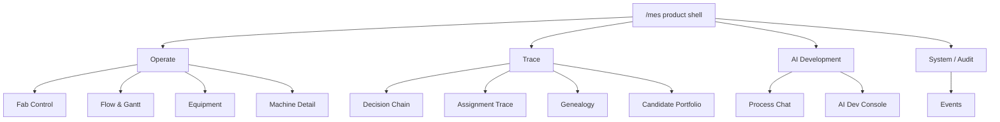

# UI Control Room Specification

Status: canonical
Last updated: 2026-07-17

## Reader

Primary reader: UI developers, product designers, and backend developers
building payloads for the control room.

Use this when changing `/mes`, adding a page, altering a table, or deciding how
operators and AI developers should inspect decisions.

Read after: [07_API_CONTRACTS.md](07_API_CONTRACTS.md).

## Purpose

The UI is an operational MES control room for a simulator-backed semiconductor
AI MES. It must help dispatchers, engineers, and AI developers understand:

- current WIP,
- equipment state,
- candidate portfolios,
- layered recommendations,
- Rule Engine validation,
- command execution,
- events and genealogy.

The UI must never imply that AI directly executes equipment commands.

The UI must also make manufacturing tradeoffs visible. The user should be able
to see when a locally strong candidate lost because L3/L4 selected a different
manufacturing objective, such as due-date pressure, WIP balance, customer
priority, or quality/setup risk.

## Information Architecture



The UI separates operational views from developer/debug views. Operators should
see status, WIP, equipment, and safe proposals. AI developers should see policy
ids, candidate portfolios, scores, traces, and tool calls.

Process engineers use Process Chat for natural-language inspection. Visual
equipment questions open a typed Active Inspector rather than injecting charts
into the message body.

## Product Shell Direction

The UI is now treated as the product shell for a Semiconductor Digital Twin MES.
The simulator remains the execution backend, but screen structure must scale to
production adapters, genealogy, operator approval, richer equipment state, and
future digital twin views.

V1 keeps the current FastAPI + static HTML/CSS/JS delivery model. The product
foundation work focuses on information architecture, reusable UI primitives,
and dense-data containment rather than a React/Next migration or decorative
redesign.

`https://github.com/nexu-io/open-design` is used only as a design-system
reference for enterprise token discipline and product-console patterns. It is
not a runtime dependency.

The previous Product UI Foundation V1 planning note has been archived at
[archive/08_PRODUCT_UI_FOUNDATION_V1.md](archive/08_PRODUCT_UI_FOUNDATION_V1.md).
This file is the active UI source of truth.

| Group | Screens | Primary question |
|---|---|---|
| Operate | Fab Control, Flow & Gantt, Equipment, Machine Detail | Is the fab healthy, and what is running where? |
| Trace | Decision Chain, Assignment Trace, Genealogy, Candidate Portfolio | Why did this decision, assignment, or state transition happen? |
| AI Development | AI Dev Console | Which policies, candidates, scores, and experiments explain behavior? |
| System / Audit | Events | What happened in the execution log? |

## Visual Source Of Truth

The visual rules in root `DESIGN.md` are now summarized here. Future UI work
should prefer this document and update root `DESIGN.md` only when project-wide
frontend rules change.

Style:

- bright neutral operations UI,
- dense table-first layout,
- status color for meaning,
- purple only for AI/model states,
- blue for primary command/action,
- green/yellow/orange/red for operational status,
- 6px panel radius,
- no marketing hero,
- no decorative gradient blobs,
- no cards inside cards.
- Open Design may inform tokens and component primitives, but MES-specific
  operational clarity wins over any external style preset.

Typography:

- system UI / Inter-style font stack,
- compact text,
- tabular numbers for KPIs,
- no viewport-scaled typography.

## Primary Views

### Fab Control Room

First viewport. Shows actual runtime state.

Must include:

- simulator time,
- active correlation id,
- autoplay state,
- KPI strip,
- A/B/C stage board,
- equipment state summary,
- active decision chain,
- Rule Engine gate,
- command preview or last command,
- recent event timeline.

### Stage Dispatch Board

For each stage, shows candidate-level decision data.

For target architecture, this view must show:

- L1 candidate portfolio,
- grouping key such as customer/product/material,
- local score,
- L2 annotation,
- L3/L4 selected group,
- final selected candidate,
- rule precheck.

For C packing, the table should make the decomposition visible:

```text
Group candidates:
  Alpha -> A1, A2
  Beta -> B1, B2

Upper selection:
  L3/L4 selected Alpha

Final pack:
  C_0 receives A1 task_uids
```

### Decision Chain Inspector

Shows the auditable chain:

```text
L4 Objective
  -> L3 Stage/Group Selection
  -> L1 Dispatch/Packing
  -> L2 Recipe/APC
  -> Rule Validation
  -> Command
  -> Events
```

Each block shows:

- layer id,
- recommendation type,
- recommendation id,
- parent recommendation id,
- feature snapshot id,
- score/confidence,
- selected action,
- validation status,
- reasons.

### Lot/Wafer Trace

Shows production object history.

Must include:

- lot id,
- wafer ids,
- current operation,
- equipment assignment,
- QA results,
- rework count,
- command id,
- correlation id,
- event history.

### Digital Twin Genealogy

Shows the execution backbone behind the live state.

Must include:

- task/wafer lookup by simulator task uid,
- lot/job rollout by lot id,
- equipment timeline by equipment id,
- execution ledger by correlation id,
- best available state snapshot by simulator time,
- command/event links back to Assignment Trace.

V1 is correlation/event-centered. It synthesizes simulator start/finish events
from process logs and combines them with persisted MES command and Rule Engine
events. It is not yet a fully normalized event-sourced reconstruction.

### Equipment And Recipe Monitor

Shows whether the selected command can actually run.

Must include:

- equipment status,
- current batch,
- finish time,
- health state,
- current recipe,
- recipe approval/download/compare status,
- replacement or maintenance recommendation.

For A/B, include machine-level quality trend and recipe/material state.
For C, target detail includes batch composition, pack quality, queue age,
compatibility, and pack id.

### Evaluator Console

Development-only but important.

Must include:

- required layers present,
- correlation id consistency,
- parent chain integrity,
- feature snapshot presence,
- candidate portfolio presence,
- L3 selection matches L1 candidate,
- L2 annotation matches L1 candidate,
- rule validation result,
- simulator action matched command,
- command execution event presence.

## Layout

Desktop:

```text
Sidebar / top shell
KPI strip
Main grid:
  Stage board
  Decision chain
  Rule gate
  Dispatch/candidate table
Secondary grid:
  Equipment matrix
  Event timeline
  Evaluator checklist
```

Mobile:

- horizontal nav,
- stacked panels,
- horizontally scrollable tables,
- vertical decision chain.

Process Chat visual analysis:

```text
Desktop:
  Chat 40% | resizable divider | Active Inspector 60%

Mobile:
  Chat -> full-screen Active Inspector drawer
```

The inspector provides Chart, Data, and Events tabs over the same immutable
artifact. It exposes source, time basis, requested range, and effective range.
Pin keeps the current artifact active while new chat turns run; Full expands
the analysis pane; Close returns to the normal Chat workspace.

Reusable product primitives:

- `page-shell`: page-level surface and scope.
- `section-kicker`: short purpose text under section titles.
- `panel`: bounded information area.
- `table-scroll`: horizontal/vertical containment for dense tables.
- `truncate-id`: safe display for long correlation/candidate/command ids.
- `inspector-grid`: split-pane detail layout.
- `trace-layer-list`: ordered decision/action timeline.
- `status`: semantic state chip.
- `raw-json-collapsed`: contained raw payload inspector.

## Current UI

Current implementation:

- `/mes` route serves rendered control-room HTML from
  `src/mes/ui/assets.py`.
- Markup, styles, and client behavior live in:
  - `src/mes/ui/templates/control_room.html`,
  - `src/mes/ui/static/control_room.css`,
  - `src/mes/ui/static/control_room.js`.
- `src/mes/live_ui.py` remains only as a compatibility import for
  `LIVE_MES_HTML`.
- UI polls live endpoints.
- Navigation is grouped by product role: Operate, Trace, AI Development, and
  System / Audit.
- `#machine`, `#assignment-trace`, and `#ai-dev` use product-shell semantics and
  inspector/table primitives so they can grow without one-off layout rules.
- `/mes#genealogy` shows Digital Twin Genealogy V1 with task, lot, equipment,
  execution ledger, state-at-time, run selector, and timeline panels.
- `/mes#factory-twin` shows Factory Spatial Digital Twin V1 as a full primary
  Three.js workspace. It renders registry-driven operations, configured
  equipment counts, wait/rework/incoming/output queues, OHT rails and carriers,
  and the finished-goods warehouse from `factory-twin.v1` payloads.
- The factory twin supports simulator live state and canonical event-time
  replay with one renderer. Its header always shows state, spatial, and
  transport provenance so inferred movement is not presented as observed data.
- Selecting an equipment or task opens a compact inspector with stable ids and
  links to Machine Detail, Assignment Trace, and Genealogy. On mobile the
  sidebar is removed from this workspace and the inspector becomes a fixed
  bottom drawer over the scene.
- It already shows WIP, equipment, decision chain, events, Gantt, autoplay,
  reset, A/B machine quality detail, C machine packing detail, L3 budget plan,
  selected candidates, L2 annotations, L3/L4 policy ids, and a Candidate
  Portfolio workbench.
- The Candidate Portfolio workbench shows selected and rejected candidates,
  stage filtering, selected-only filtering, local score, upper score, L2
  risk/recipe annotation, L3 rejection reason, and command status.
- `/mes#ai-dev` shows AI Developer Console V1 for policy-stack visibility,
  decision-cycle browsing, candidate portfolio lab, score breakdown, L2
  annotation inspection, empty portfolio diagnostics, Policy Experiment
  Runner V1, and Agent Run Inspector.
- `/mes#chat` shows Process Chat V1 for process-engineer natural-language MES
  and APC questions. It supports Agent Mode, Chat Mode, LLM/fallback execution,
  model selection, max-step control, read-only MES/APC tools, returned tool-call
  metadata, and a compact agent trace.
- Process Chat also supports generic A/B/C equipment analytics for quality,
  utilization, throughput, observed alarms, and derived anomalies. A returned
  typed artifact opens a resizable Active Inspector with Chart, Data, and
  Events tabs. The browser renders only approved artifact/chart types.
- Process Chat quality-map analysis uses the common
  `process_quality_evidence` artifact. A renders spatial pattern risk; B renders
  residual-contamination and cleaning-uniformity risk. Both show scalar versus
  map verdict, process-specific components, reason codes, cell data, and model
  provenance without changing the scalar execution verdict.
- Agent Run Inspector shows recent `agent_run_id` records, model/provider,
  status, question, final answer, tool calls, requested think mode, prompt
  version, and step timeline from `/api/v2/agent-runs`. In the MES API process,
  these records are backed by SQLite so the inspector can survive server
  restarts.
- Stage and equipment naming is configurable as display metadata. UI surfaces
  should render `stage_display_names` and `equipment_display_names` where
  present, while keeping canonical ids available for trace search, command
  payloads, and developer debugging.
- Policy Experiment Runner captures the current fab state as a scenario, lets
  AI developers select policy variants, replays each variant offline, and shows
  selected stage/candidate, local score, upper score, L2 risk, command validity,
  expected KPI delta, and a compact decision diff.
- `/mes#assignment-trace` shows Assignment Trace Inspector V1. Gantt bars open
  this page with equipment/task/correlation context, and the page shows the
  assignment summary, decision-time state, L4/L3/L1/L2/Rule/Command timeline,
  selected/rejected candidate portfolio rows, simulator action, and raw payload.
- Assignment Trace can open the related genealogy view so developers can move
  from "why was this assigned" to "what execution lineage did it create".
- Candidate Portfolio defaults to the latest actionable portfolio. If the most
  recent cycle is empty, the UI keeps the last actionable portfolio visible and
  exposes the empty reason/diagnostics in the developer console.

Current limitations:

- It only lightly distinguishes L3/L4 group selection from L1 final pack choice.
- Genealogy V1 now has a run-scoped normalized SQLite index, but it is still a
  developer diagnostic surface rather than a full event-sourced state
  reconstruction.
- Operator approval workflows are not implemented.

## Required UI Evolution

Next UI milestone:

1. Add richer experiment scenario presets for balanced/A-bottleneck/B-bottleneck
   batch states.
2. Add richer candidate detail drilldown for C packing composition and A/B APC
   implications.
3. Show selected group separately from selected pack.
4. Add operator-facing Rule Engine consistency and rejection detail.
5. Add production event-time aggregation and export controls to the Active
   Inspector after canonical FDC telemetry is available.

## UX Copy Rules

Use precise operational language:

- "AI recommendation"
- "Rule validation"
- "Validated command"
- "Candidate portfolio"
- "Selected group"
- "Final allocation"
- "Execution event"

Avoid vague phrases:

- "AI decided"
- "automatic control"
- "smart optimization" without showing score/reasons
- "best" without showing objective and constraints

## Screen Data Bindings

| UI area | Current API | Target API |
|---|---|---|
| KPI strip | `/api/v1/kpis/fab` | same plus AI KPI |
| Stage board | `/api/v1/wip`, `/api/v1/equipment` | same |
| Candidate table | `/api/v2/candidate-portfolio/latest`, `/api/v2/candidate-portfolio/{correlation_id}` | same plus richer drilldown |
| Assignment trace | `/api/v2/assignment-trace`, `/api/v2/gantt` trace keys | same plus richer persisted genealogy linkage |
| Genealogy | `/api/v2/runs`, `/api/v2/ledger-index/{index_name}`, `/api/v2/genealogy/task/{task_uid}`, `/api/v2/genealogy/equipment/{equipment_id}`, `/api/v2/genealogy/lot/{lot_id}`, `/api/v2/execution-ledger/{correlation_id}`, `/api/v2/digital-twin/state-at` | event-sourced reconstruction |
| AI developer console | `/api/v2/ai-dev/policy-stack`, `/api/v2/ai-dev/decision-cycles`, `/api/v2/ai-dev/candidate-portfolio/{correlation_id}`, `/api/v2/ai-dev/scenarios`, `/api/v2/ai-dev/policy-variants`, `/api/v2/ai-dev/experiments/*` | same plus scenario preset library |
| Process chat | `/api/v2/process-chat`, `/api/v2/process-tools/catalog`, `/api/v2/process-tools/{tool_id}/run`, `/api/v2/agent-runs` | same plus production telemetry adapters and optional approval-gated write tools |
| Decision chain | `/api/v2/decision-chain/{correlation_id}` | same with portfolio metadata |
| Rule gate | `/api/v1/rules/validate` | same plus layer consistency reasons |
| Command preview | `/api/v1/commands/track-in/preview` | `/api/v1/commands/finalize` |
| Event timeline | `/api/v1/events` | same plus simulator event linkage |
| Gantt | `/api/v2/gantt` | same |
| Machine detail | `/api/v2/equipment/{id}/detail` | A/B/C detail coverage |
| Factory spatial twin | `/api/v2/factory-twin/layout`, `/api/v2/factory-twin/snapshot`, `/api/v2/factory-twin/entity/{type}/{id}`, `/api/v2/factory-twin/replay-range`, `WS /api/v2/factory-twin/stream` | same contract with production authorization and observed spatial mapping when available |

## Process A Spatial Quality Inspector

`process_a_spatial_quality` artifacts use a process-specific view inside the
existing Chat Active Inspector.

```text
Chart
  circular 17 x 17 canonical product grid
  PASS / margin / OOS-low / OOS-high verdict colors
  scalar verdict versus map verdict
  mean, standard deviation, OOS ratio, min/max
  edge-center delta and largest OOS cluster
  radial, directional, hotspot, and local-noise factors

Data
  row, column, normalized x/y
  QA value, verdict, margin, zone

Events
  LOCAL_OOS_CLUSTER
  EDGE_NON_UNIFORMITY
  DIRECTIONAL_BIAS
  CONSUMABLE_HOTSPOT
```

The provenance footer displays `SIMULATOR`, `SIMULATION_STEP`,
`SIMULATED_SPATIAL_QUALITY`, and the spatial model id/version. The browser owns
the grid renderer and verdict colors. The LLM and tool payload cannot inject
HTML, SVG, CSS, JavaScript, or chart expressions.
