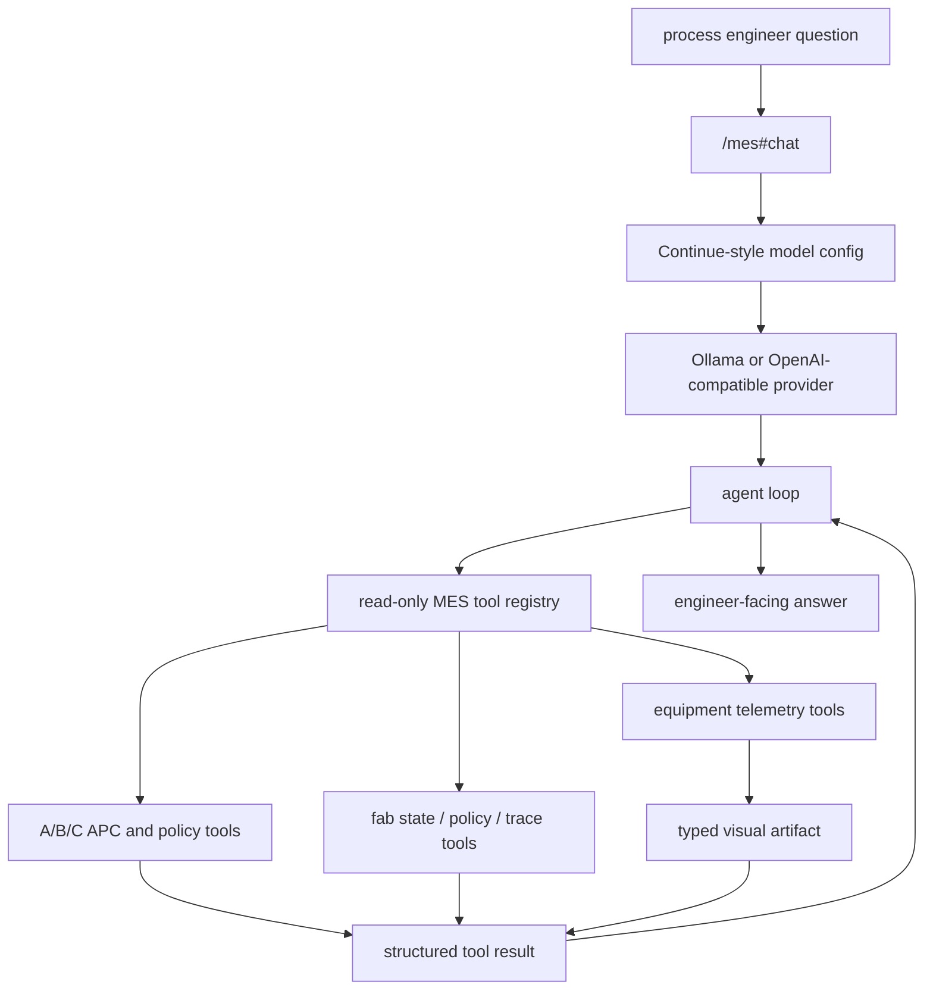
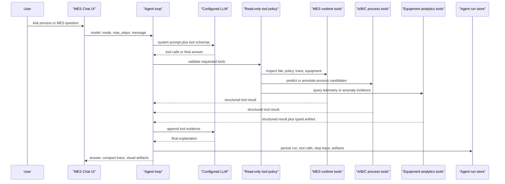

# Process APC MCP Agent V1

Status: implemented V1
Last updated: 2026-06-12

## Reader

Primary reader: agent developers, process engineers, and developers extending
read-only MES/APC tools for LLM use.

Use this when configuring chat models, adding a process tool, changing Agent
Mode, or validating the read-only boundary for natural-language APC questions.

Read after: [03_ABC_CANONICAL_SCHEMA_REFERENCE.md](03_ABC_CANONICAL_SCHEMA_REFERENCE.md)
and [07_API_CONTRACTS.md](07_API_CONTRACTS.md).

## Purpose

Process APC MCP Agent V1 lets a process engineer ask a natural-language MES/APC
question and have a local LLM call read-only process and runtime inspection
tools. The standalone process-model API starts with Process A APC prediction.
Agent Mode additionally exposes the A/B/C layered decision tools used by the
MES policy stack and generic equipment visual analytics tools.

V1 is intentionally read-only. It predicts, compares, and explains. It does not
apply recipes, update MES records, dispatch lots, or execute equipment commands.

## Architecture

```text
Natural-language process or MES question
  -> MES local agent runtime
  -> configured chat model provider
  -> optional multi-step tool call loop
  -> MES read-only tool registry
  -> Process A APC model and/or MES runtime inspection payloads
  -> structured tool results
  -> final engineer-facing explanation
```

Agent Mode follows the Continue agent loop pattern at MES scope:

```text
LLM response
  -> tool call extraction
  -> read-only policy evaluation
  -> tool execution
  -> tool result appended to the conversation
  -> next LLM response
```

Native provider tool calls are used when the selected model has `tool_use`.
Models without native tool calling can still run Agent Mode through a system
message fallback that asks the model to emit a single JSON tool call. Plain
Chat Mode disables tool execution and returns one model response.

The implementation is Continue-compatible for the local fields needed by MES
Chat, but does not require Continue itself. The runtime accepts Continue
`config.yaml` style model and MCP blocks:

- `models`
- `provider`
- `apiBase`
- `apiKey`
- `roles`
- `capabilities`
- `defaultCompletionOptions`
- `requestOptions`
- `mcpServers`

Supported V1 model providers:

- `ollama`
- `openai`

The `openai` provider also covers OpenAI-compatible gateways when they expose
`/v1/chat/completions`.

The runtime config lives at `config/mes-process-agent.yaml`. A documentation
copy remains at `docs/ai-mes/examples/mes-process-agent.yaml`.

## Provider And Tool Boundary



The model is not the source of manufacturing truth. It can reason over natural
language, but every process-specific number must come from an explicit read-only
tool result or from clearly stated user-provided input.

Compatibility details:

- Continue default model roles are honored: when `roles` is omitted, MES uses
  `[chat, edit, apply, summarize]`.
- `/mes#chat` exposes only models with the `chat` role. `autocomplete`, `embed`,
  and `rerank` models can remain in the same config but are not selectable for
  chat.
- Configured `capabilities` are combined with MES autodetection, matching
  Continue's "add to autodetection" behavior. `tool_use` controls whether tool
  schemas are sent to the model.
- `defaultCompletionOptions` are translated per provider. Ollama receives
  `contextLength -> num_ctx`, `maxTokens -> num_predict`, `topP -> top_p`,
  `topK -> top_k`, `stop`, `reasoning -> think`, and `keepAlive -> keep_alive`.
  OpenAI-compatible chat receives `maxTokens -> max_tokens`, `topP -> top_p`,
  `temperature`, and `stop`.
- `requestOptions.timeout`, `requestOptions.verifySsl`,
  `requestOptions.headers`, and `requestOptions.extraBodyProperties` are applied
  to model HTTP calls.
- `mcpServers` supports `type`, `command`, `args`, `env`, `cwd`, `url`,
  `requestOptions`, and `connectionTimeout` in the config contract. V1 runtime
  execution supports local `stdio` MCP servers.
- Top-level Continue sections such as `context`, `rules`, `prompts`, `docs`,
  and `data` are parsed/tolerated for config compatibility. MES Chat V1 does
  not yet execute those sections.
- YAML headers, anchors, and merge keys used in Continue examples are supported
  for local config reuse.
- Hub `uses` model blocks are tolerated but skipped unless they also resolve to
  a local `provider` and `model`; MES does not contact Continue Hub.

## Runtime Modules

| Module | Responsibility |
|---|---|
| `src/mes/process_tools/process_a_apc.py` | Read-only Process A APC prediction logic |
| `src/mes/process_tools/service.py` | Tool catalog, OpenAI/Ollama tool schema, and local tool execution |
| `src/mes/process_tools/api.py` | FastAPI routes for tool catalog and tool run |
| `src/mes/mcp/process_apc_server.py` | FastMCP stdio server exposing process tools |
| `src/mes/agent_runtime/config.py` | Small Continue-style config loader |
| `src/mes/agent_runtime/ollama_client.py` | Ollama `/api/chat` client with tool schema support |
| `src/mes/agent_runtime/openai_client.py` | OpenAI-compatible `/chat/completions` client with tool schema support |
| `src/mes/agent_runtime/mcp_client.py` | Synchronous MCP stdio client wrapper |
| `src/mes/agent_runtime/layered_process_tools.py` | A/B/C L1 candidate and L2 annotation tools for Agent Mode |
| `src/mes/agent_runtime/mes_tools.py` | Read-only MES runtime and layered process tool registry for Agent Mode |
| `src/mes/runtime/equipment_telemetry.py` | Generic A/B/C quality, utilization, throughput, alarm, and anomaly queries |
| `src/mes/agent_runtime/visual_tools.py` | Generic visual analytics tool schemas and execution |
| `src/mes/agent_runtime/visual_artifacts.py` | Typed, deterministic, non-executable artifact construction and validation |
| `src/mes/agent_runtime/agent_loop.py` | Multi-step Agent/Chat loop, tool policy, and final response generation |
| `src/mes/agent_runtime/process_chat.py` | Chat facade with LLM mode and local A APC fallback |
| `src/mes/agent_runtime/run_store.py` | Recent agent run records for inspector/debug APIs |
| `src/mes/agent_runtime/sqlite_run_store.py` | SQLite-backed agent run persistence for MES API runtime |
| `src/mes/agent_runtime/eval.py` | Deterministic eval helper for tool-use and policy checks |
| `src/mes/agent_runtime/cli.py` | Local CLI entrypoint |

## Tool Contract

Tool id:

```text
predict_process_a_apc
```

Input:

```json
{
  "task_rows": [
    {"task_uid": "T0", "spec_a": [48.0, 53.0]}
  ],
  "machine_state": {"u": 6, "m_age": 12},
  "recipe": [10.0, 2.0, 1.0],
  "queue_info": {"wait_pool_size": 12},
  "current_time": 120
}
```

Output:

```json
{
  "tool_id": "predict_process_a_apc",
  "stage": "A",
  "model_id": "A_RULE_BASED_APC_PREDICTOR",
  "read_only": true,
  "recipe": [10.0, 2.0, 1.0],
  "predicted_qa": 49.6646,
  "target_spec": {"low": 48.0, "high": 53.0, "target": 50.5},
  "quality_risk": "LOW",
  "replace_consumable": true
}
```

Agent Mode additionally exposes these read-only MES runtime tools when the
chat service is running inside the MES API process:

- `get_fab_snapshot`
- `get_policy_stack`
- `get_candidate_portfolio_latest`
- `get_equipment_detail`
- `get_assignment_trace`

Agent Mode also exposes the A/B/C layered process tools documented in
`03_ABC_CANONICAL_SCHEMA_REFERENCE.md`.

L1 candidate tools:

```text
generate_process_a_l1_candidates
generate_process_b_l1_candidates
generate_process_c_l1_candidates
```

L2 annotation tools:

```text
annotate_process_a_l2_apc
annotate_process_b_l2_apc
annotate_process_c_l2_pack_quality
```

All six tools are read-only and execute against the current MES decision state.
Each tool returns `layer`, `operation_id`, `policy_id`, `decision_time`,
diagnostics, and candidate or annotation rows. L1 tools expose local feasible
candidates; L2 tools expose APC/process implication for those candidates. L3/L4
selection remains separate and can be inspected through policy, portfolio, and
trace tools.

Equipment visual analytics tools:

```text
list_equipment_metrics
query_equipment_timeseries
query_equipment_anomalies
```

These tools are generic across configured A/B/C equipment. They accept
canonical ids such as `A_0` or display names such as `LITHO-01`. Supported V1
metrics are `quality`, `utilization`, `throughput`, `alarm`, and `anomaly`.
`alarm` is observed source evidence; `anomaly` is a derived condition such as
quality outside its target window.

## REST API

```http
GET /api/v2/process-tools/catalog
POST /api/v2/process-tools/{tool_id}/run
POST /api/v2/process-chat
GET /api/v2/agent-runs
GET /api/v2/agent-runs/{agent_run_id}
```

The POST endpoint is read-only despite using POST because model inference takes
a structured body.

Example:

```bash
curl -s http://localhost:8000/api/v2/process-tools/predict_process_a_apc/run \
  -H "Content-Type: application/json" \
  -d '{
    "task_rows": [{"task_uid": "T0", "spec_a": [48.0, 53.0]}],
    "machine_state": {"u": 6, "m_age": 12},
    "recipe": [10.0, 2.0, 1.0],
    "current_time": 120
  }'
```

Every chat request creates an `agent_run_id`. The run record stores:

- user question,
- mode, model, provider, max steps,
- prompt id/version,
- tool catalog version,
- requested Ollama think flag,
- final status and answer,
- tool calls,
- compact step trace,
- typed visual artifacts returned by successful visual tool calls.

When the chat service runs inside the MES API process, these records are stored
in the same local SQLite file as the MES runtime (`MES_DB_PATH`, default
`data/mes_mvp.sqlite3`) through `SQLiteAgentRunStore`. Standalone service usage
without an MES runtime context keeps the in-memory store for tests and local
tooling.

`POST /api/v2/process-chat` is the UI-facing chat endpoint. It accepts a
natural-language message, `mode`, `max_steps`, and optional `use_llm` flag. With
`use_llm=true`, the local runtime uses Agent Mode or Chat Mode against the
selected configured model and falls back to local A APC parsing when the model
is unavailable. With `use_llm=false`, it directly calls the local process tool
fallback.

Example:

```bash
curl -s http://localhost:8000/api/v2/process-chat \
  -H "Content-Type: application/json" \
  -d '{
    "message": "A 공정에서 spec_a 48~53이고 u=6, m_age=12, recipe=[10,2,1]이면 QA가 어떻게 나올까?",
    "use_llm": false,
    "mode": "agent",
    "max_steps": 5
  }'
```

## MES Chat UI

The control room left navigation has a `Chat` entry under AI Development. It
opens `/mes#chat` and renders:

- the current chat thread,
- Agent/Chat mode selector,
- Agent max-step selector,
- an LLM toggle,
- a model selector built from the Continue-style `models` config,
- the read-only MES/API tool context,
- starter equipment trend, alarm/anomaly, A L1/L2, and C packing questions,
- tool-call metadata and compact agent trace with layer, operation id, and
  policy id for returned tool calls,
- a resizable Active Inspector for server-validated visual artifacts.

Desktop visual analysis uses a 40:60 Chat/Inspector split. Chart, Data, and
Events tabs show the same artifact evidence. On mobile the inspector opens as a
full-screen drawer. The model never supplies HTML, JavaScript, SQL, or arbitrary
chart expressions; the browser maps allowlisted artifact types to built-in SVG
renderers.

The AI Developer Console also includes Agent Run Inspector. It lists recent
agent runs from `/api/v2/agent-runs`, lets developers select one run, and shows
the final answer, metadata, tool calls, and step timeline.

## Agent Tool Flow



Tool execution is deliberately narrower than a general coding agent. The MES
agent can inspect state and run process models, but V1 cannot write MES records,
apply recipes, dispatch lots, or execute equipment commands.

## Process And Equipment Display Names

The simulator still uses canonical stage keys and equipment ids (`A`, `B`, `C`,
`A_0`, `B_0`, `C_0`) for state/action contracts. Human-readable names are now a
runtime display layer:

```python
{
  "stage_display_names": {
    "A": "Process QA",
    "B": "Clean QA",
    "C": "Packing"
  },
  "equipment_display_names": {
    "A_0": "Lithography Tool 01"
  }
}
```

`src/mes/runtime/naming.py` resolves these names for live state, Gantt payloads,
and equipment detail payloads. This keeps policy/action contracts stable while
allowing future semiconductor process names and real tool names in the UI.

## Agent Eval V1

`src/mes/agent_runtime/eval.py` provides deterministic checks for response
payloads. V1 eval cases can assert:

- required tools were called,
- forbidden tools were not executed,
- status belongs to an allowed set,
- required answer terms are present,
- forbidden answer terms are absent.

This is intentionally not an LLM judge. It is a stable regression layer for
tool-use and safety contracts.

## MCP Server

Run the MCP server over stdio:

```bash
.venv/bin/python -m src.mes.mcp.process_apc_server
```

The server exposes:

```text
get_process_tool_catalog
predict_process_a_apc
```

The MCP server remains the standalone process-tool server. A/B/C L1/L2 tools
currently require the live MES runtime context and are exposed through
`/mes#chat` Agent Mode rather than the stdio MCP server.

## Local Agent CLI

Run the local agent with the example config:

```bash
.venv/bin/python -m src.mes.agent_runtime.cli \
  --config config/mes-process-agent.yaml \
  "A 공정에서 spec_a 48~53이고 u=6, m_age=12, recipe=[10,2,1]이면 QA가 어떻게 나올까?"
```

For debugging without an MCP subprocess:

```bash
.venv/bin/python -m src.mes.agent_runtime.cli \
  --direct-tools \
  --config config/mes-process-agent.yaml \
  "A 공정에서 spec_a 48~53이고 u=6, m_age=12, recipe=[10,2,1]이면 QA가 어떻게 나올까?"
```

## Safety Boundaries

Allowed in V1:

- predict Process A QA,
- return recipe recommendation context,
- explain quality risk,
- list tool schemas.

Not allowed in V1:

- recipe apply,
- MES write,
- equipment command,
- dispatch execute,
- approval bypass.

Future write-capable tools must be separated from read-only tools and routed
through operator approval and the rule engine.

## Process A Spatial Quality Tool

The live MES Agent tool catalog also exposes:

```text
query_process_a_spatial_quality
```

This read-only tool resolves `A_0`/`LITHO-01` and completed task UIDs against
Process A completion evidence. It returns a deterministic simulated product
surface map and a `process_a_spatial_quality` visual artifact.

Example question:

```text
LITHO-01에서 가장 최근 완료된 제품의 공간 품질 판정 맵을 보여줘.
```

The spatial model keeps the existing scalar QA as the map mean, then adds
feature-driven radial, directional, consumable-hotspot, and local-noise
components. The response is always labeled:

```text
SIMULATED_SPATIAL_QUALITY
```

It is not FDC, metrology, vision, or wafer-bin evidence. Process A scalar
pass/fail and rework behavior remain unchanged in V1.
