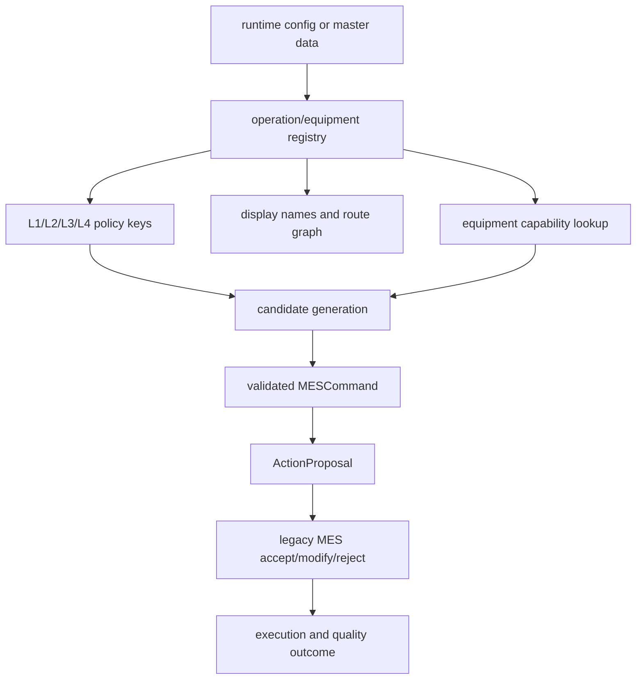

# Operation Registry And Action Proposal

Status: canonical production-transition specification
Last updated: 2026-05-31

## Reader

Primary reader: production integration engineers and backend developers
generalizing beyond the current A/B/C simulator stages.

Use this when adding operations, equipment metadata, route graph fields,
display names, or the legacy-safe action proposal boundary.

Read after: [02_SYSTEM_VISION.md](02_SYSTEM_VISION.md) and
[05_RUNTIME_HARNESS_RULE_ENGINE.md](05_RUNTIME_HARNESS_RULE_ENGINE.md).

## Purpose

This document defines the first production-transition contract for the simulator
MES. The current system still runs A/B/C simulator operations, but the runtime
now treats operations and equipment as registry entries rather than hard-coded
UI concepts.

The production principle is explicit:

```text
AI MES does not directly control equipment.
AI MES creates an Action Proposal.
Legacy MES/RMS/APC/FDC systems decide whether and how to execute it.
```

This lets the AI layer keep producing concrete recommendations and predicted
actions while preserving the real plant boundary where legacy MES remains the
system of record and execution authority.

## Registry To Proposal Flow



The registry is the generalization point. A/B/C remain valid canonical ids for
the simulator, but production operation ids can enter through the registry
without rewriting the policy and UI contracts.

## Operation Registry V1

The operation registry is the canonical lookup for operation and equipment
metadata used by runtime payloads, display naming, policy binding, and future
legacy-system mapping.

Current implementation:

- module: `src/mes/operations/registry.py`
- runtime owner: `MESAPIContext.operation_registry`
- API: `GET /api/v2/operations`

Default simulator registry:

| Operation | Display name | Type | Equipment group | Boundary |
|---|---|---|---|---|
| `A` | Lithography QA | `process_qa` | `A` | `SIMULATOR_STAGE` |
| `B` | Wet Clean QA | `clean_qa` | `B` | `SIMULATOR_STAGE` |
| `C` | Final Packing | `packing` | `C` | `SIMULATOR_STAGE` |

Default equipment is generated from simulator config:

- A: `A_0` ... `A_4`, batch size 3
- B: `B_0` ... `B_2`, batch size 2
- C: `C_0` ... `C_2`, batch size 4

The registry keeps canonical simulator ids stable. Display names are metadata
loaded from `config/mes-runtime.yaml` or `MES_RUNTIME_CONFIG`. Policy decisions,
rule validation, command payloads, and simulator actions still use `A`, `B`,
`C`, `A_0`, `B_0`, and `C_0` unless a future adapter explicitly maps them to
production operation/equipment ids.

## Operation Definition Contract

Each operation definition carries the minimum fields required to generalize from
the current A/B/C simulator to production operations.

```python
{
    "operation_id": "PHOTO_EXPOSE",
    "display_name": "Photo Exposure",
    "operation_type": "lithography",
    "equipment_group_id": "LITHO",
    "execution_boundary": "LEGACY_MES_REVIEW",
    "upstream_operation_ids": ["COAT"],
    "downstream_operation_ids": ["DEVELOP"],
    "queue_keys": {"wait": "photo_wait_queue"},
    "batch_size": 25,
    "process_time": 12,
    "simulator_env_attr": "",
    "l1_policy_key": "scheduler_PHOTO",
    "l2_policy_key": "apc_PHOTO",
    "l3_policy_key": "meta_scheduler_L3",
    "l4_policy_key": "objective_policy_L4",
    "legacy_submission_mode": "OUTBOX",
    "metadata": {"route_family": "FEOL"}
}
```

Important fields:

| Field | Meaning |
|---|---|
| `operation_id` | Stable canonical operation key inside the AI MES |
| `execution_boundary` | Whether execution is simulator-only, legacy-review, or another future adapter boundary |
| `queue_keys` | How operation-specific WIP queues are interpreted |
| `l1/l2/l3/l4_policy_key` | Policy-stack binding point for swappable algorithms |
| `legacy_submission_mode` | How proposals should be handed to the legacy side |
| `metadata` | Non-contract source-system mapping or engineering labels |

## Equipment Definition Contract

```python
{
    "equipment_id": "LITHO_01",
    "display_name": "Lithography Tool 01",
    "equipment_group_id": "LITHO",
    "capable_operations": ["PHOTO_EXPOSE"],
    "batch_size": 25,
    "execution_boundary": "LEGACY_MES_REVIEW",
    "metadata": {"source_tool_id": "EQP1234"}
}
```

The registry supports one operation per simulator tool today, but the contract
allows production equipment to advertise multiple capable operations.

## Action Proposal V1

An Action Proposal is the production-facing version of an AI command.

Current implementation:

- module: `src/mes/action_proposals.py`
- API: `GET /api/v2/action-proposals`
- source: validated `MESCommand` records

The current harness still creates `MESCommand` for simulator execution and
traceability. Action Proposal derives a production-safe envelope from each
validated command.

```python
{
    "proposal_id": "PROP_CMD_123",
    "proposal_type": "LEGACY_MES_ACTION_PROPOSAL",
    "correlation_id": "CORR_...",
    "operation_id": "A",
    "source_command_id": "CMD_123",
    "source_command_type": "RESERVE_AND_TRACK_IN",
    "validation_status": "PASSED",
    "status": "PROPOSED",
    "candidate_id": "CAND_A_...",
    "target_equipment_id": "A_0",
    "target_equipment_group_id": "A",
    "target_unit_ids": ["WAFER_1", "WAFER_2", "WAFER_3"],
    "target_lot_ids": [],
    "policy_refs": {
        "dispatch_recommendation_id": "REC_L1_...",
        "recipe_recommendation_id": "REC_L2_..."
    },
    "legacy_submission_mode": "SIMULATOR_ONLY",
    "direct_equipment_control": false,
    "lifecycle": {
        "legacy_decision_count": 0,
        "outcome_count": 0,
        "latest_legacy_status": "",
        "latest_outcome_status": ""
    },
    "payload": {"stage": "A", "task_uids": [1, 2, 3]},
    "run_id": "RUN_..."
}
```

The critical production field is:

```python
"direct_equipment_control": false
```

This field must remain false for the current architecture. A future write
adapter may submit proposals to a legacy outbox, operator review queue, or
integration API, but it must not bypass the production authority boundary.

## Action Proposal Lifecycle V1

Action Proposal Lifecycle records capture what the legacy execution authority
did with an AI proposal and what happened afterward. This is the minimum
production feedback loop needed before connecting real MES/FDC/QA data.

Current implementation:

- module: `src/mes/action_proposals.py`
- store: `InMemoryMESStore` and `SQLiteMESStore`
- normalized index: `proposal_lifecycle_index`
- APIs:
  - `POST /api/v2/action-proposals/{proposal_id}/legacy-decisions`
  - `GET /api/v2/action-proposals/{proposal_id}/legacy-decisions`
  - `POST /api/v2/action-proposals/{proposal_id}/outcomes`
  - `GET /api/v2/action-proposals/{proposal_id}/outcomes`
  - `GET /api/v2/action-proposals/{proposal_id}/lifecycle`

`LegacyDecision` records the legacy MES decision:

```python
{
    "decision_id": "LDEC_...",
    "proposal_id": "PROP_CMD_123",
    "legacy_status": "ACCEPTED",
    "correlation_id": "CORR_...",
    "legacy_assignment_id": "LEGACY_ASSIGN_...",
    "actual_equipment_id": "A_0",
    "actual_unit_ids": ["WAFER_1", "WAFER_2", "WAFER_3"],
    "reason": "legacy mes accepted recommendation",
    "decision_time": 120,
    "decided_by": "LEGACY_MES",
    "payload": {},
    "run_id": "RUN_..."
}
```

`OutcomeRecord` records execution and quality evidence:

```python
{
    "outcome_id": "OUT_...",
    "proposal_id": "PROP_CMD_123",
    "outcome_status": "EXECUTED",
    "correlation_id": "CORR_...",
    "actual_equipment_id": "A_0",
    "actual_unit_ids": ["WAFER_1", "WAFER_2", "WAFER_3"],
    "event_time": 140,
    "quality_result": {"status": "PASS"},
    "cycle_time": 20.0,
    "rework_count": 0,
    "payload": {},
    "run_id": "RUN_..."
}
```

Lifecycle records are appendable audit evidence. They do not mutate simulator
physics, and they do not imply direct AI control. They let the AI MES compare
what it recommended against what legacy MES actually accepted, modified,
rejected, or executed.

## Legacy Execution Loop Target

The target production loop is:

```text
Legacy MES/FDC/RMS/APC data
  -> canonical runtime state / digital twin
  -> L1/L2/L3/L4 policy stack
  -> Rule Engine
  -> Action Proposal
  -> legacy MES review/accept/modify/reject
  -> actual assignment / recipe / equipment event
  -> outcome + quality + cycle-time feedback
  -> AI MES learning/evaluation dataset
```

The AI layer still needs to propose actions. Without proposed actions, the
system cannot evaluate policy alternatives, upstream/downstream WIP effects, or
counterfactual KPI impact. The safety boundary is not “no action”; it is
“proposal action, legacy-controlled execution.”

## Future Extensions

The next production-facing contracts should add:

- ingestion contracts for legacy MES/RMS/FDC/APC/ERP source records,
- production PostgreSQL DDL and migration scripts,
- production outbox adapter and operator approval queue,
- reservation locks and operator approval states,
- production operation insertion from route/equipment master data.
