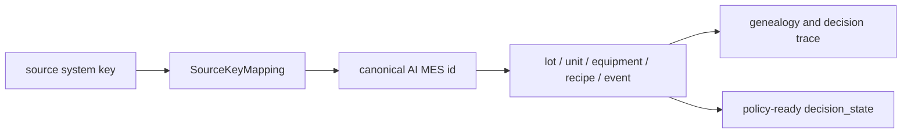

# Legacy Source Key Mapping

Status: canonical production-transition specification
Last updated: 2026-05-31

## Reader

Primary reader: data integration engineers mapping MES/RMS/FDC/APC/ERP keys
into AI MES entities.

Use this when designing source adapters, resolving duplicate or missing source
keys, or linking production evidence to canonical lot/unit/equipment ids.

Read after: [10_OPERATION_REGISTRY_ACTION_PROPOSAL.md](10_OPERATION_REGISTRY_ACTION_PROPOSAL.md).

## Purpose

Real manufacturing systems rarely share one clean primary key across MES, RMS,
FDC, APC, ERP, and engineering data marts. Legacy keys may be table-local,
system-local, reused, delayed, or missing a complete process-chain identity.

Source Key Mapping V1 creates a stable boundary between those legacy keys and
the AI MES canonical ids.

```text
legacy source key -> canonical AI MES entity id
```

The contract lets adapters ingest real data without forcing the AI decision
stack to understand every source-system key format.

## Key Resolution Flow



This mapping layer is what makes production traceability possible when source
systems disagree on primary keys. Policy code should use canonical ids, while
the mapping table preserves the original source evidence.

## Contract

Implementation:

- DTO: `SourceKeyMapping` in `src/mes/domain.py`
- runtime payloads: `src/mes/runtime/source_key_mappings.py`
- persistence: `SQLiteMESStore` and `source_key_mapping_index`
- API: `/api/v2/source-key-mappings`

Example:

```python
{
    "mapping_id": "SKM_...",
    "source_system": "LEGACY_MES",
    "source_table": "WIP_LOT",
    "source_pk": "LOT123",
    "source_key": "LEGACY_MES:WIP_LOT:LOT123",
    "entity_type": "LOT",
    "canonical_id": "LOT_CANON_123",
    "canonical_namespace": "AI_MES",
    "run_id": "RUN_...",
    "ingest_time": 100,
    "event_time": 90,
    "decision_time": 120,
    "status": "ACTIVE",
    "confidence": 1.0,
    "source_payload": {"LOT_ID": "LOT123"},
    "metadata": {"adapter": "legacy_mes_wip"}
}
```

Important fields:

| Field | Meaning |
|---|---|
| `source_system` | System that produced the source key, such as `LEGACY_MES`, `FDC`, `RMS`, `ERP` |
| `source_table` | Source table, stream, API object, or file domain |
| `source_pk` | Raw source primary key or composite-key string |
| `entity_type` | Canonical entity kind, such as `LOT`, `UNIT`, `EQUIPMENT`, `RECIPE`, `EVENT`, `ASSIGNMENT` |
| `canonical_id` | Stable AI MES id used by policy, genealogy, API, and UI |
| `ingest_time` | Time data entered the AI MES ingestion boundary |
| `event_time` | Time the source event actually happened in the plant or source system |
| `decision_time` | Time the AI decision or reconstruction used this mapping |
| `run_id` | Optional simulator/runtime run namespace |

## API

Create or update mapping:

```http
POST /api/v2/source-key-mappings
```

List mappings:

```http
GET /api/v2/source-key-mappings?source_system=LEGACY_MES&entity_type=LOT
```

Resolve one source key:

```http
GET /api/v2/source-key-mappings/resolve?source_system=LEGACY_MES&source_table=WIP_LOT&source_pk=LOT123&entity_type=LOT
```

Developer ledger access:

```http
GET /api/v2/ledger-index/source_key_mapping_index
```

Check active mappings for production data quality issues:

```http
GET /api/v2/production/data-quality
```

This endpoint flags the most dangerous mapping problem for production AI:

```text
one active source key -> multiple canonical ids
```

The system reports this as `SOURCE_KEY_CANONICAL_CONFLICT`. It does not choose
the correct canonical id automatically; integration or operations must resolve
the source-of-truth conflict.

## Production Usage

Adapters should resolve source data in this order:

```text
1. Receive source row/event
2. Build source key: source_system + source_table + source_pk
3. Resolve existing SourceKeyMapping
4. If absent, create canonical id and upsert SourceKeyMapping
5. Write canonical event/entity/assignment/quality record
6. Preserve original source_payload for audit
```

This keeps source-system identity reconstruction separate from L1/L2/L3/L4
policy logic.

Legacy Ingestion V1 now automates step 4 when an ingested source record carries
`canonical_id`. See
[`12_LEGACY_INGESTION_CONTRACT.md`](12_LEGACY_INGESTION_CONTRACT.md) for the
raw/canonical ingestion record contract.

## Boundaries

V1 intentionally does not implement:

- all legacy ingestion adapters,
- source schema inference,
- automatic fuzzy matching,
- conflict resolution workflows,
- PostgreSQL production DDL.

Those come after the canonical mapping contract is stable.
