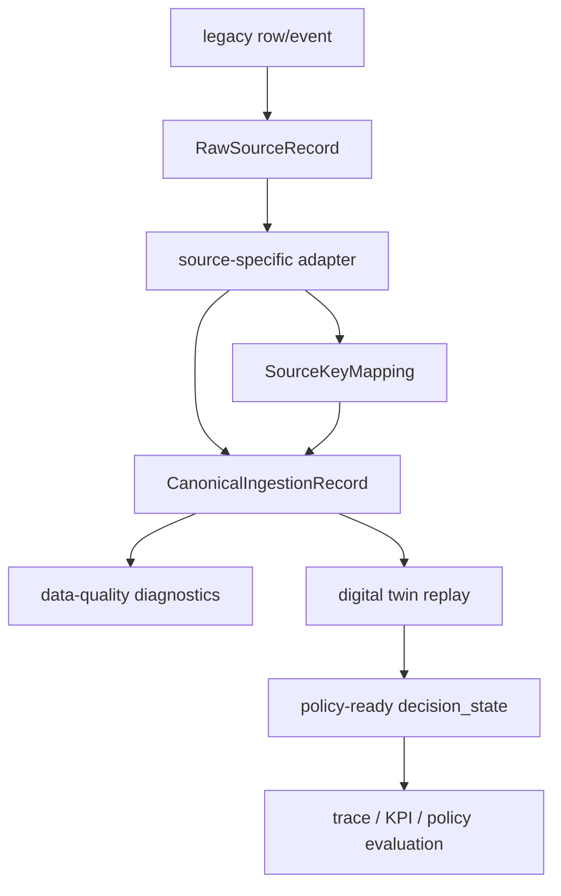

# Legacy Ingestion Contract

Status: canonical production-transition specification
Last updated: 2026-05-31

## Reader

Primary reader: ingestion engineers and data platform developers building the
bridge from legacy source rows into policy-ready AI MES state.

Use this when defining RawSourceRecord, CanonicalIngestionRecord, adapter
outputs, or event-time versus ingest-time behavior.

Read after: [11_LEGACY_SOURCE_KEY_MAPPING.md](11_LEGACY_SOURCE_KEY_MAPPING.md).

## Purpose

The production AI MES must not consume legacy MES, RMS, FDC, APC, or ERP rows
directly inside policy logic. Each source system has different keys, clocks,
field names, and completeness guarantees.

Legacy Ingestion V1 creates a two-step boundary:

```text
raw source row/event -> canonical AI MES record
```

The raw record is kept as audit evidence. The canonical record is what decision
state builders, genealogy, KPI evaluation, and future policy training consume.

## Ingestion Pipeline Flow



Raw records preserve evidence. Canonical records provide a consistent shape for
the digital twin, traceability, KPI reconstruction, and future learning data.

## Records

### RawSourceRecord

`RawSourceRecord` preserves the original source identity and payload.

Important fields:

| Field | Meaning |
|---|---|
| `record_id` | Stable `RAW_...` id for the ingested source row/event |
| `source_system` | Producing system, such as `LEGACY_MES`, `FDC`, `RMS`, `ERP` |
| `source_table` | Source table, stream, API object, or file domain |
| `source_pk` | Raw primary key or composite key string |
| `source_key` | `source_system:source_table:source_pk` |
| `entity_type` | Canonical entity kind: `LOT`, `UNIT`, `EQUIPMENT`, `RECIPE`, `EVENT`, `ASSIGNMENT`, `QUALITY` |
| `operation_id` | Canonical operation/process id when known |
| `equipment_id` | Canonical equipment id when known |
| `lot_id` | Canonical lot id when known |
| `unit_id` | Canonical wafer/unit id when known |
| `recipe_id` | Canonical recipe id when known |
| `event_time` | Time the source event happened |
| `ingest_time` | Time AI MES received it |
| `decision_time` | Time a decision/reconstruction used it |
| `payload` | Original source row/event content |

### CanonicalIngestionRecord

`CanonicalIngestionRecord` is the normalized projection used by the AI MES.

Important fields:

| Field | Meaning |
|---|---|
| `record_id` | Stable `CANON_...` ingestion record id |
| `raw_record_id` | Source evidence record that produced this projection |
| `entity_type` | Canonical entity kind |
| `canonical_id` | Stable canonical AI MES id |
| `operation_id` | Canonical operation/process id |
| `equipment_id` | Canonical equipment id |
| `lot_id` | Canonical lot id |
| `unit_id` | Canonical wafer/unit id |
| `recipe_id` | Canonical recipe id |
| `event_type` | Canonical event type, such as `LOT_WAITING`, `QA_MEASURED` |
| `attributes` | Normalized descriptive fields |
| `measurements` | Numeric/process measurements |
| `quality_result` | QA, FDC, APC, or metrology result payload |

## API

Ingest one source record:

```http
POST /api/v2/ingestion/source-records
```

Example:

```json
{
  "source_system": "LEGACY_MES",
  "source_table": "WIP_LOT",
  "source_pk": "LOT123",
  "entity_type": "LOT",
  "canonical_id": "LOT_CANON_123",
  "lot_id": "LOT_CANON_123",
  "operation_id": "A",
  "event_time": 90,
  "ingest_time": 100,
  "decision_time": 120,
  "canonical": {
    "event_type": "LOT_WAITING",
    "attributes": {"priority": "HOT"}
  },
  "payload": {"LOT_ID": "LOT123", "OPER": "A"}
}
```

Response:

```json
{
  "status": "INGESTED",
  "raw_record": {"record_id": "RAW_...", "source_key": "LEGACY_MES:WIP_LOT:LOT123"},
  "canonical_record": {"record_id": "CANON_...", "canonical_id": "LOT_CANON_123"},
  "source_key_mapping": {"mapping_id": "SKM_...", "canonical_id": "LOT_CANON_123"}
}
```

List raw records:

```http
GET /api/v2/ingestion/source-records?source_system=LEGACY_MES&entity_type=LOT
```

List canonical projections:

```http
GET /api/v2/ingestion/canonical-records?canonical_id=LOT_CANON_123
```

Developer ledger access:

```http
GET /api/v2/ledger-index/raw_source_record_index
GET /api/v2/ledger-index/canonical_ingestion_index
```

Inspect whether the ingested records are safe for policy use:

```http
GET /api/v2/production/data-quality
```

The diagnostics endpoint does not automatically repair data. It flags issues
that integration engineers must resolve before treating production-shaped data
as high-trust policy input:

- one source key mapped to multiple canonical ids,
- canonical record without a raw evidence reference,
- canonical record that references a missing raw source record,
- unsupported entity type,
- missing `operation_id`,
- event-time/ingest-time inconsistencies.

## Source Key Mapping Link

When `canonical_id` is supplied, ingestion also upserts a `SourceKeyMapping`.
That gives the system one consistent lookup path:

```text
source_system + source_table + source_pk + entity_type
  -> canonical_id
  -> canonical ingestion/event/entity records
```

Raw-only ingestion is allowed when a source row cannot yet be mapped. In that
case `canonical_record` and `source_key_mapping` are `null`, but the raw
evidence is still preserved.

## Boundaries

V1 intentionally does not:

- mutate simulator state from production rows,
- implement all source-specific MES/FDC/RMS/ERP adapters,
- infer schemas automatically,
- automatically resolve conflicting source-key mappings,
- replace production MES scheduling or equipment-control engines.

The current production-twin path can replay these records into policy-ready
state. The next production step is scheduled ingestion/backfill, production
PostgreSQL migrations, and operational data-quality review workflows.
