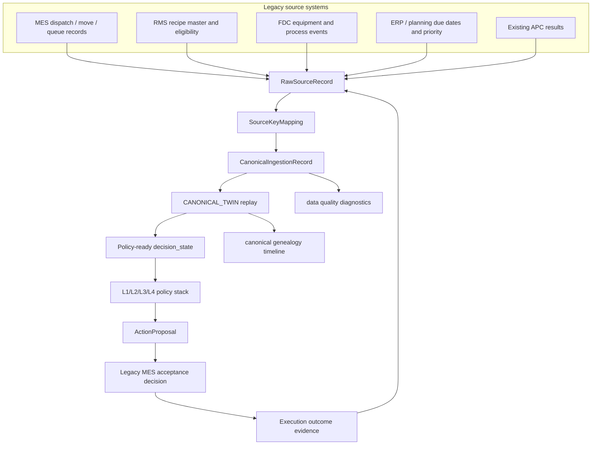
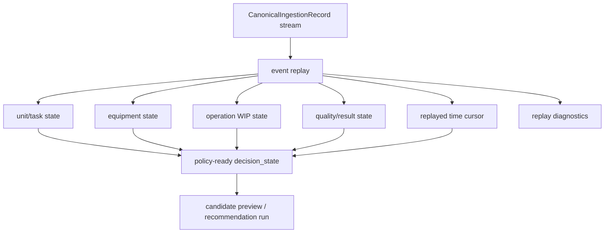

# Production Digital Twin Backbone

Status: canonical production-transition specification
Last updated: 2026-05-31

## Reader

Primary reader: production-state engineers, backend developers, and AI
developers who need policy-ready state reconstructed from real source data.

Use this when implementing canonical twin replay, state-at-time queries,
candidate previews from production-shaped data, or learning dataset capture.

Read after: [12_LEGACY_INGESTION_CONTRACT.md](12_LEGACY_INGESTION_CONTRACT.md).

## Purpose

The simulator is useful for MVP development, but a deployable manufacturing AI
must reconstruct state from production data. The production data backbone uses
canonical ingestion records as the source of truth:

```text
RawSourceRecord
  -> CanonicalIngestionRecord
  -> CANONICAL_TWIN state
  -> policy-ready decision_state
  -> L1/L2/L3/L4 recommendation flow
```

The AI MES still does not directly control equipment. This layer only creates a
consistent decision-state surface from legacy MES/RMS/FDC/APC/ERP data.

## Production Data Flow



The loop closes through observed outcomes. Future learning-based policies should
train from the canonical state, recommendation, proposal, legacy decision, and
outcome sequence rather than from unlinked source rows.

Data quality is part of the backbone, not a separate dashboard concern. If a
source key maps to two canonical ids, a canonical record references missing raw
evidence, or a unit record lacks `operation_id`, the policy stack may still run
but the decision should be treated as lower-trust evidence.

## Twin State Composition



The digital twin is not just a database copy. It is the reconstructed state
surface that policies can use exactly like the simulator's `decision_state`.

## Current V1 Implementation

Implementation files:

- `src/mes/digital_twin.py`
- `src/mes/runtime/digital_twin.py`
- `src/mes/runtime/trace_api.py`
- `tests/test_mes_digital_twin_backbone.py`

V1 replays `CanonicalIngestionRecord` rows and produces:

- unit/task state,
- equipment state,
- operation-level WIP counts,
- quality result attachments,
- current/replayed `time`,
- applied record ids,
- twin replay diagnostics,
- existing policy-compatible `decision_state`.

It also exposes production data foundation diagnostics:

- canonical schema contract,
- raw/canonical/source-key counts,
- entity and operation coverage,
- event-time/ingest-time freshness,
- source-key canonical conflicts,
- missing raw evidence references,
- missing `operation_id` warnings,
- canonical entity genealogy with raw evidence.

## Supported Event Semantics

V1 intentionally uses a compact event vocabulary that can be mapped from legacy
systems.

| Category | Event types |
|---|---|
| Wait/queue | `LOT_WAITING`, `UNIT_WAITING`, `WAFER_WAITING`, `WAITING`, `QUEUED`, `QUEUE_ENTERED`, `MOVE_TO_OPERATION`, `RELEASE`, `TRACK_OUT` |
| Running | `TRACK_IN`, `ASSIGNMENT_STARTED`, `PROCESS_STARTED`, `EQUIPMENT_STARTED` |
| Rework | `REWORK_REQUESTED`, `REWORK_WAITING`, `REWORK` |
| Hold | `HOLD`, `LOT_HOLD`, `UNIT_HOLD` |
| Completed | `PACKED`, `SHIPPED`, `COMPLETED`, `UNIT_COMPLETED` |
| Equipment idle | `EQUIPMENT_AVAILABLE`, `EQUIPMENT_IDLE`, `IDLE`, `TOOL_AVAILABLE` |
| Equipment busy | `EQUIPMENT_BUSY`, `EQUIPMENT_RUNNING`, `TOOL_BUSY` |

Adapters should map source-specific events into this vocabulary before policy
state generation.

## Decision State Contract

`build_canonical_decision_state()` emits the same core structure used by the
simulator-backed policy stack:

```python
{
    "state_source": "CANONICAL_TWIN",
    "time": 5,
    "tasks": {
        101: {
            "uid": 101,
            "job_id": "LOT_ALPHA",
            "due_date": 30,
            "location": "QUEUE_A",
            "material_type": "plastic",
            "color": "red",
            "customer_id": "ALPHA"
        }
    },
    "A": {
        "machines": {
            "A_0": {
                "status": "idle",
                "finish_time": -1,
                "batch_size": 2,
                "current_batch_uids": []
            }
        },
        "wait_pool_uids": [101, 102],
        "rework_pool_uids": [],
        "held_uids": [],
        "queue_stats": {"wait_pool_size": 2}
    }
}
```

That means the current factory-built L1 candidate portfolio can consume
canonical production state without reading simulator internals.

## API

Replay canonical ingestion records into a twin state:

```http
GET /api/v2/digital-twin/canonical-state
GET /api/v2/digital-twin/canonical-state?at_time=10&run_id=RUN_...
```

The response includes:

```python
{
    "diagnostics": {
        "twin": {"status": "OK", "unit_count": 2, "equipment_count": 1},
        "data_quality": {
            "status": "OK",
            "counts": {"raw_records": 3, "canonical_records": 3}
        }
    }
}
```

Return policy-ready decision state:

```http
GET /api/v2/digital-twin/canonical-decision-state
```

Preview L1 candidates from canonical state:

```http
GET /api/v2/digital-twin/candidate-preview?stage=A
```

Run the full recommendation chain from canonical state:

```http
POST /api/v2/digital-twin/recommendation-run
```

Inspect the production schema contract:

```http
GET /api/v2/production/schema
```

Inspect production data quality:

```http
GET /api/v2/production/data-quality
```

Trace a canonical entity back to source evidence:

```http
GET /api/v2/genealogy/canonical/UNIT/WAFER_401
```

This executes:

```text
CANONICAL_TWIN decision_state
-> L4 objective
-> L3 selection
-> L1 selected allocation
-> L2 APC/recipe annotation
-> Rule Engine
-> MESCommand
-> ActionProposal
```

The preview is intentionally read-only. It proves that production-shaped
canonical records can feed the same candidate-generation path as simulator
state.

## Boundary

V1 does not yet:

- mutate the live simulator from canonical records,
- handle source-specific adapter scheduling,
- resolve late/out-of-order conflicts beyond event-time cutoff replay and diagnostics,
- replace the SQLite MVP store with production PostgreSQL,
- replace legacy MES execution logic.

The current V1 path can already run the full L4 -> L3 -> L1 -> L2 -> Rule
Engine -> Action Proposal chain against `CANONICAL_TWIN` state. The next step is
scheduled source ingestion, production database migrations, and operator-gated
proposal submission into the legacy MES boundary.
