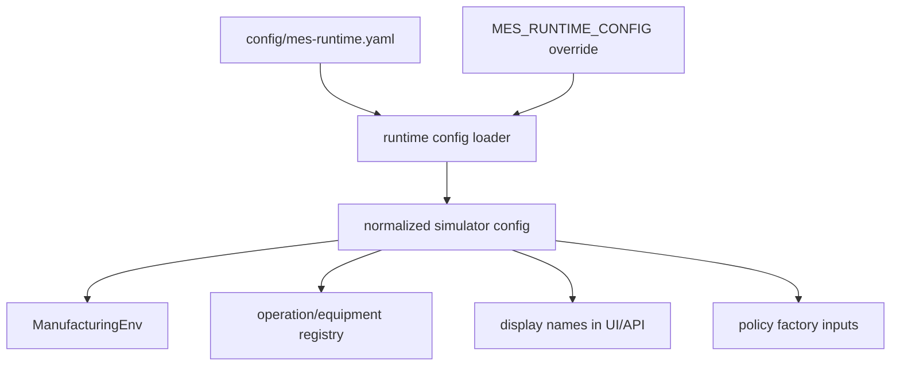

# Runtime Config

Status: canonical production-transition specification
Last updated: 2026-07-17

## Reader

Primary reader: operators, backend developers, and simulation users who need to
change process names, equipment names, machine counts, batch sizes, or process
times without editing Python code.

Use this when configuring a local experiment or preparing a production-shaped
operation registry.

Read after: [10_OPERATION_REGISTRY_ACTION_PROPOSAL.md](10_OPERATION_REGISTRY_ACTION_PROPOSAL.md).

## Purpose

Runtime Config V1 moves simulator and display settings out of Python code and
into `config/mes-runtime.yaml`.

This is a transition step toward production operation insertion. The simulator
still uses canonical ids such as `A`, `B`, `C`, `A_0`, `B_0`, and `C_0`, but
process names, equipment names, batch sizes, process times, and machine counts
can now be changed without editing `MESAPIContext`.

## Config Load Flow



The config file controls experiment shape and display naming. It should not
change canonical state/action ids unless a future adapter explicitly maps
production ids into the AI MES namespace.

## Config Location

Default:

```text
config/mes-runtime.yaml
```

Override:

```bash
MES_RUNTIME_CONFIG=/path/to/mes-runtime.yaml
```

Loader:

```text
src/mes/runtime/config.py
```

Runtime owner:

```text
src/mes/runtime/context.py
```

## V1 Shape

```yaml
name: MES Runtime
version: 0.1.0
schema: v1

simulator:
  num_machines:
    A: 5
    B: 3
    C: 3
  batch_size:
    A: 3
    B: 2
    C: 4
  process_time:
    A: 20
    B: 8
    C: 2
  max_packs_per_step: 3
  deterministic_mode: true

display:
  stages:
    A: Lithography QA
    B: Wet Clean QA
    C: Final Packing
  equipment:
    A_0: LITHO-01
    A_1: LITHO-02
    B_0: CLEAN-01
    C_0: PACK-01

factory_twin:
  enabled: true
  source: SIMULATOR
  layout:
    mode: registry
    operation_spacing: 28
    equipment_spacing: 5
    aisle_width: 6
  transport:
    mode: timed_oht
    oht_time:
      A>B: 3
      B>C: 3
  rendering:
    max_visible_queue_items: 24
    labels_default: true
  warehouse:
    enabled: true
    visible_slots: 48
```

The loader normalizes this friendly shape into the existing `ManufacturingEnv`
flat keys:

```python
{
    "num_machines_A": 5,
    "batch_size_A": 3,
    "process_time_A": 20,
    "stage_display_names": {"A": "Lithography QA"},
    "equipment_display_names": {"A_0": "LITHO-01"}
}
```

## OHT Travel Time

The default runtime uses authoritative `timed_oht` transport. `oht_time` may be
a route map when each handoff has a different duration:

```yaml
transport:
  mode: timed_oht
  oht_time:
    A>B: 3
    B>C: 5
```

It may also be one scalar applied to every route:

```yaml
transport:
  mode: timed_oht
  oht_time: 3
```

The older `default_travel_time` and `route_travel_time` keys remain accepted for
backward compatibility. New runtime profiles should use `oht_time`.

The dedicated Factory Twin profile uses the same contract:

```text
config/mes-runtime-factory-twin.yaml
```

Run it with:

```bash
MES_RUNTIME_CONFIG=config/mes-runtime-factory-twin.yaml \
  .venv/bin/python -m uvicorn src.mes.api:app --host 127.0.0.1 --port 8000
```

In `timed_oht` mode, A-to-B and B-to-C outputs remain `IN_TRANSIT` until their
configured arrival time. A task belongs to the OHT transfer during this interval
and is added to the downstream Wait Pool only on arrival. This changes downstream
candidate eligibility and is therefore domain behavior, not just browser
animation. Layout settings affect only visualization and must not enter
L1/L2/L3/L4 policy inputs.

## Boundary

Display names are metadata. They must not replace canonical ids.

| Purpose | Uses canonical id | Uses display name |
|---|---:|---:|
| Policy decisions | yes | no |
| Rule Engine validation | yes | no |
| Simulator action payload | yes | no |
| Genealogy lookup | yes | optional label |
| UI labels | no | yes |
| Operator-facing text | no | yes |

This lets the current simulator remain stable while future production adapters
map real operation and equipment names into the registry.

## Future Extensions

Runtime Config V1 intentionally stays small. Later production work should add:

- route/equipment master import into `operations` and `equipment`,
- config validation with field-level error messages,
- hot reload or admin update workflow,
- per-operation policy binding in config,
- production profile selection for dev/stage/prod environments.
