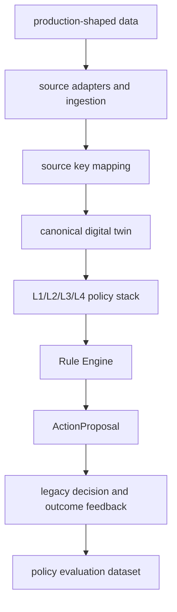

# Production MES V1 Goals

Status: canonical implementation summary
Last updated: 2026-05-31

## Reader

Primary reader: product owners, architecture leads, and deployment planners
checking how current implementation maps to production-transition goals.

Use this when deciding what is already implemented, what remains outside V1,
and how simulator work supports legacy-safe deployment.

Read after: [13_PRODUCTION_DIGITAL_TWIN_BACKBONE.md](13_PRODUCTION_DIGITAL_TWIN_BACKBONE.md).

## Goal

Production MES V1 connects the simulator-born AI MES architecture to a
legacy-safe production integration path. It does not replace legacy MES control.
It turns production-shaped data into canonical state, runs the AI policy stack,
creates action proposals, and records feedback for evaluation.

## Capability Map



Production MES V1 is not autonomous control. It is the first complete loop from
production-shaped evidence to recommendation proposal to observed outcome.

These goals follow from the same manufacturing-decision thesis as the simulator
architecture. Production value does not come from replacing one dispatch rule
with another. It comes from capturing the full decision context, proposing a
legacy-safe action, and comparing the proposal with actual legacy decisions and
outcomes.

## Implemented V1 Axes

### 1. Canonical Twin Recommendation Runner

Endpoint:

```http
POST /api/v2/digital-twin/recommendation-run
```

Flow:

```text
CanonicalIngestionRecord
-> CANONICAL_TWIN decision_state
-> L4/L3/L1/L2 policy stack
-> Rule Engine
-> MESCommand
-> ActionProposal
```

The runner is read-only with respect to the live simulator. It records audit
artifacts and returns an action proposal with
`direct_equipment_control=false`.

### 2. Source-Specific Legacy Adapters

Endpoints:

```http
GET /api/v2/legacy-adapters
POST /api/v2/legacy-adapters/{adapter_id}/ingest
```

Initial adapters:

- `legacy_mes_wip_unit`
- `legacy_mes_equipment`
- `fdc_quality_event`
- `rms_recipe`

Each adapter maps a source row into the generic ingestion contract:

```text
source row -> RawSourceRecord -> CanonicalIngestionRecord -> SourceKeyMapping
```

### 3. Production Data Foundation Diagnostics

Endpoints:

```http
GET /api/v2/production/schema
GET /api/v2/production/data-quality
```

The schema endpoint documents the target canonical production data contract:

- lots,
- units/wafers,
- equipment,
- operations,
- recipes,
- events,
- assignments,
- quality results,
- source key mappings,
- raw source records,
- canonical ingestion records,
- action proposals,
- action proposal reviews,
- legacy decisions,
- outcome records.

The data quality endpoint checks whether production-shaped source data is safe
for policy use:

- source-key canonical conflicts,
- unsupported entity types,
- missing canonical ids,
- missing raw evidence,
- missing `operation_id`,
- event-time/ingest-time inconsistencies,
- entity and operation coverage.

### 4. Dynamic Operation / Route Generalization

Endpoint:

```http
GET /api/v2/operations/route-graph
```

The operation registry now exposes a route graph with operation nodes,
downstream edges, and equipment grouped by operation. This keeps A/B/C as
defaults while allowing production operation ids from config or master data.

### 5. Canonical Twin Genealogy

Endpoint:

```http
GET /api/v2/genealogy/canonical/{entity_type}/{canonical_id}
```

Canonical genealogy connects one production entity back to:

- replayed canonical records,
- raw source evidence,
- related lot/unit/equipment/recipe ids,
- event-time and ingest-time sequence,
- data quality diagnostics.

This is the bridge from "the AI selected this" to "these source records and
events created the state the AI saw."

### 6. Recommendation Lifecycle Feedback Loop

Endpoint:

```http
GET /api/v2/action-proposals/{proposal_id}/workflow
GET /api/v2/action-proposals/{proposal_id}/feedback-summary
```

The workflow and feedback summary link:

- review status and safe-to-submit gate,
- proposed equipment/units,
- legacy MES accept/modify/reject decision,
- actual equipment/units,
- execution/quality outcome,
- learning/evaluation usability signal.

### 7. Policy Evaluation Platform V2

Decision records can now be exported as policy-evaluation rows, and canonical
twin scenarios can be captured and replayed through existing policy variant
experiments.

Endpoint:

```http
GET /api/v2/ai-dev/decision-dataset
GET /api/v2/ai-dev/policy-evaluation-summary
POST /api/v2/ai-dev/scenarios/capture-canonical
POST /api/v2/ai-dev/experiments/run
```

This lets policy variants compare against the same production-shaped
`CANONICAL_TWIN` state rather than only simulator state, and it creates the
learning-ready row shape needed before replacing FIFO/rule policies with
learning-based policies.

### 8. Production Persistence / Deployment Hardening

Endpoint:

```http
GET /api/v2/production-readiness
```

The readiness payload reports:

- persistence backend,
- schema version,
- normalized indexes,
- production schema and data quality endpoints,
- idempotent surfaces,
- direct-equipment-control boundary,
- read-only LLM/tool default,
- production integration endpoints.

## Current Boundary

Production MES V1 still does not:

- submit commands directly to equipment,
- replace legacy MES scheduling or dispatch engines,
- implement production PostgreSQL,
- provide auth/roles,
- run source adapters on Airflow/Cron schedules,
- train learning-based policies.

Those are next-phase deployment tasks.
