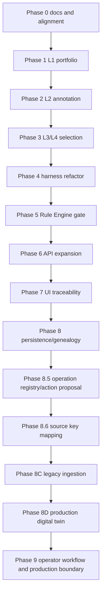

# Implementation Roadmap

Status: canonical
Last updated: 2026-05-31

## Reader

Primary reader: project planners and implementation leads coordinating future
work across policy, runtime, UI, ingestion, and deployment hardening.

Use this when selecting the next development phase, checking acceptance
criteria, or deciding where a new requirement belongs.

Read after: [15_PRODUCTION_MES_V1_GOALS.md](15_PRODUCTION_MES_V1_GOALS.md) and
[17_CURRENT_IMPLEMENTATION_STATUS.md](17_CURRENT_IMPLEMENTATION_STATUS.md).

## Guiding Principle

Do not replace the working simulator. Add layered MES policy contracts around it.

Existing tests and simulator research flows should continue to pass while the
MES path evolves.

Roadmap phase numbers preserve the historical build sequence. For new planning,
use [17_CURRENT_IMPLEMENTATION_STATUS.md](17_CURRENT_IMPLEMENTATION_STATUS.md)
to understand what exists today, then use the "Next Priorities" section below
to choose the next production-readiness slice.

## Roadmap Dependency Map



The roadmap is intentionally cumulative. Later production work depends on the
same portfolio, annotation, Rule Engine, and traceability contracts built for
the simulator.

## Phase 0: Documentation And Alignment

Deliverables:

- canonical docs in `docs/ai-mes/`,
- legacy document map,
- root documentation pointers if needed.

Acceptance:

- one canonical folder exists,
- layered decision architecture is documented,
- UI/MES/API/runtime docs agree on the same flow.

## Phase 1: C Packing Candidate Portfolio

Status: implemented in the simulator-backed MES path.

Why first:

- C packing has the clearest policy factorization.
- Current `GreedyScorePacker` already has local scoring.
- Customer/product/material attributes already exist on `Task`.

Deliverables:

- L1 candidate portfolio generation in `src/mes/decision/candidates.py`,
- candidate ids,
- group keys,
- local scores,
- feature payloads,
- tests for Alpha/Beta style group portfolios.

Acceptance:

- L1 can generate multiple candidates per group,
- local best candidate remains compatible with current `select_pack()` behavior,
- no simulator environment code contains scheduling decisions.

## Phase 2: L2 Candidate Annotation

Status: implemented in `src/mes/decision/annotations.py`.

Deliverables:

- A/B candidate annotation through tuners,
- C candidate annotation for pack quality, compatibility, queue age, and risk,
- recommendation envelope support for annotated candidate portfolios.

Acceptance:

- each candidate can carry process implications,
- L2 annotation references `candidate_id`,
- existing A/B recipe behavior is preserved.

## Phase 3: L3/L4 Selection Over Portfolio

Status: implemented for the simulator-backed MES path.

Deliverables:

- L4 objective policy object,
- L3 meta selector object,
- selection contract over candidate portfolio,
- due-date/customer/product/WIP/rework score components,
- tests showing upper layer can select lower local-score group due to objective
  pressure.

Acceptance:

- L3/L4 select from candidate ids/groups generated by L1,
- L3 does not invent task lists,
- selected group is auditable.

## Phase 4: Harness Refactor

Status: implemented for the current harness API surface and completed as a
Strangler Refactor.

Deliverables:

- harness phases split into candidate generation, annotation, objective,
  selection, finalization, validation, storage, execution,
- `src/mes/harness.py` reduced to a compatibility facade,
- DTOs moved to `src/mes/harnessing/artifacts.py`,
- planner/generator/evaluator moved to `src/mes/harnessing/`,
- `src/mes/services.py` reduced to a facade over `src/mes/decision/`,
- `src/mes/api.py` reduced to FastAPI route wiring,
- feature-specific FastAPI route declarations split into focused
  `src/mes/runtime/*_api.py` router modules,
- runtime payload builders moved to `src/mes/runtime/`,
- control-room UI moved to `src/mes/ui/templates` and `src/mes/ui/static`,
- evaluator checks for portfolio and layer consistency,
- current `run()`/`run_and_step()` behavior preserved behind compatible output.

Acceptance:

- old harness tests pass or are updated intentionally,
- new portfolio tests pass,
- decision chain still stores L4/L3/L1/L2 recommendations,
- rejected chains do not create commands.

## Phase 5: Rule Engine Consistency Gate

Status: implemented for current L4/L3/L1/L2 chain consistency. Duplicate
same-cycle reservation locks and operator approval gates remain future work.

Deliverables:

- validation that L3 selected group matches L1 selected candidate,
- validation that L2 recommendation references selected L1 candidate,
- validation that L4 objective id matches the chain,
- clearer rejection reasons.

Future deliverables:

- duplicate same-cycle task checks across concurrent command batches,
- operator approval gates,
- recipe approval/download compatibility gates.

Acceptance:

- invalid upper/lower chain mismatch is rejected,
- valid C packing chain passes,
- rejection reasons are surfaced in API/UI.

## Phase 6: API Expansion

Status: implemented for the current control-room API surface. Standalone
candidate, annotation, meta-selection, and finalization APIs remain future work.

Deliverables:

- `/api/v2/decision-chain/{correlation_id}` traceability,
- `/api/v2/gantt` flow/stage/equipment schedule payload,
- `/api/v2/equipment/{equipment_id}/detail` A/B/C machine detail,
- `/api/v2/fab/live` live control-room payload,
- `/api/v2/harness/run-cycle` L3 budget-driven AUTO execution,
- `/api/v2/harness/run-until` bounded execution loop,
- decision-chain response with candidate portfolio metadata.
- `/api/v2/candidate-portfolio/latest` selected/rejected portfolio payload,
- `/api/v2/candidate-portfolio/{correlation_id}` correlation-specific
  portfolio payload.
- `/api/v2/ai-dev/policy-stack` active policy-stack payload,
- `/api/v2/ai-dev/decision-cycles` correlation-level decision browser payload,
- `/api/v2/ai-dev/candidate-portfolio/{correlation_id}` developer portfolio
  payload with score breakdown and L2 detail.

Future deliverables:

- standalone annotation endpoint,
- standalone meta-selection endpoint,
- command finalization endpoint.

Acceptance:

- UI can show local score vs upper-layer score,
- API remains backward compatible for current `/mes`,
- command execution still goes through Rule Engine.

## Phase 7: UI Expansion

Status: implemented for Control Room Traceability V1, Candidate Portfolio
Workbench V1, AI Developer Console V1, Policy Experiment Runner V1, and
Assignment Trace Inspector V1. The control room shows L3 budget plan, selected
and rejected candidate rows, L2 annotations, L3/L4 policy ids, A/B/C machine
detail, Gantt drilldown, autoplay, generate lot, reset, offline policy
experiment comparison, and assignment-level chain inspection.

Delivered:

- selected-candidate trace panels,
- selected/rejected Candidate Portfolio workbench,
- local score vs L3 upper score,
- L2 annotation and command status per candidate,
- latest actionable portfolio fallback when the newest cycle is empty,
- empty portfolio diagnostics,
- AI Developer Console policy stack, decision cycle browser, portfolio lab,
  score breakdown, and L2 annotation inspector,
- Policy Experiment Runner scenario capture, policy variant registry, offline
  replay, result comparison, and decision diff inspector,
- Assignment Trace Inspector search and Gantt click-through from equipment/task
  assignment to L4 -> L3 -> L1 -> L2 -> Rule -> Command -> simulator action,
- C packing group-selection traceability,
- selected local-score and upper-score metadata where available,
- C machine detail,
- evaluator checks for portfolio flow.

Future deliverable:

- Scenario preset library for balanced/A-bottleneck/B-bottleneck/stress states.
- Learning-policy adapters behind the existing variant registry.

Acceptance:

- user can see why a lower local score group won,
- selected group and final pack are visually separate,
- Rule Engine status remains visually distinct from AI recommendation.

## Phase 8: Persistence And Genealogy

Status: implemented for Digital Twin Genealogy & Execution Ledger V1 and
Run-Scoped Normalized Ledger Index V1.

Deliverables:

- task/wafer genealogy query by simulator task uid,
- lot/job genealogy rollout,
- equipment command and simulator event timeline,
- correlation-level execution ledger,
- simulator action applied event persistence,
- decision-state snapshot lookup by simulator time,
- Assignment Trace to Genealogy UI linkage,
- durable `run_id` namespace for startup/reset sessions,
- reset that preserves prior genealogy under prior run ids,
- normalized SQLite index tables for runs, tasks, lots, assignments,
  equipment timeline, commands, events, state snapshots, and genealogy edges,
- SQLite persistence internals split into `src/mes/persistence/sqlite_schema.py`,
  `sqlite_records.py`, and `sqlite_ledger_index.py` while preserving the
  `SQLiteMESStore` public API,
- direct `/api/v2/ledger-index/{index_name}` developer index query API,
- SQLite-backed Agent Run records for `/mes#chat` and Agent Run Inspector,
- configurable process/equipment display names while preserving canonical
  simulator ids.

Acceptance:

- command can be traced to objective, group selection, candidate, recipe/APC,
  Rule Engine validation, simulator action, post-state, and equipment event,
- T0/task lookup shows creation, assignment, command, and equipment start/finish
  lineage,
- equipment lookup shows the processed task sequence,
- lot lookup rolls up related task and command ids,
- runtime state can be inspected at a requested simulator time from available
  snapshots,
- SQLite path remains usable for MVP,
- reused task ids after reset resolve to the current run by default and to
  historical runs when `run_id` is supplied.

Future deliverables:

- event-sourced WIP reconstruction independent of live simulator state,
- explicit quality/rework lineage records,
- durable genealogy queries across process restarts.

## Phase 8.5: Operation Registry And Action Proposal Boundary

Status: implemented for V1 production-transition contracts.

Deliverables:

- operation/equipment registry in `src/mes/operations/registry.py`,
- default A/B/C simulator operations registered from runtime config,
- configurable operation insertion path for future production process steps,
- registry-backed stage/equipment display naming,
- external runtime config in `config/mes-runtime.yaml` and
  `MES_RUNTIME_CONFIG`,
- `GET /api/v2/operations` registry API,
- Action Proposal DTOs in `src/mes/action_proposals.py`,
- `GET /api/v2/action-proposals` API derived from validated commands,
- explicit `direct_equipment_control=false` production boundary,
- proposal lifecycle DTOs for legacy decisions and execution outcomes,
- in-memory and SQLite persistence for proposal lifecycle records,
- `proposal_lifecycle_index` normalized ledger table,
- `POST/GET /api/v2/action-proposals/{proposal_id}/legacy-decisions`,
- `POST/GET /api/v2/action-proposals/{proposal_id}/outcomes`,
- `GET /api/v2/action-proposals/{proposal_id}/lifecycle`.

Acceptance:

- A/B/C remain compatible with simulator state/action keys,
- real operations can be represented without changing environment physics,
- AI-generated commands can be projected as legacy-safe proposals,
- proposal records link back to correlation id, candidate id, command id, target
  equipment, target units, and L1/L2 recommendation ids,
- legacy accept/modify/reject decisions and execution outcomes can be linked
  back to the `proposal_id`,
- `/api/v2/action-proposals` includes lifecycle summary fields for each proposal.

Future deliverables:

- production outbox adapter and operator approval queue,
- operation registry loading from route/equipment master data.

## Phase 8.6: Legacy Source Key Mapping

Status: implemented for V1 mapping contracts.

Deliverables:

- `SourceKeyMapping` DTO in `src/mes/domain.py`,
- in-memory and SQLite store support for source-key mappings,
- `source_key_mapping_index` normalized ledger table,
- deterministic `SKM_...` mapping ids from source system/table/pk/entity/run,
- `POST /api/v2/source-key-mappings` upsert API,
- `GET /api/v2/source-key-mappings` list API,
- `GET /api/v2/source-key-mappings/resolve` lookup API,
- canonical documentation in `11_LEGACY_SOURCE_KEY_MAPPING.md`.

Acceptance:

- a legacy source key can be resolved to a canonical AI MES id,
- mapping records preserve `event_time`, `ingest_time`, and `decision_time`,
- mappings persist through SQLite reload,
- `/api/v2/ledger-index/source_key_mapping_index` exposes mapping evidence.

Follow-on deliverables:

- canonical ingestion records are handled by Phase 8C below,
- source-specific ingestion adapters,
- conflict review workflow for one source key mapping to multiple canonical ids,
- production PostgreSQL DDL and migration scripts,
- source-system data quality dashboard.

## Phase 8C: Legacy Ingestion Contract V1

Deliverables:

- `RawSourceRecord` DTO in `src/mes/ingestion.py`,
- `CanonicalIngestionRecord` DTO in `src/mes/ingestion.py`,
- in-memory and SQLite store support for both ingestion record types,
- `raw_source_record_index` and `canonical_ingestion_index` normalized ledger
  tables,
- `POST /api/v2/ingestion/source-records` ingest API,
- `GET /api/v2/ingestion/source-records` list API,
- `GET /api/v2/ingestion/canonical-records` list API,
- automatic SourceKeyMapping upsert when `canonical_id` is present,
- canonical documentation in `12_LEGACY_INGESTION_CONTRACT.md`.

Acceptance:

- raw source evidence persists through SQLite reload,
- canonical projections persist through SQLite reload,
- ingestion preserves `event_time`, `ingest_time`, and `decision_time`,
- source-key mapping resolve works after ingestion with a canonical id,
- raw-only records can be stored before a mapping is available.

Future deliverables:

- source-specific MES/FDC/RMS/ERP ingestion adapters,
- event-sourced WIP reconstruction from canonical ingestion records,
- conflict review workflow for mapping collisions,
- production PostgreSQL DDL and migration scripts,
- source-system data quality dashboard and alerting.

## Phase 8D: Production Digital Twin Backbone V1

Status: implemented for canonical replay, diagnostics, genealogy, candidate
preview, and production-safe recommendation run.

Deliverables:

- event-sourced replay helper in `src/mes/digital_twin.py`,
- runtime payload helpers in `src/mes/runtime/digital_twin.py`,
- API routes:
  - `GET /api/v2/digital-twin/canonical-state`,
  - `GET /api/v2/digital-twin/canonical-decision-state`,
  - `GET /api/v2/digital-twin/candidate-preview`,
  - `POST /api/v2/digital-twin/recommendation-run`,
  - `GET /api/v2/production/schema`,
  - `GET /api/v2/production/data-quality`,
  - `GET /api/v2/genealogy/canonical/{entity_type}/{canonical_id}`,
- supported canonical event semantics for wait/running/rework/hold/completed
  unit state and equipment availability,
- production `CANONICAL_TWIN` state source marker,
- policy-compatible decision-state builder,
- L1 candidate portfolio preview from canonical state,
- full L4 -> L3 -> L1 -> L2 -> Rule Engine -> Action Proposal run from
  canonical state,
- twin replay diagnostics and production data quality diagnostics,
- canonical entity genealogy linked to raw source evidence,
- canonical documentation in `13_PRODUCTION_DIGITAL_TWIN_BACKBONE.md`.

Acceptance:

- canonical unit/equipment records replay into operation WIP state,
- event-time cutoff changes reconstructed state,
- rework events move units into `rework_pool_uids`,
- policy-ready state has the same `tasks`, stage queues, and machine shape as
  simulator state,
- candidate preview generates L1 candidates from canonical state without
  mutating simulator state,
- recommendation run returns an `ActionProposal` with
  `direct_equipment_control=false`,
- data-quality diagnostics flag source-key conflicts and missing source
  evidence,
- canonical genealogy can explain which raw/canonical records produced a unit,
  lot, equipment, recipe, assignment, or quality entity.

Future deliverables:

- source-specific adapter packages for MES/FDC/RMS/ERP event vocabularies,
- out-of-order event conflict diagnostics,
- production PostgreSQL event store,
- WIP reconstruction freshness and data-quality monitoring.

## Next Priorities

Recommended next build order:

1. Source adapter scheduling/backfill jobs for MES/FDC/RMS/ERP ingestion.
2. Production PostgreSQL schema and migrations for canonical/event/proposal
   records.
3. Auth, roles, and operator approval queue for write-capable workflows.
4. Full source-data quality dashboard for duplicate, late, missing, and
   conflicting events.
5. Extend read-only Agent Mode tools from Process A APC to Process B APC and C
   packing quality.
6. Add approval-gated write-tool contract for future L4/operator workflows,
   keeping current `/mes#chat` default read-only.
7. Scenario preset library and config controls for balanced/A-bottleneck/
   B-bottleneck/stress experiments.
8. Duplicate same-cycle reservation locks for multi-command AUTO cycles.
9. Learning-policy adapter contract for L1/L2/L3/L4 experiment variants.
10. Richer FeatureSnapshot and state diff indexing for every decision cycle.
11. Quality/rework lineage records linked to task, recipe/APC, and equipment.
12. Recipe/APC command endpoints and operator hold/release/approval workflows.

## Phase 9: Operator Workflow And Production Boundaries

Deliverables:

- hold/release workflow,
- operator approval,
- command replay/export,
- auth/roles,
- production adapter boundaries for route master, equipment master, recipe
  master, dispatch command adapter, equipment event ingestion.

Acceptance:

- mutation endpoints are role-aware,
- recipe and command mutation can require approval,
- simulator adapter can later be replaced by production adapters.

## Test Strategy

For each phase:

- add narrow unit tests for new contracts,
- add harness integration tests for chain integrity,
- run relevant MES tests first,
- run full `pytest` when shared action/state contracts change.

Core regression command:

```bash
.venv/bin/python -m pytest
```

High-risk contracts:

- no duplicate task assignment,
- no command without validation,
- no environment-side scheduling decisions,
- L1 candidate ids remain stable within a cycle,
- L3/L4 selections must reference candidates produced by lower layers,
- UI must not imply direct AI execution.

## Migration Strategy

Do not remove `DefaultMetaScheduler` immediately. It remains:

- simulator baseline,
- regression comparator,
- source of current A/B/C policy behavior.

The layered MES policy stack now runs beside it and is the active `/mes` runtime
decision path. Once the MES path is mature,
compare:

- legacy meta scheduler KPI,
- layered portfolio policy KPI,
- acceptance/rejection rate,
- layer chain completion rate,
- throughput/yield/tardiness tradeoff.
