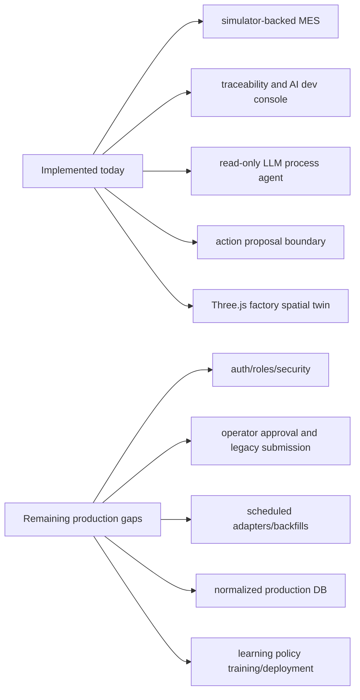

# Current Implementation Status

Status: canonical implementation snapshot
Last updated: 2026-07-17

## Reader

Primary reader: everyone who needs a quick factual snapshot of what is
implemented now and what remains a production gap.

Use this before planning new work, reviewing branch scope, or explaining the
current product maturity level.

Read after: [01_ARCHITECTURE_FLOW_GUIDE.md](01_ARCHITECTURE_FLOW_GUIDE.md) or
after any deeper document when checking implementation status.

## Purpose

This document answers one question:

```text
What is implemented today, and what is still a production-transition gap?
```

It is intentionally separate from [00_INDEX.md](00_INDEX.md) so the index stays
focused on navigation.

## Current Maturity Map



Read this diagram as the maturity boundary: the AI MES has a strong simulator
and production-transition skeleton, but it is not yet a deployable autonomous
manufacturing control system.

## Implemented Today

| Area | Implemented capability |
|---|---|
| Simulator kernel | `ManufacturingEnv`, `ProcessA_Env`, `ProcessB_Env`, `ProcessC_Env` |
| Local policies | A/B schedulers, A/B tuners, C packers |
| Policy factory | Config-built L1/L2/L3/L4 stack through `src/agents/factory.py` |
| L1/L2/L3/L4 chain | `L1 portfolio -> L2 annotations -> L4 objective -> L3 selection -> L1 finalization -> L2 finalization` |
| Rule Engine | Layer consistency validation and command creation |
| Harness | Planner, generator, evaluator, DTO artifacts under `src/mes/harnessing/` |
| Runtime APIs | Live state, Gantt, equipment detail, decision chain, assignment trace, genealogy, candidate portfolio, AI dev, experiments |
| Store | In-memory store plus SQLite JSON payload and normalized ledger indexes |
| UI | `/mes` control room with Fab, Flow/Gantt, Equipment, Machine Detail, Decision Chain, Assignment Trace, Candidate Portfolio, AI Dev Console, Chat, Events |
| Factory spatial twin | `/mes#factory-twin` with registry-driven 3D equipment, queues, OHT rails/carriers, warehouse, live simulator stream, canonical replay, and MES trace links |
| Agent tools | Read-only MES/APC chat agent with Continue-style config, Ollama/OpenAI-compatible providers, A/B/C layered tools, generic equipment telemetry/anomaly tools, typed visual artifacts, Active Inspector, and agent run audit |
| Production boundary | Operation registry, source key mapping, ingestion contracts, PostgreSQL target schema, source adapter registry, ingestion job/backfill runner, production schema/data-quality diagnostics, canonical twin replay/genealogy, action proposal boundary, review-gated proposal workflow |

## Current Default Policy Stack

| Layer | Current policy id | Current role |
|---|---|---|
| L1 | `L1_FIFO_BASELINE` | Local dispatch/packing baseline |
| L2 | `L2_RULE_BASED_APC` | Rule-based APC/process annotation |
| L3 | `L3_CANDIDATE_PORTFOLIO_RULE` | Cross-process candidate portfolio scoring |
| L4 | `L4_CYCLE_WEIGHT_RULE` | Cycle-level objective weighting |

## Current Simulator Baseline

```text
A: 5 tools, batch_size=3, process_time=20
B: 3 tools, batch_size=2, process_time=8
C: 3 tools, batch_size=4, process_time=2, max_packs_per_step=3
```

Display names are configurable through `config/mes-runtime.yaml` and
`MES_RUNTIME_CONFIG`; canonical simulator ids remain stable state/action keys.

The default runtime preserves immediate A-to-B and B-to-C transfer semantics.
`config/mes-runtime-factory-twin.yaml` enables authoritative timed OHT for
spatial experiments and downstream-arrival eligibility tests.

## Production-Transition Capabilities

Implemented V1 production-transition surfaces:

- operation/equipment registry,
- legacy-safe `ActionProposal` records with `direct_equipment_control=false`,
- source key mapping,
- raw source and canonical ingestion records,
- canonical production schema contract endpoint,
- PostgreSQL target schema and migration draft,
- source-specific MES/FDC/RMS/ERP adapters,
- framework-neutral ingestion job/backfill runner,
- source data quality diagnostics and `/mes#data-quality` UI panel,
- canonical digital twin replay and policy-ready decision state,
- canonical entity genealogy with raw evidence,
- canonical twin recommendation run into action proposal,
- common `factory-twin.v1` projection for simulator and canonical replay,
- source-specific legacy adapter examples,
- decision dataset and policy evaluation summary APIs,
- approval queue and action proposal review records,
- recommendation lifecycle feedback summaries,
- production readiness diagnostics.

## Not Implemented Yet

The system is not yet production-deployable as an autonomous or write-capable
manufacturing system.

Remaining gaps:

- production action-proposal outbox submission integration,
- legacy MES acceptance/rejection/modification outcome ingestion at production
  scale,
- production reservation locks and role-enforced operator approval workflows,
- auth, roles, and tenant/security model,
- PostgreSQL repository implementation and operational migrations,
- Airflow, Cron, or equivalent orchestration wired to the framework-neutral
  ingestion job runner,
- primary event-sourced digital twin replacing simulator state for live runtime,
- data quality alerting and conflict review workflows,
- learning-based policy training and model deployment,
- production MES/RMS/FDC/ERP adapters hardened against live source credentials,
  pagination, watermarks, late events, duplicate events, missing keys, and
  conflicting source records,
- production event-time telemetry adapter for Agent Visual Analytics; current
  visual queries read simulator event logs and label the time basis explicitly,
- approved production spatial mapping for real operation/equipment positions,
  observed OHT routes, and carrier telemetry; the current twin uses configured
  or deterministic auto-layout and labels inferred movement explicitly,
- route optimization, collision avoidance, robotics physics, and CAD/BIM import;
  these are intentionally outside Factory Spatial Digital Twin V1.

## Current Boundary

The most important boundary remains:

```text
AI MES may recommend and explain.
Legacy MES remains responsible for execution authority.
```

Any future write-capable workflow should route through:

```text
Recommendation
-> Rule Engine
-> ActionProposal
-> operator or auto-gated approval
-> legacy MES acceptance
-> observed execution outcome
```

## Process Quality Intelligence V1

Process A and B completion evidence now use a common provider-driven
`QualityEvidence` envelope. Existing `realized_qa_A`/`realized_qa_B` scalar
results remain the execution and rework verdicts. The maps add operation-
specific local-risk evidence for explanation and future policy evaluation.

Implemented surfaces:

- provider registry for operation A/B quality evidence,
- pure `PROCESS_A_SPATIAL_FIELD` and `PROCESS_B_CLEANING_FIELD` models,
- full evidence on A/B completion events,
- compact summary/model reference in task history,
- generic `query_process_quality_evidence` read-only Agent tool,
- `query_process_a_spatial_quality` read-only Agent tool,
- `process_quality_evidence` typed artifact,
- `process_a_spatial_quality` typed artifact,
- Active Inspector Chart/Data/Events rendering,
- explicit A `SIMULATED_SPATIAL_QUALITY` and B
  `SIMULATED_CLEANING_QUALITY` provenance.
