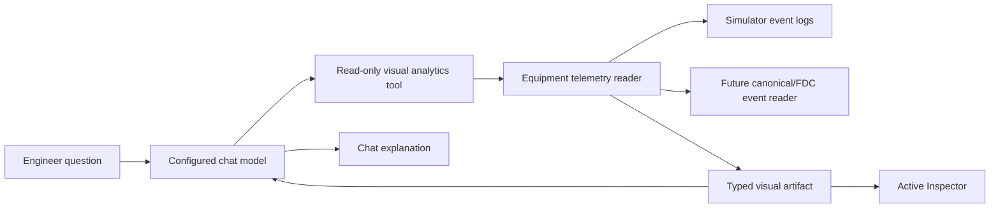

# MES Agent Visual Analytics V1

Status: implemented V1
Last updated: 2026-06-12

## Purpose

MES Agent Visual Analytics V1 lets an engineer request equipment analysis in
natural language and receive both:

- a concise explanation in Process Chat, and
- a server-validated visual artifact in an Active Inspector.

The model selects read-only tools. It does not generate executable chart code,
SQL, HTML, or equipment actions.

## Example Flow

```text
"Show the last 15 days of quality for LITHO-01"
  -> resolve LITHO-01 to canonical equipment A_0
  -> inspect supported metrics
  -> query equipment time series
  -> derive summary and anomaly markers
  -> return typed visual artifact
  -> explain the result in Chat
  -> open the artifact in Active Inspector
```

## UI Decision

The selected desktop layout is chart-focused:

```text
Chat 40% | Active Inspector 60%
```

The divider is resizable. The inspector supports close, pin, and full-screen
states. On narrow/mobile viewports it becomes a full-screen drawer.

The inspector contains:

- Chart tab,
- Data tab,
- Events tab,
- equipment/metric/time-range scope,
- KPI summary,
- source and time-basis provenance.

## V1 Metrics

| Metric | Meaning |
|---|---|
| `quality` | A/B QA or C composition/compatibility quality |
| `utilization` | busy duration divided by observed duration |
| `throughput` | completed units per aggregation bucket |
| `alarm` | observed source alarm records only |
| `anomaly` | derived OOS, drift, low utilization, or throughput drop |

Observed alarms and derived anomalies are different evidence classes. The
simulator must not claim that an equipment alarm occurred when only a derived
condition exists.

## Tool Contract

V1 exposes three generic tools:

```text
list_equipment_metrics
query_equipment_timeseries
query_equipment_anomalies
```

Tools accept canonical equipment ids or configured display names. Comparison
uses an `equipment_ids` array rather than equipment-specific tool names.

Example:

```json
{
  "equipment_ids": ["A_0", "A_1"],
  "metrics": ["quality", "utilization"],
  "time_range": {
    "type": "relative",
    "value": 15,
    "unit": "day"
  },
  "aggregation": "daily"
}
```

## Time Semantics

Simulator data and production event-time data must never be presented as if
they were the same clock.

Simulator response:

```json
{
  "source": "SIMULATOR",
  "time_basis": "SIMULATION_STEP",
  "requested_range": "15 days",
  "effective_range": "last 15 simulation periods"
}
```

Production response:

```json
{
  "source": "FDC",
  "time_basis": "EVENT_TIME",
  "timezone": "Asia/Seoul"
}
```

## Visual Artifact Contract

The tool returns structured data and a constrained display specification:

```json
{
  "artifact_id": "VIZ_...",
  "artifact_type": "equipment_timeseries",
  "title": "LITHO-01 Quality",
  "series": [],
  "events": [],
  "summary": {},
  "visualization": {
    "chart_type": "line",
    "x_field": "time",
    "y_field": "value",
    "series_field": "equipment_id",
    "metric_field": "metric",
    "target_bands": []
  },
  "provenance": {
    "source": "SIMULATOR",
    "time_basis": "SIMULATION_STEP",
    "query_tool": "query_equipment_timeseries"
  }
}
```

The browser renders only known artifact and chart types. Tool output cannot
inject script, HTML, CSS, SQL, or arbitrary Vega expressions.

## Implementation Map

| Module | Responsibility |
|---|---|
| `src/mes/runtime/equipment_telemetry.py` | Generic A/B/C equipment resolution, metric catalog, time series, alarm/anomaly evidence |
| `src/mes/agent_runtime/visual_tools.py` | Read-only Agent Mode tool schemas and execution |
| `src/mes/agent_runtime/visual_artifacts.py` | Deterministic typed artifacts and data-only validation |
| `src/mes/agent_runtime/agent_loop.py` | Artifact collection across multi-step tool calls |
| `src/mes/agent_runtime/run_store.py` | Agent run artifact audit contract |
| `src/mes/agent_runtime/sqlite_run_store.py` | Artifact persistence in the SQLite agent run payload |
| `src/mes/ui/static/control_room.js` | Active Inspector rendering and interaction |

The inspector does not execute chart code from the model. It maps the approved
artifact fields to built-in SVG renderers for line, bar, and event-timeline
views.

## Runtime Boundaries



## Safety And Limits

- visual tools remain `read_only=true`,
- equipment ids and metric ids are allowlisted,
- invalid display names fail rather than guessing,
- maximum equipment count, period, and returned point count are bounded,
- raw source and time basis are always included,
- artifact payloads are persisted with the agent run for audit,
- no direct MES, recipe, dispatch, or equipment mutation is added.

## Completion Criteria

1. Any configured A/B/C equipment can be queried by canonical id or display
   name.
2. One request can compare multiple equipment records.
3. Quality, utilization, throughput, observed alarms, and derived anomalies are
   represented without conflating their meaning.
4. Chat returns `visual_artifacts` linked to the agent run.
5. A visual tool call opens the 40:60 Active Inspector.
6. Chart, Data, and Events views show the same artifact evidence.
7. Source and time basis remain visible.
8. Existing non-visual Agent Mode and MES behavior remain compatible.
