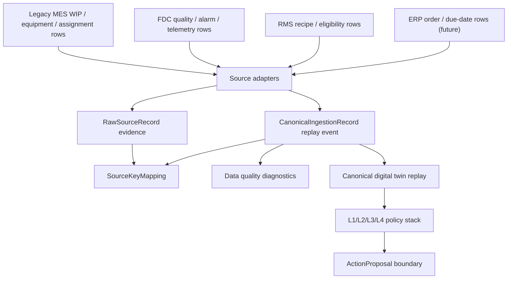

# Production Data Backbone V1

Status: canonical implementation guide  
Last updated: 2026-06-21

## Reader

Primary reader: production integration engineers and backend developers who
will connect real MES/FDC/RMS/ERP data to AI MES.

Read after:

- [01_ARCHITECTURE_FLOW_GUIDE.md](01_ARCHITECTURE_FLOW_GUIDE.md)
- [11_LEGACY_SOURCE_KEY_MAPPING.md](11_LEGACY_SOURCE_KEY_MAPPING.md)
- [12_LEGACY_INGESTION_CONTRACT.md](12_LEGACY_INGESTION_CONTRACT.md)
- [13_PRODUCTION_DIGITAL_TWIN_BACKBONE.md](13_PRODUCTION_DIGITAL_TWIN_BACKBONE.md)

## Goal

Production Data Backbone V1 turns source-system rows into canonical AI MES
events that can be replayed into the production digital twin.

It does not replace the legacy MES. It prepares data so AI MES can recommend,
explain, compare policies, and produce safe action proposals.

## Runtime Flow



## Implemented Modules

| Area | Files |
|---|---|
| Raw/canonical DTOs | `src/mes/ingestion/__init__.py` |
| Adapter interface | `src/mes/ingestion/adapters/base.py` |
| Adapter registry | `src/mes/ingestion/adapters/registry.py` |
| MES adapters | `src/mes/ingestion/adapters/legacy_mes_adapter.py` |
| FDC adapters | `src/mes/ingestion/adapters/fdc_adapter.py` |
| RMS adapters | `src/mes/ingestion/adapters/rms_adapter.py` |
| ERP adapter | `src/mes/ingestion/adapters/erp_adapter.py` |
| Backward-compatible facade | `src/mes/legacy_adapters.py` |
| PostgreSQL schema contract | `src/mes/persistence/postgres_schema.py` |
| PostgreSQL migration draft | `src/mes/persistence/migrations/postgres/001_production_data_backbone_v1.sql` |
| Ingestion job runner | `src/mes/jobs/ingestion_jobs.py` |
| Data quality runtime payload | `src/mes/runtime/data_quality.py` |
| Production boundary APIs | `src/mes/runtime/production_boundary_api.py` |
| UI data-quality panel | `/mes#data-quality` |

## API Surface

| Endpoint | Purpose |
|---|---|
| `GET /api/v2/production/schema` | Canonical contract plus PostgreSQL schema target |
| `GET /api/v2/production/data-quality` | Readiness, issue groups, late/missing/conflict diagnostics |
| `GET /api/v2/legacy-adapters` | Adapter catalog |
| `POST /api/v2/legacy-adapters/{adapter_id}/ingest` | Compatibility ingestion path for one source row |
| `GET /api/v2/ingestion/jobs` | Scheduler/backfill adapter catalog and recent runs |
| `GET /api/v2/ingestion/jobs/runs` | Ingestion job run ledger |
| `POST /api/v2/ingestion/jobs/run` | Framework-neutral delta/backfill runner |
| `POST /api/v2/ingestion/source-records` | Direct raw/canonical ingestion payload |
| `GET /api/v2/ingestion/source-records` | Raw evidence query |
| `GET /api/v2/ingestion/canonical-records` | Canonical event query |

## Data Quality Scope

V1 flags:

- duplicate raw/canonical/mapping ids,
- duplicate raw source keys,
- source key to canonical id conflicts,
- unsupported entity types,
- missing canonical ids,
- missing raw evidence references,
- missing operation ids,
- event time after ingest time,
- late-arriving canonical events,
- out-of-order canonical events.

The UI panel shows:

- readiness status,
- raw/canonical counts,
- blocking issue count,
- warning count,
- issue groups,
- freshness metrics,
- recommended actions.

## Scheduler/Backfill Boundary

`src/mes/jobs/ingestion_jobs.py` is framework-neutral. Airflow or cron should
call:

```python
run_ingestion_batch(context, adapter_id, rows, job_id="...")
backfill_ingestion(context, adapter_id, rows, window_start=..., window_end=...)
```

This keeps source-specific collection outside AI MES while preserving one
canonical ingestion path.

## Acceptance Criteria

Production Data Backbone V1 is accepted when:

1. PostgreSQL DDL exists for raw, canonical, mapping, proposal, outcome, and job
   run tables.
2. MES/FDC/RMS source rows can be converted through adapter classes.
3. Existing compatibility endpoint `/api/v2/legacy-adapters/{id}/ingest`
   still works.
4. Batch and backfill ingestion use the same adapter and persistence path.
5. Data quality API and UI expose missing/duplicate/conflict/late diagnostics.
6. Canonical replay handles out-of-order source input deterministically.
7. Tests cover the above contracts.
