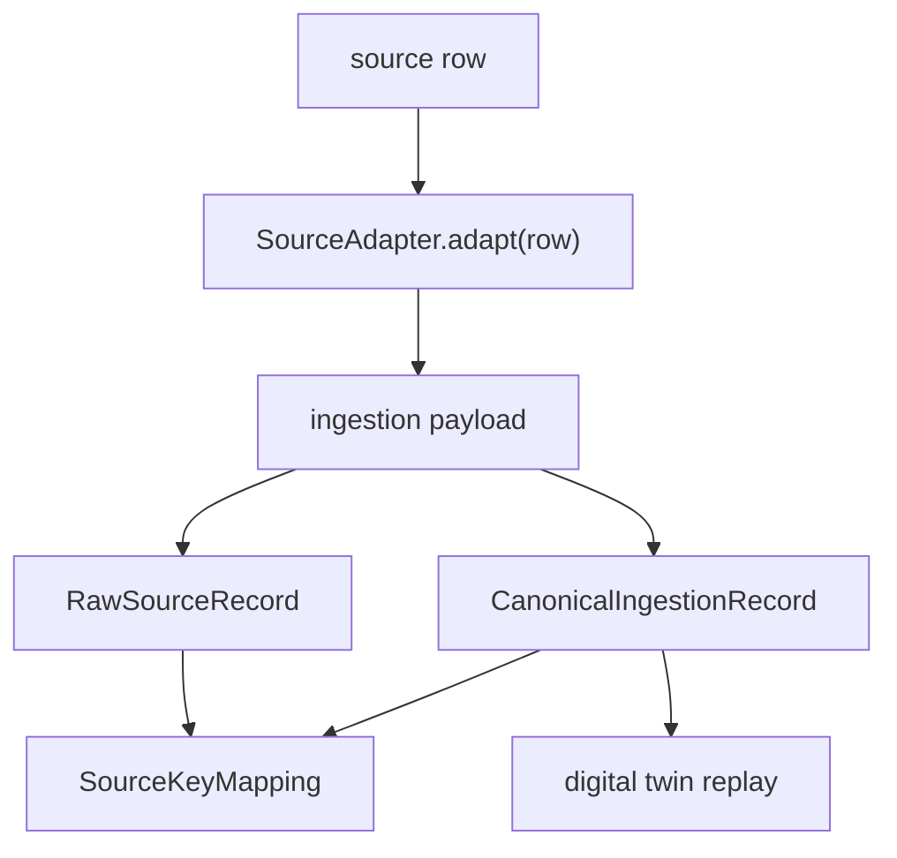

# Source Adapter Spec

Status: canonical contract  
Last updated: 2026-06-21

## Reader

Primary reader: engineers implementing source-specific connectors for legacy
MES, FDC, RMS, ERP, or factory databases.

Read after:

- [12_LEGACY_INGESTION_CONTRACT.md](12_LEGACY_INGESTION_CONTRACT.md)
- [19_PRODUCTION_DATA_BACKBONE_V1.md](19_PRODUCTION_DATA_BACKBONE_V1.md)

## Adapter Responsibility

An adapter converts one source row into an ingestion payload.

It must not:

- mutate MES state directly,
- call policy code,
- decide whether a recommendation should execute,
- hide or discard the original source row.

It must:

- preserve raw source identity,
- set canonical entity type and id,
- set event/ingest/decision time fields when known,
- place source-specific data under `payload`,
- place AI MES replay fields under `canonical`.

## Interface

Implemented in `src/mes/ingestion/adapters/base.py`.

```python
class SourceAdapter(Protocol):
    adapter_id: str
    source_system: str
    source_tables: Sequence[str]
    canonical_entity_types: Sequence[str]

    def adapt(self, row: dict) -> dict:
        ...

    def metadata(self) -> dict:
        ...
```

Catalog endpoint:

```http
GET /api/v2/legacy-adapters
```

Registry functions:

```python
source_adapter_catalog()
get_source_adapter(adapter_id)
adapt_source_row(adapter_id, row)
```

## Output Contract

Every adapter returns a payload accepted by:

```python
src.mes.runtime.legacy_ingestion.ingest_source_record_payload()
```

Required top-level fields:

```text
source_system
source_table
source_pk
entity_type
canonical_id
event_time
ingest_time
canonical
payload
```

`canonical` can contain:

```text
event_type
attributes
measurements
quality_result
```

## Implemented Adapters

| Adapter id | File | Source | Canonical output |
|---|---|---|---|
| `legacy_mes_wip_unit` | `legacy_mes_adapter.py` | MES WIP rows | `UNIT` queued/rework/running events |
| `legacy_mes_equipment` | `legacy_mes_adapter.py` | MES equipment rows | `EQUIPMENT` availability/status events |
| `legacy_mes_assignment` | `legacy_mes_adapter.py` | MES dispatch/track-in rows | `ASSIGNMENT` events |
| `fdc_quality_event` | `fdc_adapter.py` | FDC inspection/APC rows | `QUALITY` events |
| `fdc_equipment_event` | `fdc_adapter.py` | FDC alarm/trace rows | `EVENT` equipment telemetry |
| `rms_recipe` | `rms_adapter.py` | RMS recipe master rows | `RECIPE` availability/version events |
| `rms_recipe_eligibility` | `rms_adapter.py` | RMS recipe-tool matrix rows | `RECIPE` eligibility events |
| `erp_order_lot` | `erp_adapter.py` | ERP order/lot demand rows | `LOT` demand and due-date context events |

## Adapter Flow



## Example: MES WIP Unit

Input row:

```json
{
  "unit_id": "WAFER_900",
  "lot_id": "LOT_900",
  "operation_id": "A",
  "task_uid": 900,
  "event_time": 10,
  "ingest_time": 11
}
```

Canonical output intent:

```json
{
  "source_system": "LEGACY_MES",
  "entity_type": "UNIT",
  "canonical_id": "WAFER_900",
  "operation_id": "A",
  "canonical": {
    "event_type": "UNIT_WAITING",
    "attributes": {
      "task_uid": 900
    }
  }
}
```

## Adding A New Adapter

1. Create a class in `src/mes/ingestion/adapters/`.
2. Inherit `BaseSourceAdapter`.
3. Set adapter metadata.
4. Implement `adapt(row)`.
5. Register the adapter in `registry.py`.
6. Add tests for metadata and sample rows.
7. Add data-quality expectations if the source has late or duplicate behavior.

## Production Notes

- Adapters should be deterministic.
- Adapter ids are API contracts and should not be renamed casually.
- Raw source keys should match the source database primary keys whenever
  possible.
- If a source has weak primary keys, create a source-specific composite
  `source_pk` and document the rule.
- Do not normalize all source attributes prematurely. Keep raw payload evidence.
