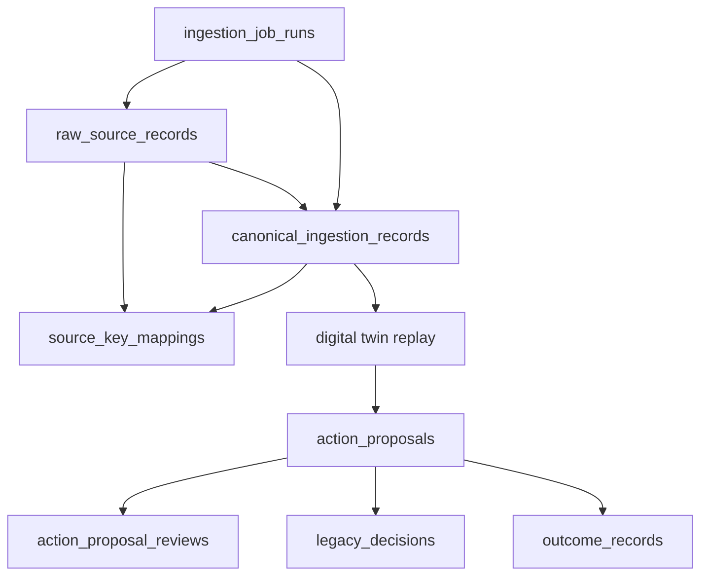

# PostgreSQL Schema

Status: canonical production target draft  
Last updated: 2026-06-21

## Reader

Primary reader: database engineers and backend developers preparing the AI MES
production persistence layer.

Read after:

- [06_MES_DOMAIN_MODEL.md](06_MES_DOMAIN_MODEL.md)
- [19_PRODUCTION_DATA_BACKBONE_V1.md](19_PRODUCTION_DATA_BACKBONE_V1.md)

## Current State

The simulator-backed MVP still runs on:

- `InMemoryMESStore`,
- optional SQLite JSON payload tables plus normalized ledger indexes.

PostgreSQL is the production target. The first schema contract is implemented
as:

```text
src/mes/persistence/postgres_schema.py
src/mes/persistence/migrations/postgres/001_production_data_backbone_v1.sql
```

## Schema Flow



## Tables

| Table | Purpose |
|---|---|
| `raw_source_records` | Immutable evidence from MES/FDC/RMS/ERP |
| `canonical_ingestion_records` | Standardized append-only event stream |
| `source_key_mappings` | Source key to AI MES canonical id mapping |
| `action_proposals` | AI recommendation intents for legacy review |
| `action_proposal_reviews` | Human/system review decisions |
| `legacy_decisions` | Legacy MES accept/reject/modify response |
| `outcome_records` | Observed execution and quality outcomes |
| `ingestion_job_runs` | Delta/backfill/reprocess job audit ledger |

## Required Indexes

| Index | Why |
|---|---|
| `idx_raw_source_records_source_key` | resolve source evidence quickly |
| `idx_canonical_ingestion_entity` | build genealogy by canonical entity |
| `idx_canonical_ingestion_time` | replay digital twin by event/ingest time |
| `idx_source_key_mappings_lookup` | resolve legacy keys to canonical ids |
| `idx_action_proposals_correlation` | trace policy decisions to proposal |
| `idx_ingestion_job_runs_adapter` | inspect ingestion operations by adapter |

## Time Semantics

The schema keeps three times separate:

| Field | Meaning |
|---|---|
| `event_time` | When the factory event occurred in the source system |
| `ingest_time` | When AI MES received/standardized the event |
| `decision_time` | When an AI MES policy used the event |

This separation is required because late FDC or MES events are normal in real
factories. Policy evaluation must be able to distinguish what was known at
decision time from what arrived later.

## Production Migration Path

1. Use the SQL file as the initial database contract.
2. Keep SQLite/InMemory stores for local simulation and tests.
3. Add a PostgreSQL repository implementation behind the same store methods.
4. Run dual-write or replay comparison before making PostgreSQL the default.
5. Use `canonical_ingestion_records` as the event-sourced input to the
   production digital twin.

## Contract API

The schema is exposed through:

```http
GET /api/v2/production/schema
```

The response includes:

- current MVP backend,
- normalized index counts,
- production PostgreSQL schema contract,
- migration file references,
- invariants.

## Non-Goals For V1

V1 does not include:

- tenant isolation,
- row-level security,
- connection pooling,
- operational backup policy,
- partitioning strategy,
- materialized KPI views,
- Alembic/Flyway integration.

Those belong to deployment hardening after the canonical source flow is stable.
