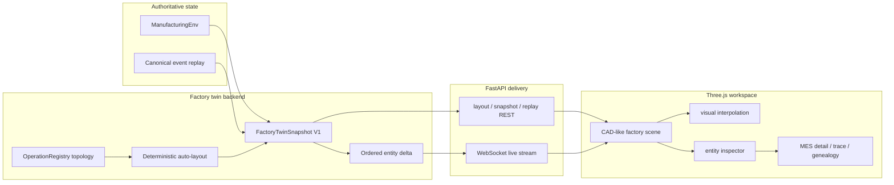

# Factory Spatial Digital Twin

Status: implemented V1 user and engineering guide
Last updated: 2026-07-17

## Reader

Primary reader: manufacturing engineers, AI policy developers, MES developers,
and integration engineers who need a spatial view of factory state.

Read after:
[01_ARCHITECTURE_FLOW_GUIDE.md](01_ARCHITECTURE_FLOW_GUIDE.md) and
[13_PRODUCTION_DIGITAL_TWIN_BACKBONE.md](13_PRODUCTION_DIGITAL_TWIN_BACKBONE.md).

## Purpose

The Factory Spatial Digital Twin turns the same state used by the AI MES into an
inspectable three-dimensional factory. It is not a separate simulation engine
and does not make scheduling decisions.

```text
authoritative Python state
-> versioned spatial projection
-> Three.js rendering and interpolation
-> equipment, queue, task, carrier, and warehouse inspection
```

Open the implemented page at:

```text
http://127.0.0.1:8000/mes#factory-twin
```

## Why This View Exists

Tables explain exact records well, but they do not make spatial flow obvious.
The twin answers operational questions such as:

- Which tools are processing now?
- Where is WIP waiting?
- Is a batch still in process or moving to the next operation?
- Which route connects two operations?
- Has completed work reached the warehouse?
- Which MES trace explains a visible assignment?

The 3D scene remains evidence-driven. A smooth browser animation must never be
mistaken for an observed production event, so the UI always shows state,
spatial, and transport provenance.

## Architecture



The browser may own camera position, selected entity, labels, and visual
interpolation. It does not own equipment status, queue membership, process
completion, transport arrival, or warehouse completion.

## Reference Factory

The default configuration renders the current simulator line:

| Operation | Display name | Equipment | Batch | Process time |
|---|---|---:|---:|---:|
| A | Lithography QA | 5 | 3 | 20 |
| B | Wet Clean QA | 3 | 2 | 8 |
| C | Final Packing | 3 | 4 | 2 |

The renderer does not hard-code these counts. It reads operations, equipment,
routes, batch sizes, and names from the Operation Registry. A newly configured
operation appears as a generic process cell until a custom visual archetype is
defined.

## Runtime Modes

### Simulator Live

`SIMULATOR` reads `ManufacturingEnv.get_decision_state()` and receives ordered
updates over WebSocket. Existing MES controls remain authoritative:

```text
Start | Stop | Run cycle | Generate lot | Reset
```

Use this mode for policy development, repeatable experiments, and live visual
inspection.

### Canonical Replay

`CANONICAL_TWIN` reconstructs state from `CanonicalIngestionRecord` event time.
The replay slider requests an earlier `at_time` without changing the renderer or
the live simulator.

```text
CanonicalIngestionRecord
-> build_digital_twin_state(at_time)
-> policy-ready canonical decision_state
-> FactoryTwinSnapshot V1
```

Use this mode for production-shaped historical evidence. Missing records remain
`UNKNOWN`; the adapter does not silently report missing equipment as idle.

## Transport Modes

| Mode | Downstream eligibility | Scene treatment |
|---|---|---|
| `immediate` | Existing same-step behavior | Short `INFERRED_VISUAL` carrier transition |
| `timed_oht` | Tasks become eligible only at authoritative arrival time | Carrier progress follows Python transfer state |

The default runtime keeps `immediate` for regression compatibility. The
dedicated profile enables timed OHT:

```bash
MES_RUNTIME_CONFIG=config/mes-runtime-factory-twin.yaml \
  .venv/bin/python -m uvicorn src.mes.api:app --host 127.0.0.1 --port 8000
```

Transport belongs to `src/environment/material_flow.py`. It moves tasks but
does not choose tasks, recipes, destinations, or policy objectives.

## Using The Page

1. Open `Factory Twin` in the MES navigation.
2. Keep `Simulator live` selected for the current runtime.
3. Use `Overview`, A, B, C, or `Warehouse` to focus the camera.
4. Orbit, pan, or zoom without resetting state.
5. Select equipment, a queue token, carrier, or warehouse slot.
6. Read exact ids, status, task list, progress, timing, and provenance in the
   inspector.
7. From equipment or task inspection, open Machine Detail, Assignment Trace,
   or Genealogy.
8. Select `Canonical replay` to inspect event-sourced historical state.

On narrow screens the navigation is removed from the twin workspace and the
inspector opens as a fixed bottom drawer. The scene remains the primary surface.

## Provenance

Every snapshot includes three independent provenance fields:

| Field | Values | Meaning |
|---|---|---|
| `state_source` | `SIMULATOR`, `CANONICAL_TWIN` | Which state authority produced the entity state |
| `spatial_source` | `CONFIGURED`, `AUTO_LAYOUT` | Whether coordinates were configured or inferred |
| `transport_source` | `OBSERVED`, `SIMULATED`, `INFERRED_VISUAL` | Whether movement is source evidence, domain simulation, or presentation only |

The header displays these values together. Policies must never consume browser
coordinates or inferred visual movement as manufacturing evidence.

## Public APIs

| Endpoint | Purpose |
|---|---|
| `GET /api/v2/factory-twin/layout` | Stable operation, equipment, queue, route, warehouse coordinates |
| `GET /api/v2/factory-twin/snapshot` | Full simulator or canonical state projection |
| `GET /api/v2/factory-twin/entity/{type}/{id}` | One entity with layout and state evidence |
| `GET /api/v2/factory-twin/replay-range` | Canonical event-time range for one run |
| `WS /api/v2/factory-twin/stream` | `hello`, `snapshot`, `delta`, heartbeat, and resync messages |

All public payloads use `schema_version: factory-twin.v1`. A delta applies only
when its `base_sequence` equals the browser's current sequence. A mismatch
causes a full snapshot resync.

## Configuration

```yaml
factory_twin:
  enabled: true
  source: SIMULATOR
  layout:
    mode: registry
    operation_spacing: 28
    equipment_spacing: 5
    aisle_width: 6
  transport:
    mode: timed_oht
    oht_time:
      A>B: 3
      B>C: 3
  rendering:
    max_visible_queue_items: 24
    labels_default: true
  warehouse:
    enabled: true
    visible_slots: 48
```

Queue and warehouse rendering are bounded for performance, but API and
inspector counts remain exact.

While a transfer is active, its task UIDs belong only to the OHT carrier. They
are inserted into the destination Wait Pool when the configured `oht_time`
elapses. A scalar `oht_time` applies one duration to every route; a mapping sets
route-specific durations.

## Implementation Map

| Responsibility | Location |
|---|---|
| Timed/immediate transport | `src/environment/material_flow.py` |
| Spatial contracts | `src/mes/factory_twin/contracts.py` |
| Topology and layout | `src/mes/factory_twin/topology.py`, `layout.py` |
| Source adapters and snapshots | `src/mes/factory_twin/sources.py`, `snapshot.py` |
| Delta and sequence ownership | `src/mes/factory_twin/diff.py`, `service.py` |
| REST and WebSocket | `src/mes/runtime/factory_twin_api.py` |
| Three.js application | `frontend/factory-twin/src/` |
| MES mount and styling | `src/mes/ui/templates/control_room.html`, `src/mes/ui/static/control_room.css` |

## Verification

```bash
.venv/bin/python -m pytest tests/test_material_flow.py -q
.venv/bin/python -m pytest tests/test_mes_factory_twin_contracts.py -q
.venv/bin/python -m pytest tests/test_mes_factory_twin_topology.py -q
.venv/bin/python -m pytest tests/test_mes_factory_twin_snapshot.py -q
.venv/bin/python -m pytest tests/test_mes_factory_twin_api.py -q
.venv/bin/python -m pytest tests/test_mes_factory_twin_performance.py -q
npm --prefix frontend/factory-twin run build
npm --prefix frontend/factory-twin run test
npm --prefix frontend/factory-twin run test:browser
```

The browser suite verifies nonblank WebGL pixels, scene framing, live deltas,
carrier movement, reconnect, entity links, mobile layout, and repeated page
entry. The backend suite enforces the 500 KB large-snapshot and 50 KB normal-
delta V1 budgets.

## Boundary And Remaining Work

V1 does not perform route optimization, collision avoidance, robot physics,
CAD import, direct equipment control, or policy changes from the scene. The
production path remains read-only until source adapters, identity mapping,
authorization, and Legacy MES action-proposal workflows are approved.

```text
3D selection
-> inspect and explain
-> existing MES trace surfaces
-> no direct equipment command
```
