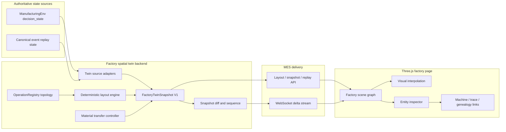
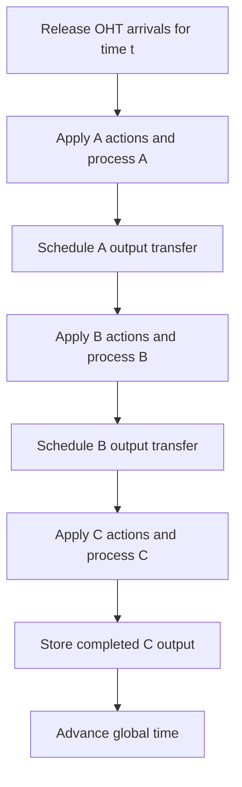

# Factory Spatial Digital Twin Simulator V1

> **Status:** IMPLEMENTED AND VERIFIED (2026-07-17)
>
> **Implementation rule:** Execute the tasks in order. Preserve the existing
> environment/policy separation and keep the full regression suite green after
> each phase.

**Goal:** Build a Three.js factory simulator that makes the current A -> B -> C
manufacturing state visible as a spatial, inspectable factory with configurable
equipment, wait pools, overhead transport, and a finished-goods warehouse.

**Architecture:** Python remains the source of truth for manufacturing state.
`ManufacturingEnv` and the canonical event-replayed twin are adapted into one
versioned Factory Twin contract. Three.js renders that contract and interpolates
movement between authoritative state changes. An optional timed OHT transport
mode adds real in-transit state without breaking the existing immediate-transfer
simulation mode.

**Tech stack:** Python 3.12, FastAPI, Pydantic, existing MES runtime and
OperationRegistry, Three.js, native ES modules bundled with Vite, Playwright,
pytest.

**Verification record:** 307 Python tests passed, 17 focused spatial-twin tests
passed, 3 real-browser Playwright scenarios passed, npm audit reported zero
vulnerabilities, Python dependency checks passed, and `git diff --check` passed.

---

## 1. Product Outcome

The finished page is a working factory, not a decorative model.

From `/mes#factory-twin`, a user can:

1. See every configured operation and equipment instance.
2. See which equipment is idle, processing, warning, held, or unavailable.
3. See each operation's wait pool and queued work.
4. Watch carriers move on an overhead OHT rail between operations.
5. Watch completed work enter a finished-goods warehouse.
6. Select an equipment, queue, carrier, or task and inspect its live state.
7. Follow a selected task from A through B and C to the warehouse.
8. Switch between live simulator state and canonical event replay without
   changing the renderer.
9. Open existing Machine Detail, Assignment Trace, and Genealogy views from the
   selected 3D entity.

The initial A/B/C configuration remains the reference scenario:

| Operation | Display name | Equipment | Batch | Process time |
|---|---|---:|---:|---:|
| A | Lithography QA | 5 | 3 | 20 |
| B | Wet Clean QA | 3 | 2 | 8 |
| C | Final Packing | 3 | 4 | 2 |

The renderer must not hard-code those counts. A future operation inserted into
the OperationRegistry must appear with a generic visual archetype even before a
custom model is added.

## 2. Scope

### V1 includes

- configurable A/B/C operation layout;
- equipment generated from OperationRegistry;
- visible wait, rework, hold, and output areas when present;
- simplified semiconductor equipment models;
- overhead rail topology derived from operation routes;
- carrier and work-item movement;
- immediate and timed OHT transfer modes;
- finished-goods warehouse;
- live simulator mode;
- canonical twin replay mode;
- entity selection and MES trace links;
- desktop and mobile-safe rendering;
- deterministic layout and replay;
- WebSocket updates with polling recovery;
- nonblank-canvas, framing, interaction, and movement verification.

### Explicitly excluded from V1

- route optimization;
- collision avoidance or robot physics;
- detailed cleanroom airflow or process physics;
- photorealistic equipment geometry;
- CAD import, BIM import, or proprietary Siemens assets;
- direct equipment control;
- changing L1/L2/L3/L4 policy decisions from inside the 3D scene;
- multi-floor factory design;
- operators dragging production equipment into new positions at runtime;
- Unity, Omniverse, Isaac Sim, Gazebo, or a separate simulation server.

## 3. Design Premises

1. **Python state is authoritative.** Three.js never decides that a task has
   finished, moved, or entered a queue.
2. **The spatial twin is a projection, not a third state model.** It consumes
   simulator or canonical twin state and adds layout coordinates and visual
   interpolation.
3. **Transport time is domain behavior.** If OHT travel affects scheduling, it
   must exist in Python state rather than only in browser animation.
4. **The renderer is operation-generic.** A/B/C receive custom visual archetypes,
   but topology, queues, equipment, and routing come from configuration.
5. **No physics engine is needed.** Deterministic tracks, progress values, and
   process timers are easier to test and are sufficient for V1.
6. **The existing MES remains the product shell.** The twin is a new operational
   page, not a separate app or marketing experience.
7. **Production safety remains unchanged.** Canonical mode visualizes evidence
   and proposals. It does not send commands directly to equipment.

## 4. Approaches Considered

### Approach A: Frontend-Only Visualizer

Read `/api/v2/fab/live` and animate inferred movement entirely in the browser.

- Effort: small
- Risk: medium
- Advantages: fastest first image and few backend files.
- Disadvantages: transport state is not replayable, policy eligibility cannot
  account for travel time, and the browser can disagree with Python state.

### Approach B: Unified Spatial Twin Contract

Adapt simulator and canonical state into one Factory Twin contract. Keep browser
animation visual, but add an optional Python timed-OHT model for experiments.

- Effort: large
- Risk: medium
- Advantages: one renderer for MVP and production-shaped data, deterministic
  replay, policy-compatible transport semantics, and clear test boundaries.
- Disadvantages: requires a new contract, transport state, streaming, and a
  focused frontend build pipeline.

### Approach C: External Industrial Simulation Engine

Build the factory in Unity, Omniverse, Isaac Sim, or another standalone engine.

- Effort: extra large
- Risk: high
- Advantages: richer assets, physics, and future robotics support.
- Disadvantages: duplicates time/state ownership, complicates Codex iteration,
  adds deployment infrastructure, and is unnecessary before route optimization
  or robot control becomes a real requirement.

### Decision

Use **Approach B**. It is the only option that preserves the existing Python
simulation and production-transition architecture while giving the 3D scene
real state semantics.

## 5. System Architecture



### Source-of-truth rule

```text
Python state change
  -> FactoryTwinSnapshot / FactoryTwinDelta
  -> browser receives sequence N
  -> Three.js interpolates from rendered state to sequence N
  -> browser never writes manufacturing state
```

The browser may retain camera position, selection, playback speed, and visual
preferences. It may not retain a conflicting equipment, queue, or task status.

## 6. Runtime Modes

### 6.1 Simulator Live

Source:

```text
ManufacturingEnv.get_decision_state()
```

Use for repeatable development, policy evaluation, and real-time animation. The
existing simulation controls remain authoritative:

```text
Run cycle / Start / Stop / Generate lot / Reset
```

### 6.2 Canonical Replay

Source:

```text
CanonicalIngestionRecord
  -> build_digital_twin_state()
  -> FactoryTwinSnapshot
```

Use for production-shaped evidence and time-at-state playback. The page is
read-only in this mode. Missing spatial fields use deterministic layout defaults
and show provenance as inferred rather than observed.

### 6.3 Transport Modes

| Mode | Downstream eligibility | Visual movement | Purpose |
|---|---|---|---|
| `immediate` | Existing same-step behavior | Short inferred transition | Regression compatibility |
| `timed_oht` | Eligible only after arrival | Progress follows Python transfer state | Spatial simulation and policy experiments |

`immediate` remains the default for existing tests and workflows. A dedicated
factory-twin runtime profile enables `timed_oht` until its scheduling impact is
explicitly accepted as the normal simulator behavior.

## 7. Operation-Generic Topology

The OperationRegistry already exposes operation nodes, route edges, equipment,
batch size, process time, and display names. The spatial twin extends registry
metadata instead of adding another A/B/C registry.

Optional visual metadata:

```yaml
operations:
  - operation_id: A
    display_name: Lithography QA
    operation_type: process_qa
    metadata:
      visual:
        position: [0, 0, 0]
        archetype: lithography_cell
        footprint: [18, 12]
        queue_capacity_visible: 18

equipment:
  - equipment_id: A_0
    display_name: LITHO-01
    capable_operations: [A]
    metadata:
      visual:
        slot: 0
        rotation_y: 0
```

Fallback behavior:

1. Topologically sort operation nodes.
2. Place operation zones left to right by route depth.
3. Space parallel operations vertically.
4. Place equipment in deterministic rows inside each operation zone.
5. Place wait pool before equipment and output port after equipment.
6. Connect route edges with overhead rail segments.
7. Add a warehouse after terminal operations.

The fallback must produce the same coordinates for the same registry payload.

If an operation exists in the registry but not in the selected state source, it
still appears in the layout. Its equipment state is `UNKNOWN`, queues are empty,
and the inspector explains that the source supplied no runtime evidence. The
adapter must not silently report that equipment as idle.

## 8. Factory Twin Contracts

Public payloads are versioned Pydantic models. Layout and state are separated so
equipment geometry is not retransmitted every cycle.

### 8.1 Layout

```python
FactoryTwinLayoutV1 = {
    "schema_version": "factory-twin.v1",
    "layout_id": "LAYOUT_...",
    "operations": [...],
    "equipment": [...],
    "queues": [...],
    "routes": [...],
    "warehouse": {...},
    "bounds": {...},
}
```

Each spatial entity has:

```text
id, entity_type, display_name, position[x,y,z], rotation[x,y,z],
size[x,y,z], operation_id, archetype, metadata
```

### 8.2 Snapshot

```python
FactoryTwinSnapshotV1 = {
    "schema_version": "factory-twin.v1",
    "run_id": "RUN_...",
    "snapshot_id": "TWIN_...",
    "sequence": 42,
    "time": 27,
    "state_source": "SIMULATOR",
    "layout_id": "LAYOUT_...",
    "equipment": [...],
    "queues": [...],
    "work_items": [...],
    "carriers": [...],
    "transfers": [...],
    "warehouse": {...},
    "diagnostics": {...},
}
```

Required equipment state:

```text
equipment_id, operation_id, status, batch_size, task_uids,
start_time, finish_time, progress, recipe_summary, health_summary
```

`start_time`, `finish_time`, `progress`, recipe, and health fields are nullable.
The simulator adapter may derive `start_time` from configured process time when
that derivation is unambiguous. Canonical mode uses observed event timestamps
when available. If progress cannot be supported by evidence, it is `null` and
the UI shows an indeterminate running state rather than inventing a percentage.

Required work-item state:

```text
task_uid, lot_id, carrier_id, operation_id, location_type,
location_id, status, due_date, customer_id, quality_summary
```

Required transfer state:

```text
transfer_id, carrier_id, task_uids, from_operation_id, to_operation_id,
route_id, dispatch_time, arrival_time, status, progress
```

### 8.3 Delta

```python
FactoryTwinDeltaV1 = {
    "schema_version": "factory-twin.v1",
    "run_id": "RUN_...",
    "base_sequence": 41,
    "sequence": 42,
    "time": 27,
    "upsert": {...},
    "remove": {...},
}
```

If `base_sequence` does not match the browser's current sequence, the browser
must request a full snapshot. It must not guess missing state.

### 8.4 Provenance

Every snapshot reports:

```text
state_source: SIMULATOR | CANONICAL_TWIN
spatial_source: CONFIGURED | AUTO_LAYOUT
transport_source: OBSERVED | SIMULATED | INFERRED_VISUAL
```

This prevents a smooth animation from being mistaken for observed production
evidence.

Warehouse payloads preserve exact totals but bound detailed recent-completion
rows. The renderer never requires every historical completion to remain in the
live snapshot.

## 9. OHT And Material Flow

### 9.1 Domain model

Add a focused transport controller outside process policies:

```python
TransferJob(
    transfer_id,
    carrier_id,
    task_uids,
    from_operation_id,
    to_operation_id,
    dispatch_time,
    arrival_time,
    status,
)
```

The controller owns only movement state:

- accept completed tasks from an operation;
- create or assign a carrier;
- mark tasks `IN_TRANSIT`;
- release arrivals to the downstream wait pool;
- expose active and completed transfer jobs;
- reset deterministically.

It does not select tasks, recipes, or destinations. Route selection follows the
operation graph. L1/L2/L3/L4 remain outside the environment.

### 9.2 Step order in timed mode



For zero-duration transfers, arrivals are released in the same global step to
preserve existing semantics.

### 9.3 Visual movement

The backend sends dispatch and arrival times. The browser calculates the carrier
position along a fixed rail curve:

```text
progress = clamp((render_time - dispatch_time) /
                 (arrival_time - dispatch_time), 0, 1)
```

Browser interpolation improves motion only. Eligibility and arrival remain
Python decisions.

## 10. Three.js Scene Design

### 10.1 Visual language

The style reference is
[Siemens Tecnomatix Process Simulate](https://www.siemens.com/ko-kr/products/tecnomatix/process-simulate-software/),
used only as an engineering-visualization reference.

Use:

- bright gray/white factory environment;
- matte CAD-like materials;
- simplified but recognizable equipment;
- elevated three-quarter orthographic camera by default;
- soft directional light, hemisphere light, and restrained shadows;
- subtle edge definition and selection outline;
- neutral equipment surfaces with color reserved for status;
- visible but uncomplicated OHT rails and carriers;
- sparse technical overlays.

Do not use:

- Siemens branding or proprietary assets;
- cinematic or photorealistic rendering;
- neon floors, sci-fi HUDs, or saturated zone blocks;
- cartoon outlines or toy-like proportions;
- decorative animations unrelated to state.

### 10.2 Procedural archetypes

V1 uses shared primitives instead of downloaded models:

| Archetype | Visual form |
|---|---|
| `lithography_cell` | cabinet body, load ports, status tower |
| `wet_clean_cell` | enclosed process cabinet, wet bench bays |
| `packing_cell` | compact pack station, input/output ports |
| `generic_process_cell` | neutral cabinet and ports |
| `wait_pool` | queue rack or floor-buffer slots |
| `oht_carrier` | compact overhead carrier with FOUP token |
| `warehouse` | rack grid with occupied-bin count |

All equipment of the same archetype share geometry and materials. High-count
work items use `InstancedMesh`; queues render a bounded number of tokens plus an
aggregate count.

### 10.3 Status semantics

| State | Treatment |
|---|---|
| idle / available | neutral body, green status lamp |
| reserved | yellow outline/lamp |
| processing | blue status lamp and visible progress |
| setup / attention | orange outline/lamp |
| hold / down / rejected | red outline/lamp |
| selected | strong blue outline independent of status |
| inferred data | dashed or muted provenance indicator in inspector |

### 10.4 Camera and interaction

- Orbit, pan, and zoom with stable scene bounds.
- Orthographic default and optional perspective mode.
- Camera presets: Overview, A, B, C, Warehouse, Selected.
- Double-click focuses an entity.
- Escape clears selection.
- Camera does not reset on data refresh.
- Reduced-motion mode disables nonessential easing.

### 10.5 Page composition

The Three.js scene is the full primary workspace, not a card.

```text
Factory Twin
+---------------------------------------------------------------+
| Source | time | connection | camera | labels | playback       |
+---------------------------------------------------------------+
|                                                               |
|                    full 3D factory scene                       |
|                                                               |
|                                      +----------------------+ |
|                                      | Entity inspector     | |
|                                      | state / batch / QA   | |
|                                      | trace links          | |
|                                      +----------------------+ |
+---------------------------------------------------------------+
| timeline / selected transfer / replay cursor                  |
+---------------------------------------------------------------+
```

The right inspector is a drawer over the scene. It must not permanently shrink
the 3D viewport on narrow screens.

## 11. API And Streaming

### REST

```http
GET /api/v2/factory-twin/layout
GET /api/v2/factory-twin/snapshot?source=SIMULATOR
GET /api/v2/factory-twin/snapshot?source=CANONICAL_TWIN&run_id=...&at_time=...
GET /api/v2/factory-twin/entity/{entity_type}/{entity_id}
GET /api/v2/factory-twin/replay-range?run_id=...
```

The existing simulation control routes remain unchanged. Do not duplicate
start, stop, reset, lot generation, or run-cycle commands under the twin API.

The current autoplay mechanism remains the simulation clock in V1. WebSocket
streaming distributes state changes; it does not create a second timer that
steps `ManufacturingEnv`.

### WebSocket

```http
WS /api/v2/factory-twin/stream?source=SIMULATOR
```

Message types:

```text
hello            negotiated schema and current sequence
snapshot         complete state
delta            ordered upsert/remove state
heartbeat        connection and source time
resync_required  browser must fetch a complete snapshot
```

Publish after every simulator mutation. The browser reconnects with exponential
backoff and falls back to snapshot polling. WebSocket failure must never stop the
simulation.

### Runtime concurrency boundary

V1 supports one MES runtime context in one FastAPI worker. Environment mutation,
snapshot construction, and sequence advancement use one context-owned lock so a
snapshot cannot observe half of a simulation step. Each WebSocket client receives
the latest committed sequence; a slow client is resynchronized rather than
allowed to grow an unbounded message queue.

Multiple Uvicorn workers are explicitly unsupported for the in-memory simulator
runtime because each worker would own a different `MESAPIContext`. A later
production deployment must move sequence publication to shared persistence or a
message broker before enabling multiple workers.

## 12. Configuration

Extend the runtime config with an optional section:

```yaml
factory_twin:
  enabled: true
  source: SIMULATOR
  layout:
    mode: registry
    operation_spacing: 28
    equipment_spacing: 5
    aisle_width: 6
  transport:
    mode: immediate
    default_travel_time: 2
    route_travel_time:
      A>B: 3
      B>C: 3
  rendering:
    max_visible_queue_items: 24
    labels_default: true
  warehouse:
    enabled: true
    visible_slots: 48
```

Production canonical records may override statuses and observed timestamps, but
must not override configured geometry unless an approved spatial mapping source
is introduced later.

## 13. File Structure

```text
config/
  mes-runtime-factory-twin.yaml    # timed-OHT reference runtime profile

src/environment/
  material_flow.py                 # transfer jobs and immediate/timed controller

src/mes/factory_twin/
  contracts.py                     # versioned Pydantic public contracts
  topology.py                      # registry to spatial topology
  layout.py                        # deterministic coordinates and bounds
  sources.py                       # simulator/canonical source adapters
  snapshot.py                      # common snapshot builder
  diff.py                          # ordered state delta generation
  service.py                       # facade and sequence ownership

src/mes/runtime/
  factory_twin_api.py              # REST and WebSocket routes

frontend/factory-twin/
  package.json                     # pinned Three.js/Vite dependencies
  package-lock.json                # reproducible frontend dependency graph
  vite.config.js                   # bundle to MES static assets
  src/
    main.js                        # page lifecycle and state store
    scene.js                       # renderer, camera, lights, resize
    topology.js                    # operation/equipment/queue construction
    machines.js                    # procedural archetypes
    material-flow.js               # carriers, tokens, rail interpolation
    inspector.js                   # selection and trace links
    status-materials.js            # semantic material palette
  tests/browser/
    factory-twin.spec.js           # scene, selection, movement, responsive QA

src/mes/ui/static/dist/
  factory-twin.js                  # generated browser bundle served by FastAPI

tests/
  test_material_flow.py
  test_mes_factory_twin_contracts.py
  test_mes_factory_twin_topology.py
  test_mes_factory_twin_snapshot.py
  test_mes_factory_twin_api.py
  test_mes_factory_twin_ui.py

```

The generated bundle is not edited manually. Backend contracts, source adapters,
and material-flow semantics remain separate from browser rendering.

Existing integration files expected to change:

```text
src/environment/manufacturing_env.py
src/mes/api.py
src/mes/runtime/config.py
src/mes/runtime/context.py
src/mes/runtime/simulation_control.py
src/mes/ui/assets.py
src/mes/ui/templates/control_room.html
src/mes/ui/static/control_room.css
src/mes/ui/static/control_room.js
```

## 14. Implementation Plan

### Phase 1: Contract And Topology Foundation

**Goal:** Produce a stable spatial layout and state snapshot without rendering.

- [x] Add failing contract tests for schema version, ids, sources, and entity
      references.
- [x] Implement Pydantic layout, snapshot, delta, and provenance models.
- [x] Add deterministic topology generation from OperationRegistry.
- [x] Add configured-position and fallback auto-layout behavior.
- [x] Prove 5 A, 3 B, and 3 C equipment instances are placed without overlap.
- [x] Prove a new configured operation appears through the generic fallback.
- [x] Add snapshot builders for simulator decision state.
- [x] Add snapshot builders for canonical twin state.
- [x] Prove both sources validate against the same public contract.

Acceptance:

```text
The same renderer-facing schema describes both SIMULATOR and CANONICAL_TWIN.
No public twin payload depends on ProcessA_Env/ProcessB_Env/ProcessC_Env objects.
```

### Phase 2: Read-Only Three.js Factory

**Goal:** Render the live A/B/C factory before changing transport semantics.

- [x] Add `/mes#factory-twin` navigation and full-bleed page mount.
- [x] Add pinned Three.js build and FastAPI static asset delivery.
- [x] Build neutral floor, operation zones, equipment, queues, OHT rails, and
      warehouse from the layout payload.
- [x] Render equipment status, batch occupancy, queue tokens, and warehouse
      occupancy from a full snapshot.
- [x] Add camera presets, orbit/pan/zoom, fit-to-scene, resize, and reduced motion.
- [x] Add selection outline and entity inspector.
- [x] Link equipment/task selections to existing detail, assignment trace, and
      genealogy pages.
- [x] Add loading, disconnected, empty, and unsupported-schema states.

Acceptance:

```text
Changing num_machines_A/B/C changes the rendered equipment count without JS edits.
The scene is nonblank and correctly framed on desktop and mobile.
```

### Phase 3: OHT Material Flow

**Goal:** Make product transfer visible and optionally meaningful to scheduling.

- [x] Add failing tests for immediate transfer compatibility.
- [x] Add TransferJob and carrier state.
- [x] Refactor A->B and B->C handoff through the material-flow controller.
- [x] Keep `immediate` results equivalent to the existing environment.
- [x] Implement `timed_oht` arrival and downstream ineligibility.
- [x] Add `config/mes-runtime-factory-twin.yaml` with timed OHT enabled while
      preserving immediate transfer in the default runtime profile.
- [x] Expose transfer jobs in decision/twin state without exposing browser
      coordinates to policies.
- [x] Render carrier travel on overhead rail curves.
- [x] Animate warehouse intake after C completion.
- [x] Verify reset clears carriers, jobs, and warehouse occupancy consistently.

Acceptance:

```text
In timed_oht mode, a task cannot enter B or C before its transfer arrival time.
In immediate mode, the existing environment regression behavior is preserved.
```

### Phase 4: Real-Time Stream And Replay

**Goal:** Synchronize state without scroll-breaking polling or visual jumps.

- [x] Add sequence-owned FactoryTwinService to MESAPIContext.
- [x] Add a context-owned lock around environment mutation, snapshot creation,
      and sequence advancement.
- [x] Publish a new snapshot after every state mutation.
- [x] Generate deterministic deltas from consecutive snapshots.
- [x] Add WebSocket hello/snapshot/delta/heartbeat/resync messages.
- [x] Add browser sequence checks, reconnect, and polling fallback.
- [x] Interpolate render transforms without mutating authoritative state.
- [x] Add canonical run/time replay API and timeline cursor.
- [x] Label observed, simulated, and inferred movement provenance.

Acceptance:

```text
A dropped delta causes a clean full resync.
Reconnecting does not duplicate entities or reset the camera.
Canonical replay at the same run/time produces the same spatial state.
```

### Phase 5: Operational Inspection And AI MES Links

**Goal:** Make the scene useful for engineering investigation.

- [x] Equipment inspector: status, operation, batch, recipe, finish time,
      utilization/quality summary, and machine-detail link.
- [x] Queue inspector: wait/rework/hold counts and bounded task list.
- [x] Task inspector: lot/customer/due date/current location/quality summary.
- [x] Carrier inspector: task list, route, dispatch, arrival, and progress.
- [x] Warehouse inspector: completed count and recent completions.
- [x] Highlight a selected task's current equipment, queue, carrier, and route.
- [x] Link to Assignment Trace and Genealogy with stable ids.
- [x] Show current policy/correlation summary as context, without embedding the
      entire decision console in the 3D page.

Acceptance:

```text
Starting from a visible task, the user can reach the evidence explaining its
assignment in no more than two interactions.
```

### Phase 6: Performance, QA, And Documentation

**Goal:** Make the simulator stable enough to become a long-lived product view.

- [x] Use shared geometry/materials and InstancedMesh for repeated entities.
- [x] Bound visible queue tokens while preserving exact counts in the inspector.
- [x] Dispose geometries, materials, listeners, and animation frames on page exit.
- [x] Pause heavy rendering when the page is hidden.
- [x] Add canvas pixel checks for nonblank rendering.
- [x] Add Playwright checks for desktop/mobile framing, selection, carrier
      movement, resize, reconnect, and no overlap.
- [x] Add contract, transport, API, and full regression tests.
- [x] Run JS syntax/build checks and dependency audit.
- [x] Update API, UI, runtime config, architecture, status, and roadmap docs.
- [x] Add a user guide for simulator live mode and canonical replay mode.

Acceptance:

```text
The default factory runs smoothly on a normal laptop, produces no console errors,
and preserves existing MES APIs and policy outcomes in immediate mode.
```

## 15. Test Matrix

| Layer | Required proof |
|---|---|
| Material flow | immediate compatibility, timed arrival, reset, duplicate-task prevention |
| Topology | configured and fallback layouts, stable ids, no overlap, terminal warehouse |
| Contract | simulator/canonical parity, schema validation, broken-reference rejection |
| Delta stream | monotonic sequence, upsert/remove correctness, resync after gap |
| API | layout, snapshot, entity, replay, source validation, WebSocket lifecycle |
| Renderer | nonblank canvas, camera framing, status colors, selection, movement |
| Responsive | desktop, tablet, mobile drawer, no text/toolbar overlap |
| Regression | existing ManufacturingEnv, policy, MES, Gantt, chat, and trace tests |

Verification commands expected after implementation:

```bash
.venv/bin/python -m pytest tests/test_material_flow.py -q
.venv/bin/python -m pytest tests/test_mes_factory_twin_contracts.py -q
.venv/bin/python -m pytest tests/test_mes_factory_twin_topology.py -q
.venv/bin/python -m pytest tests/test_mes_factory_twin_snapshot.py -q
.venv/bin/python -m pytest tests/test_mes_factory_twin_api.py -q
.venv/bin/python -m pytest tests/test_mes_factory_twin_ui.py -q
.venv/bin/python -m pytest -q
npm --prefix frontend/factory-twin run build
npm --prefix frontend/factory-twin run test
git diff --check
```

## 16. Performance Budgets

V1 target budgets:

- default 11-equipment scene: stable 60 FPS on a normal development laptop;
- 200 equipment and 2,000 work items: at least 30 FPS using instancing and
  bounded visible queue tokens;
- full snapshot: under 500 KB for the 2,000-work-item test fixture;
- normal delta: under 50 KB;
- WebSocket reconnect and full resync: under 2 seconds on localhost;
- no continuously increasing renderer memory after 20 page enter/leave cycles.

These are acceptance budgets, not promises about untested production hardware.

## 17. Failure Behavior

| Failure | Required behavior |
|---|---|
| Unknown schema version | stop applying updates and show unsupported-version state |
| Missing layout entity | keep scene alive, report diagnostic, request full layout |
| Delta sequence gap | request full snapshot |
| WebSocket disconnect | show stale indicator and retry; polling fallback remains read-only |
| Canonical data gap | render known state and mark missing/inferred provenance |
| Unknown operation type | render generic process cell |
| Excess queue size | render bounded tokens and exact numeric count |
| WebGL unavailable | show a useful compatibility message and links to table views |
| Timed transfer inconsistency | reject duplicate ownership and surface backend diagnostic |

## 18. Security And Safety Boundary

- The scene renders structured allowlisted data only.
- No model-supplied JavaScript, shader, HTML, or asset URL is executed.
- Production canonical mode is read-only.
- Simulator controls reuse current authenticated/authorized boundaries when
  authentication is introduced.
- WebSocket production deployment must enforce the same session, origin, and
  authorization rules as REST.
- No 3D interaction creates a direct equipment command.
- Existing Action Proposal and legacy MES acceptance boundaries remain intact.

## 19. Final Definition Of Done

V1 is complete only when this end-to-end scenario works:

```text
1. Open /mes#factory-twin.
2. See 5 Lithography, 3 Wet Clean, and 3 Packing tools in a CAD-like factory.
3. See A/B/C wait pools and exact queue counts.
4. Start the existing simulator.
5. Watch A equipment load a batch and show processing progress.
6. Watch its carrier travel on the overhead rail to B.
7. Confirm the batch appears in B only at the correct arrival time in timed mode.
8. Follow the same work through B and C into the warehouse.
9. Select the task and open its assignment trace/genealogy.
10. Switch to canonical replay and inspect an earlier state at a selected time.
11. Confirm the renderer states whether movement was observed, simulated, or inferred.
12. Run all tests and browser checks with no regression or blank canvas.
```

## 20. Recommended Execution Slices

The plan should be implemented as three reviewable goals rather than one giant
change:

1. **Factory Twin Read-Only V1**: Phases 1-2.
2. **OHT And Real-Time Twin V1**: Phases 3-4.
3. **Operational Twin Productization V1**: Phases 5-6.

Each slice must be independently usable and must not leave the main MES runtime
in a broken intermediate state.
